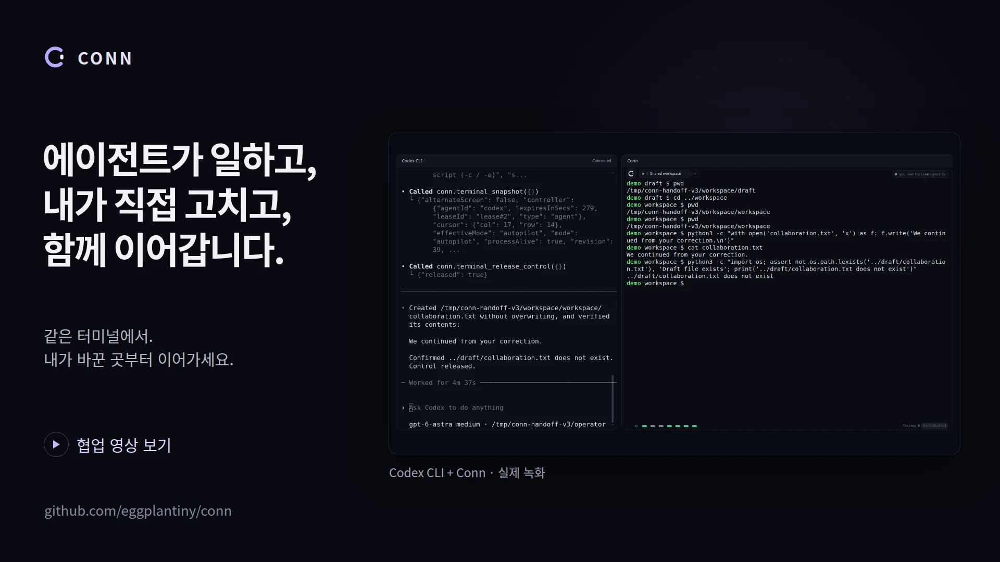

  

<h1 align="center">Conn</h1>

<strong>쓰던 에이전트와, 같은 터미널에서.</strong>

<a href="README.md">English</a> · 한국어

AI 에이전트와 같은 셸에서 일하세요. 직접 고치고, 바뀐 화면에서 이어가게 하세요.

## 다운로드

**데스크톱 앱을 설치하세요.** Rust나 Node.js는 필요하지 않고, 에이전트 연결 도구도 포함됩니다.

| 운영체제 | v0.8.0 프리뷰 |
|---|---|
| macOS · Apple Silicon | [Mac용 다운로드](https://github.com/eggplantiny/conn/releases/download/v0.8.0/conn-v0.8.0-aarch64-apple-darwin-desktop.dmg) |
| Windows · x64 | [설치 파일 다운로드](https://github.com/eggplantiny/conn/releases/download/v0.8.0/conn-v0.8.0-x86_64-pc-windows-msvc-setup.exe) |
| Ubuntu · x64 | [.deb 다운로드](https://github.com/eggplantiny/conn/releases/download/v0.8.0/conn-v0.8.0-x86_64-unknown-linux-gnu-desktop.deb) · [AppImage](https://github.com/eggplantiny/conn/releases/download/v0.8.0/conn-v0.8.0-x86_64-unknown-linux-gnu-desktop.AppImage) |

Mac 배포 파일은 서명·공증되어 있습니다. Windows 프리뷰는 무서명이며, Linux는 Ubuntu 24.04에서 빌드합니다. Intel Mac 배포는 잠시 중단했습니다. [설치·업데이트 안내](docs/getting-started.ko.md) · [전체 파일·체크섬](https://github.com/eggplantiny/conn/releases/tag/v0.8.0)

## 조금 고쳤다고, 처음부터 다시 할 필요는 없으니까

에이전트가 작업할 폴더를 골랐는데, 내가 원한 곳이 아닙니다. Conn에 직접 입력해 제어권을 가져오고 폴더를 바꿉니다. 그리고 에이전트에게 말합니다.

> 경로는 내가 고쳤어. 터미널을 읽고 여기서 이어가.

에이전트가 바뀐 화면을 읽고 수정된 위치에서 작업을 재개합니다. 대화는 쓰던 에이전트에서, 작업은 함께 보는 터미널에서 이어집니다.

[한국어 영상](docs/assets/conn-handoff-ko.mp4) · [English video](docs/assets/conn-handoff-en.mp4) · [촬영 설명](docs/demo.ko.md)

*실제 Codex와 Conn을 사용해 협업 경험을 재구성했습니다. 사람 역할의 입력은 자동화했고, 대기 시간은 편집했습니다.*

## 직접 해보기

1. **Conn을 여세요.** **설정 → 프로필**에서 사용할 셸을 선택합니다.
2. **에이전트를 연결하세요.** **설정 → 에이전트**에서 클라이언트를 고르고 **설정하기**를 누릅니다. 클라이언트는 재시작하고 Conn은 켜 두세요. [연결 안내](docs/agent-integrations.ko.md)
3. **작은 보정을 함께 해보세요.** [첫 협업 예제](docs/first-collaboration.ko.md)는 임시 로컬 폴더와 파일 하나로 진행합니다. SSH 서버는 필요하지 않습니다.

**Codex, Claude Code, Cursor, GitHub Copilot**의 연결 설정을 지원합니다. Codex는 데스크톱 앱·CLI·IDE 확장에서 로컬 작업으로 사용하세요. Conn은 MCP나 CLI로 연결하며 모델을 실행하지 않습니다. 기존 클라이언트와 모델 계정을 그대로 사용합니다. ChatGPT 앱 통합은 아니며 웹·클라우드 작업에서는 이 로컬 연결을 사용할 수 없습니다.

## 내가 키보드를 잡으면

직접 입력하면 에이전트의 추가 입력이 셸에 전달되기 전에 제어권을 되찾습니다. **이미 실행 중인 프로세스가 중단되는 것은 아닙니다.** 필요한 경우 터미널의 일반적인 중단 방법을 사용하세요. 다시 맡길 때는 에이전트에게 현재 화면을 먼저 읽도록 요청합니다.

타임라인에서 실행한 명령과 제어권 전환, 거절한 요청과 원문을 함께 확인할 수 있습니다. 로컬 Bash/Zsh 통합은 실행된 셸 명령을 기록하며, 원시 타이핑이나 프로그램 안에서의 입력을 수집하지 않습니다.

## 더 알아보기

- [협업 이야기: 같은 터미널에서의 작은 보정](docs/collaboration-story.ko.md)
- [FAQ: 제어권·SSH·암호·기록](docs/faq.ko.md)
- [프로필과 백엔드](docs/backends.md) · [CLI 설치](docs/getting-started.ko.md)
- [다른 협업 사례: 내가 테스트 조건을 추가하면 에이전트가 다시 수정](https://github.com/user-attachments/assets/4f06180c-6a2c-4c10-99e1-7941db86470b)
- [기여하기](CONTRIBUTING.ko.md) · [문제 제보](https://github.com/eggplantiny/conn/issues/new/choose)

**프리뷰 · MIT 라이선스.** 명령은 사용자 계정 권한으로 실행됩니다. Conn은 OS 샌드박스가 아닙니다. [신뢰 모델](docs/security.md) · [보안 제보](SECURITY.md)

이런 협업이 필요했다면 **Star로 Conn을 알려주세요.** 에이전트 작업 중 직접 키보드를 잡고 싶었던 순간도 듣고 싶습니다.

## 공유와 확장

v0.8.0에서는 창이 뒤에 있어도 에이전트가 공유된 세션에서 계속 작업하고, 새 에이전트는 허용을 받아야 참여하며, 제어권은 한 번에 한 탭에만 주어집니다. v0.7.0에서는 실행 중인 셸의 공유를 켜고 끌 수 있고, 테마와 선택형 명령 제안을 제공합니다.
앱을 업데이트한 뒤 MCP 클라이언트도 함께 재시작하세요.
[제품 계약](docs/PRD.ko.md) · [확장 안내](docs/extensions.ko.md)
