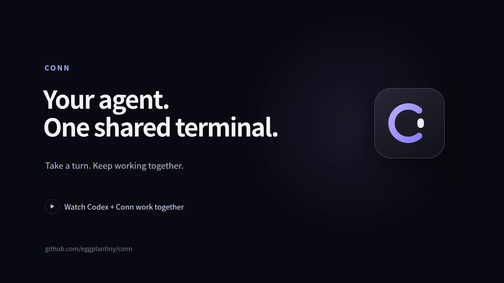

<p align="center">
  
</p>

<h1 align="center">Conn</h1>
<p align="center"><strong>쓰던 에이전트와, 같은 터미널에서 함께.</strong></p>
<p align="center"><a href="README.md">English</a> · 한국어</p>
<p align="center">
  <a href="docs/getting-started.ko.md">시작하기</a> ·
  <a href="https://github.com/eggplantiny/conn/releases">릴리스</a> ·
  <a href="CONTRIBUTING.ko.md">기여하기</a> ·
  <a href="LICENSE">MIT 라이선스</a>
</p>

Conn은 사람과 AI 에이전트가 함께 사용하는 터미널입니다. 대화는 쓰던 에이전트 클라이언트에서 이어가고, 작업은 같은 셸에서 진행하세요. 필요하면 직접 입력해 이어받고, 준비가 되면 에이전트에게 바뀐 화면을 읽고 계속하도록 요청합니다.

데스크톱 앱으로도, 쓰던 터미널 안에서도 실행할 수 있습니다. 에이전트는 **MCP 또는 CLI**로 연결하며 Conn 자체는 모델을 실행하지 않습니다.

[](docs/assets/conn-demo-ko.mp4)

**[데모 영상 보기](docs/assets/conn-demo-ko.mp4)** · [English video](docs/assets/conn-demo-en.mp4) · [촬영 방법](docs/demo.ko.md)

*실제 Codex CLI 세션을 Conn MCP로 연결했습니다. 준비된 데모 프로젝트를 사용하며 사용자 역할의 입력은 자동화했고 대기 시간은 편집했습니다.*

## 같은 작업을 번갈아 이어가기

- **쓰던 에이전트로 시작합니다.** Codex CLI 같은 MCP 클라이언트를 연결하세요. 에이전트가 현재 화면을 읽고, 내가 사용하는 셸에 명령을 요청할 수 있습니다.
- **필요하면 직접 이어받습니다.** 요청을 검토하거나 터미널에 직접 입력하세요. 직접 입력하면 제어권을 회수하고 에이전트의 추가 입력을 막습니다. 이미 실행 중인 명령까지 취소되지는 않습니다.
- **바뀐 상태에서 계속합니다.** 내 작업이 끝나면 에이전트에게 화면을 다시 읽고 이어가도록 요청하세요. 명령과 제어권 변경은 하나의 타임라인에 남으며, 요청 원문도 펼쳐 볼 수 있습니다.

## 시작하기

### 1. Conn 실행

rustup으로 Rust를 설치하고 Node.js 24와 운영체제별 [Tauri 필수 구성 요소](https://v2.tauri.app/start/prerequisites/)를 준비하세요. Rust 버전은 저장소에 고정되어 있습니다.

```sh
git clone https://github.com/eggplantiny/conn.git
cd conn
cargo install --path crates/cli --locked
cd frontends/tauri
npm ci
npm run tauri dev
```

쓰던 터미널을 계속 사용하려면 CLI 설치 후 그 터미널에서 `conn`을 실행하세요. 이 경로에는 Rust와 네이티브 컴파일러·링커가 필요하며 Node.js와 Tauri는 필요하지 않습니다. 에이전트를 연결하는 동안 세션을 열어 두세요.

### 2. 에이전트 연결

Codex CLI를 사용한다면 Conn을 등록하고 새 Codex 세션을 시작하세요.

```sh
codex mcp add conn -- conn mcp
```

에이전트가 연결하는 동안 Conn을 열어 두세요. 다른 클라이언트에서는 `conn mcp`를 MCP **stdio 서버**로 등록합니다. JSON 설정을 사용하는 클라이언트의 예시는 다음과 같습니다.

```json
{
  "mcpServers": {
    "conn": {
      "command": "conn",
      "args": ["mcp"]
    }
  }
}
```

설정 형식과 위치는 클라이언트마다 다릅니다. `conn`을 찾지 못하면 실행 파일의 절대 경로를 지정하세요. 연결 주소와 클라이언트 옵션은 [에이전트 연결 안내](docs/getting-started.ko.md#에이전트-연결)를 참고하세요.

### 3. 첫 요청 보내기

데스크톱 오른쪽 위 제어 설정에서 **Autopilot**, **제어권 부여 전 확인 켜기**, **실행 유예 2초**를 선택하세요. 에이전트에게 다음과 같이 요청합니다.

> 모든 셸 작업은 Conn으로 해줘. 현재 화면을 읽고 현재 디렉터리를 확인할 제어권을 요청해. 정확한 명령도 포함해 줘. 파일은 변경하지 마. 내가 거절하거나 제어권을 가져오면 멈춰.

요청을 검토하고 **허용** 또는 **거부**를 선택하세요. 허용한 뒤에는 직접 명령을 입력해 제어권을 가져와 보세요. 에이전트에게 다음 작업을 제안하기 전에 화면을 다시 읽도록 요청합니다. **타임라인**에서 누가 무엇을 했는지 확인할 수 있습니다.

명령 승인, Co-pilot 모드, CLI만 사용하는 방법은 [첫 협업 안내](docs/getting-started.ko.md#3-제어권-주고받기)에 있습니다.

## 더 알아보기

| 하고 싶은 일 | 문서 |
|---|---|
| 설치, 연결, 문제 해결 | [시작하기](docs/getting-started.ko.md) |
| 로컬 셸, WSL, SSH, Docker 설정 | [백엔드와 프로필](docs/backends.md) |
| 승인·실행 규칙 선택 | [정책](docs/policy.md) |
| 에이전트·프런트엔드 연결 | [프로토콜](docs/protocol.md) · [아키텍처](docs/architecture.md) |
| 테스트와 기여 | [브라우저 테스트](docs/browser-testing.md) · [기여 안내](CONTRIBUTING.ko.md) |
| 배포 파일과 릴리스 요건 확인 | [플랫폼 지원](docs/platform-support.ko.md) · [릴리스](docs/releasing.ko.md) |

## 프리뷰 상태

**v0.3.0 프리뷰입니다.** 위의 소스 실행 방법으로 시작하세요. Linux·macOS·Windows 패키지 목표와 검증 상태는 [플랫폼 지원](docs/platform-support.ko.md)에서 확인할 수 있습니다. 빌드 통과만으로 설치·실제 조작의 호환성이 검증되지는 않습니다.

Conn은 협업과 실수 방지를 위한 도구이며 **보안 샌드박스가 아닙니다.** 타임라인은 Conn을 통과한 작업을 기록합니다. `실행됨`은 입력이 셸에 전달됐다는 뜻이며 명령의 성공을 보장하지 않습니다. 요청과 화면 스냅샷에는 민감한 정보가 포함될 수 있습니다. [신뢰 범위](docs/security.md#한국어-요약)와 [보안 제보 안내](SECURITY.md)를 확인하세요.
