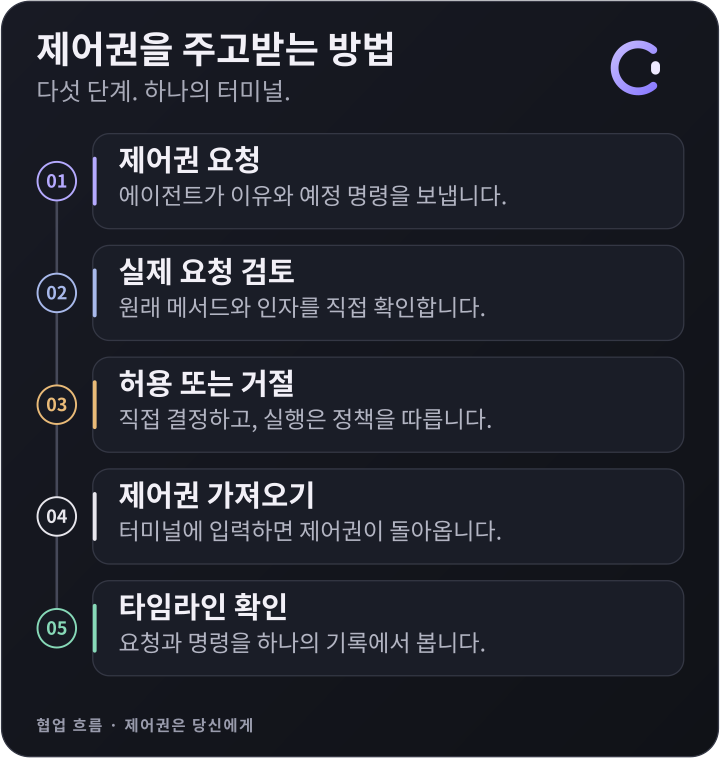

<p align="center">
  
</p>

<h1 align="center">Conn</h1>
<p align="center"><strong>하나의 터미널. 당신과 에이전트. 제어권은 당신에게.</strong></p>
<p align="center"><a href="README.md">English</a> · 한국어</p>
<p align="center">
  <a href="https://github.com/eggplantiny/conn/actions/workflows/ci.yml"></a>
</p>
<p align="center">
  <a href="docs/getting-started.ko.md">시작하기</a> ·
  <a href="https://github.com/eggplantiny/conn/releases">릴리스</a> ·
  <a href="CONTRIBUTING.ko.md">기여하기</a> ·
  <a href="LICENSE">MIT 라이선스</a>
</p>

Conn은 사람과 AI 에이전트가 **같은 셸에서 함께 작업**하게 해줍니다. 에이전트가 입력하는 명령을 직접 보고, 요청을 검토한 뒤 허용하고, 키를 눌러 제어권을 가져오세요. 사람의 명령과 에이전트의 작업은 하나의 타임라인에 남습니다.

**데스크톱 터미널**로도, 쓰던 터미널 안에서도 실행할 수 있습니다. 에이전트는 **MCP 또는 CLI**로 연결합니다. Conn은 모델을 실행하지 않으므로 원하는 에이전트를 연결해 사용하세요.

> **v0.3.0 프리뷰.** Linux·macOS ARM·Windows 네이티브 데스크톱 디버그 빌드는 CI를 통과했으며 실제 설치·조작은 별도로 검증합니다. 첫 바이너리 배포는 Ubuntu 24.04·26.04 x64, 인증서 서명 없는 Windows x64, Apple 가입 후 Developer ID 서명·공증을 적용한 Mac 두 아키텍처를 목표로 합니다. 현재 Mac 빌드는 ad-hoc 테스트 산출물입니다. 다운로드는 관리자가 공개한 뒤 제공됩니다. [플랫폼 방침과 검증표](docs/platform-support.ko.md)를 확인하세요.

## 이런 순간을 위한 도구입니다

에이전트와 프로젝트를 조사합니다. 에이전트가 내 터미널에서 파일을 읽고 수정을 제안한 뒤, 무언가를 삭제하겠다고 요청합니다. **실제 요청 명령**을 펼쳐 보고 거절한 다음 작업을 이어갑니다. 나중에는 타임라인에서 어떤 요청이 있었는지, 정책이 무엇을 막았는지, 무엇이 실제 셸에 전달됐는지 확인합니다.

<p align="center">
  
</p>

## 주요 기능

- **사람의 입력이 우선입니다.** 사람이 터미널에 입력하면 해당 입력을 셸에 전달하기 전에 에이전트의 제어권을 회수합니다. 문자를 입력하지 않고 회수하는 별도 동작도 있습니다.
- **필요한 순간에 검토합니다.** 관찰만 허용하거나, 사람이 수락하는 명령 제안을 받거나, 정책에 따라 에이전트가 실행하도록 설정합니다. 제어권 승인과 명령 실행 승인은 서로 다른 단계입니다.
- **둘의 작업이 같은 타임라인에 남습니다.** 명령, 요청, 승인, 거절, 정책 차단, 제어권 이양을 함께 확인합니다. 요청을 펼치면 원래 메서드와 인자가 보이며, 에이전트가 전달한 경우 예정 명령도 남습니다.
- **움직임으로 상태를 전합니다.** 열린 C 아이콘이 제어권, 요청 대기, 실행 유예, 일시 정지, 정책 차단, 연결 종료를 표현합니다. 클릭하면 앱 메뉴가 열리고, 시스템의 모션 줄이기 설정도 따릅니다.
- **실행 환경은 설정에서 관리합니다.** 로컬 셸, WSL, SSH, Docker 프로필을 구성하고 새 탭에 사용할 기본 프로필을 선택합니다.
- **영어와 한국어를 지원합니다.** 설정 → 테마 → 언어에서 바꿀 수 있습니다. 데스크톱과 로컬 브라우저 테스트 환경이 동일한 Svelte UI를 사용합니다.

## 시작하기

### 소스에서 실행

rustup으로 Rust를 설치하고 Node.js 24와 운영체제별 [Tauri 필수 구성 요소](https://v2.tauri.app/start/prerequisites/)를 준비하세요. Rust 버전은 저장소에 고정되어 있습니다.

```sh
git clone https://github.com/eggplantiny/conn.git
cd conn
cargo install --path crates/cli --locked
cd frontends/tauri
npm ci
npm run tauri dev
```

데스크톱 실행 스크립트가 플랫폼에 맞는 CLI 보조 실행 파일을 자동으로 빌드합니다. CLI만 사용한다면 위의 CLI 설치 후 기존 터미널에서 `conn`을 실행하면 됩니다. 이 경로에는 Node.js와 Tauri가 필요하지 않습니다.

### 에이전트 연결

Conn 세션을 열고, 에이전트 클라이언트에 MCP **stdio 서버**를 등록하세요.

```json
{
  "mcpServers": {
    "conn": {
      "command": "conn",
      "args": ["mcp"]
    }
  }
}
```

흔히 사용하는 JSON 예시입니다. 클라이언트마다 설정 파일 위치와 형식은 다를 수 있습니다. 실행 환경에서 `conn`을 찾지 못한다면 절대 경로를 지정하세요. [에이전트 연결 안내](docs/getting-started.ko.md#에이전트-연결)와 [플러그인 안내](plugin/README.md#한국어)를 참고하세요.

연결한 에이전트에게 이렇게 요청해 보세요.

> 모든 셸 작업은 Conn으로 해줘. 현재 화면부터 읽고, 이유와 정확한 예정 명령을 포함해 제어권을 요청한 다음 현재 디렉터리를 보여줘. 내가 거절하거나 제어권을 가져오면 멈춰.

MCP 없이 시험하려면 Conn을 켜 둔 채 **다른 터미널**에서 실행하세요.

```sh
conn agent --agent-id demo run "pwd" --reason "파일을 변경하지 않고 현재 디렉터리를 확인합니다"
```

POSIX 셸과 PowerShell용 예시입니다. cmd.exe에서는 `pwd` 대신 `cd`를 사용하세요. 요청은 현재 탭의 모드와 정책을 따릅니다. **`executed`는 입력이 셸에 전달됐다는 의미이며, 명령의 성공이나 완료를 뜻하지 않습니다.** 결과를 확인한 뒤 다음 작업으로 넘어가세요.

## 협업 방식 선택

| 모드 | 에이전트의 동작 | 사람이 하는 일 |
|---|---|---|
| **Observe** | 보이는 터미널을 읽음 | 명령을 직접 실행 |
| **Co-pilot** | 고스트 텍스트로 명령을 제안 | Enter로 수락, Esc로 거절 |
| **Autopilot** | 정책 안에서 명령 입력·실행 | 필요한 요청을 검토하고 언제든 제어권 회수 |

오른쪽 위 제어 상태 표시를 누르면 현재 탭의 제어 설정이 열립니다. 프로필, 에이전트 도구, 정책, 실행 속도, 외형은 설정에서 관리합니다. **제어권 부여 전 확인**을 켜면 매번 제어 요청을 검토할 수 있고, **실행 유예**를 두면 실행 전에 취소할 시간이 생깁니다.

다른 탭으로 이동하면 명시적으로 맡긴 경우를 제외하고 에이전트는 보지 않는 탭을 읽거나 쓸 수 없습니다. 맡겨 둔 작업에도 정책의 제한이 적용됩니다. 에이전트가 새 탭을 만들어도 사람의 화면은 바뀌지 않습니다.

## 다운로드와 플랫폼 상태

[릴리스 워크플로](docs/releasing.ko.md)는 다음 패키지를 대상으로 합니다.

| 플랫폼 | 데스크톱 | CLI |
|---|---|---|
| Ubuntu 24.04·26.04 x86-64 | `.deb`, `.AppImage` | `.tar.gz` |
| macOS Apple Silicon | `.dmg` | `.tar.gz` |
| macOS Intel | `.dmg` | `.tar.gz` |
| Windows x86-64 | NSIS `.exe` 설치 파일 | `.zip` |

릴리스에 실제 첨부된 파일과 알려진 제한을 확인하세요. 빌드 성공만으로 실제 플랫폼 동작을 검증했다고 볼 수는 없습니다. [플랫폼 방침](docs/platform-support.ko.md)에 배포 기준을, [검증 기록](docs/backend-verification.md)에 날짜별 빌드 근거와 남은 실행 검증을 정리했습니다.

## 알아둘 범위

Conn은 협업과 실수 방지를 위한 도구이며 **보안 샌드박스가 아닙니다.** 정책은 에이전트가 입력하는 명령을 분석하지만 임의의 셸 스크립트 동작까지 보장하지는 않습니다. 다른 도구로 Conn을 우회할 수 있으며, 감사 기록도 Conn을 통과한 작업만 담습니다.

에이전트는 MCP로 현재 화면을 받을 수 있습니다. 감사 기록에는 명령, 이유, 원래 요청 인자가 포함될 수 있으므로 비밀 정보를 넣지 마세요. Conn 자체에는 모델 API나 사용 분석 전송 기능이 없지만 에이전트 클라이언트와 구성한 SSH·Docker 클라이언트는 네트워크를 사용할 수 있습니다. 세션은 프런트엔드와 함께 종료되며 분리·재접속은 구현되어 있지 않습니다.

[신뢰 범위](docs/security.md) · [보안 문제 제보](SECURITY.md) · [정책 문서](docs/policy.md)

## 더 알아보기와 기여

| 하고 싶은 일 | 문서 |
|---|---|
| 첫 협업 시나리오 실행 | [시작하기](docs/getting-started.ko.md) |
| 셸과 원격 환경 설정 | [백엔드와 프로필](docs/backends.md) |
| 다른 에이전트·프런트엔드 연결 | [프로토콜](docs/protocol.md) · [아키텍처](docs/architecture.md) |
| 공유 UI를 브라우저에서 테스트 | [브라우저 테스트](docs/browser-testing.md) |
| Conn 개선 | [기여 안내](CONTRIBUTING.ko.md) |
| 버전 빌드·배포 | [릴리스 안내](docs/releasing.ko.md) |

초기에는 macOS·Windows 실제 환경 테스트, 재현 가능한 셸 호환성 제보, UI 접근성 개선, 영어·한국어 문구 다듬기가 큰 도움이 됩니다. 환경과 최소 재현 절차를 적어 [이슈를 등록](https://github.com/eggplantiny/conn/issues/new/choose)해 주세요.

이런 방식으로 에이전트와 일하고 싶다면 **저장소에 Star를 남기고**, 시도해 보고 싶은 작업을 알려주세요.

*“You have the conn”으로 제어권을 건네고, 키 입력으로 다시 가져옵니다.*
