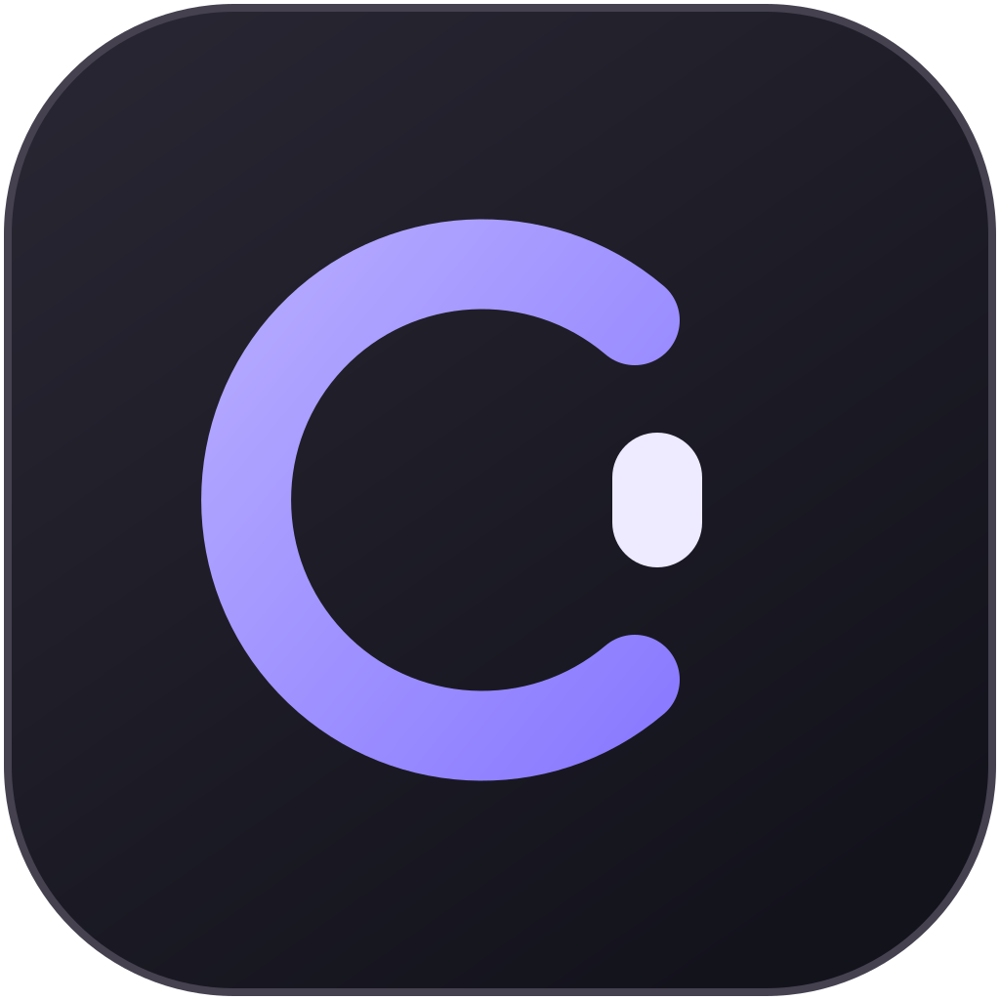

  

<h1 align="center">Conn</h1>

<strong>Keep your agent. Share your terminal.</strong>

English · <a href="README.ko.md">한국어</a>

Conn connects your AI agent to a terminal you can both use. Keep the conversation in your agent client, follow its work in the shared shell, and step in by typing. Ask it to read the screen again and continue from your changes.

## Download

**Install the desktop app — no Rust or Node.js required.** It includes the Conn CLI used to connect your agent.

| Platform | Download v0.5.0 preview |
|---|---|
| macOS · Apple Silicon | [Download for Apple Silicon](https://github.com/eggplantiny/conn/releases/download/v0.5.0/conn-v0.5.0-aarch64-apple-darwin-desktop.dmg) |
| Windows · x64 | [Download Windows installer](https://github.com/eggplantiny/conn/releases/download/v0.5.0/conn-v0.5.0-x86_64-pc-windows-msvc-setup.exe) |
| Ubuntu · x64 | [Download .deb](https://github.com/eggplantiny/conn/releases/download/v0.5.0/conn-v0.5.0-x86_64-unknown-linux-gnu-desktop.deb) · [AppImage](https://github.com/eggplantiny/conn/releases/download/v0.5.0/conn-v0.5.0-x86_64-unknown-linux-gnu-desktop.AppImage) |

[All downloads and checksums](https://github.com/eggplantiny/conn/releases/tag/v0.5.0) · [Installation help](docs/getting-started.md) · [Platform support](docs/platform-support.md)

New releases target Apple Silicon, Windows x64 and Linux x64. Intel Mac distribution is paused; existing Intel downloads remain in [past releases](https://github.com/eggplantiny/conn/releases).

Windows preview installers are unsigned and may show an unknown-publisher warning. Linux packages are built on Ubuntu 24.04. See the release notes for signing and tested platform details.

## See it work

https://github.com/user-attachments/assets/c20ec712-1915-44c2-a6a2-08b83e6951c4

An agent fixes a failing test. You add an edge case. It reads the updated terminal and completes the fix.

[한국어 영상](https://github.com/user-attachments/assets/4f06180c-6a2c-4c10-99e1-7941db86470b) · [Recording details](docs/demo.md)

*Actual Codex CLI + Conn. Prepared demo project, automated user-role input, and shortened waits.*

## Your first collaboration

1. **Open Conn.** Install the app above and choose your shell under **Settings → Profiles**.
2. **Connect your agent.** Open **Settings → Agents**, choose Codex, Claude Code, Cursor or GitHub Copilot, and click **Set up**. Conn registers MCP and its collaboration skill using the bundled CLI. Restart your client and keep Conn open. [Connection guide](docs/agent-integrations.md)
3. **Try one request.** In the top-right controls, select **Autopilot**, enable **Ask before granting**, and set **Grace** to 2 seconds. Ask your agent:

   > Use Conn to read the current screen, then request control to show the current directory. Include the exact command. Do not change files. Stop if I deny the request or take control back.

Review the request and allow or deny it. Type into Conn to take control yourself. When you are done, ask the agent to read the current screen and continue. **Timeline** keeps commands and control changes together, including the original requests.

Taking control stops further agent input; it does not cancel a command already running.

## Use the tools you already have

Conn is a desktop app or a session inside your existing terminal. Agents connect through **MCP or CLI**; Conn does not run a model. The demo uses Codex CLI. Other local clients supporting MCP stdio can use the copied server configuration.

For CLI-only use, download a `-cli` archive from the release, put `conn` on your `PATH`, and run `conn` in your terminal. [CLI setup and source builds](docs/getting-started.md)

## Explore

| Task | Guide |
|---|---|
| Install, connect, and troubleshoot | [Getting started](docs/getting-started.md) |
| Local shells, WSL, SSH, or Docker | [Backends and profiles](docs/backends.md) |
| Approval and execution rules | [Policy](docs/policy.md) |
| Build from source or contribute | [Contributing](CONTRIBUTING.md) |
| Agent and frontend integration | [Protocol](docs/protocol.md) · [Architecture](docs/architecture.md) |

**Preview software · MIT licensed.** Commands run with your account's permissions. Conn's approval controls are not an operating-system sandbox. See the [trust model](docs/security.md) and [security reporting policy](SECURITY.md).
