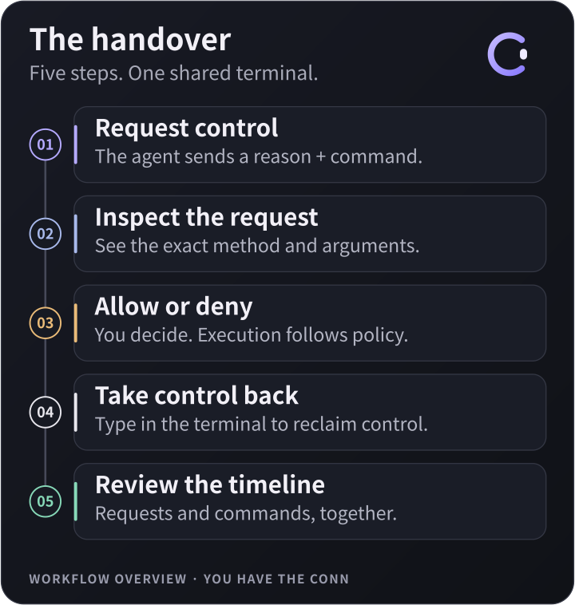

<p align="center">
  
</p>

<h1 align="center">Conn</h1>
<p align="center"><strong>One terminal. You and your agent. You have the conn.</strong></p>
<p align="center">English · <a href="README.ko.md">한국어</a></p>
<p align="center">
  <a href="https://github.com/eggplantiny/conn/actions/workflows/ci.yml"></a>
</p>
<p align="center">
  <a href="docs/getting-started.md">Get started</a> ·
  <a href="https://github.com/eggplantiny/conn/releases">Releases</a> ·
  <a href="CONTRIBUTING.md">Contribute</a> ·
  <a href="LICENSE">MIT license</a>
</p>

Conn lets you and an AI agent work in **the same live shell**. Watch its commands appear, inspect a request before allowing it, and take back control by typing. Your commands and the agent's actions stay together in one timeline.

It runs as a **desktop terminal** or inside your existing terminal, and connects to agents through **MCP or a CLI**. Bring your own agent; Conn does not run a model.

> **v0.3.0 preview.** Linux development flows have been exercised locally. macOS and Windows have implementation and CI build targets; native behavior and installers still need platform validation. Release downloads become available after a successful release build and maintainer publication. macOS builds use ad-hoc signing without notarization; Windows installers are not certificate-signed.

## The moment Conn is for

You're investigating a project with an agent. It reads a file in your terminal, proposes an edit, then asks to remove something. You inspect the **exact requested command**, deny it, and keep working. Later, the timeline tells you what was requested, what was blocked by policy, and what actually reached the shell.

<p align="center">
  
</p>

## What you get

- **Human-first control.** Human terminal input revokes the agent's lease before that input reaches the shell. Use the separate take-control action when you want to reclaim control without typing.
- **Review at the right moment.** Choose observation, human-accepted proposals, or agent execution governed by policy. Control approval and command approval are separate decisions.
- **A timeline for both of you.** Commands, requests, approvals, denials, policy blocks, and handovers share one view. Expand a request to inspect its original method and arguments, including the planned command when supplied.
- **Motion with meaning.** The open-C icon responds to control, pending requests, execution grace, pauses, policy blocks, and disconnection. It also opens the app menu. Reduced-motion preferences are respected.
- **Your environments, in settings.** Profiles cover local shells, WSL, SSH, and Docker. Configure them once and choose the default for new tabs.
- **English and Korean.** Switch under Settings → Appearance → Language. The same Svelte UI runs in the desktop and the local browser test harness.

## Try it

### Build from source

Install Rust using rustup, Node.js 24, and the [Tauri prerequisites](https://v2.tauri.app/start/prerequisites/) for your operating system. The repository pins its Rust toolchain.

```sh
git clone https://github.com/eggplantiny/conn.git
cd conn
cargo install --path crates/cli --locked
cd frontends/tauri
npm ci
npm run tauri dev
```

The desktop wrapper builds the matching CLI sidecar automatically. For a CLI-only session, install the CLI with the command above and run `conn` in an existing terminal; Node.js and Tauri are not needed for that path.

### Connect an agent

With a Conn session open, register an MCP **stdio server** with your agent client:

```json
{
  "mcpServers": {
    "conn": {
      "command": "conn",
      "args": ["mcp"]
    }
  }
}
```

This is the common JSON configuration shape; your client may use a different file or format. Use an absolute executable path if its environment cannot find `conn`. See the [agent setup guide](docs/getting-started.md#connect-your-agent) and [plugin instructions](plugin/README.md).

Then ask your agent:

> Use Conn for all shell work. Read the current screen, request control with a reason and the exact planned command, then show me the current directory. Stop if I deny the request or take control back.

Without MCP, try this from **a second terminal** while Conn is open:

```sh
conn agent --agent-id demo run "pwd" --reason "Show the current directory without changing files"
```

That example targets a POSIX shell or PowerShell; use `cd` instead of `pwd` for cmd.exe. The request follows the active tab's mode and policy. **`executed` means input reached the shell, not that a command succeeded or finished.** Read the result before continuing.

## Choose how to collaborate

| Mode | Agent behavior | Your role |
|---|---|---|
| **Observe** | Reads the visible terminal | Run the commands yourself |
| **Co-pilot** | Proposes a command as ghost text | Enter accepts; Esc rejects |
| **Autopilot** | Types and runs commands within policy | Review flagged actions; reclaim control whenever needed |

The top-right control indicator opens the current tab's controls. Settings holds profiles, agent tools, policy, pacing, and appearance. Enable **Ask before granting** to review every control request, and add **execution grace** for time to cancel before a command runs.

When you switch tabs, the agent cannot read or write an unattended tab unless you explicitly entrust it. Entrusted work remains capped by policy. A new agent-created tab does not switch your view.

## Downloads and platform status

The [release workflow](docs/releasing.md) targets these packages:

| Platform | Desktop | CLI |
|---|---|---|
| Linux x86-64 | `.deb`, `.AppImage` | `.tar.gz` |
| macOS Apple Silicon | `.dmg` | `.tar.gz` |
| macOS Intel | `.dmg` | `.tar.gz` |
| Windows x86-64 | NSIS `.exe` installer | `.zip` |

Use the artifacts actually attached to a release and read its known limitations. A successful build alone is not a native runtime test. [Verification notes](docs/backend-verification.md) track the earlier local evidence and remaining checks.

## Boundaries worth understanding

Conn is a collaboration and mistake-prevention layer, **not a security sandbox**. Policy analyzes agent command input; it cannot prove the behavior of arbitrary shell scripts. Other tools can bypass Conn, and the audit only covers actions routed through it.

The agent can receive the current screen through MCP. Audit records can contain commands, reasons, and original request arguments; keep secrets out of them. Conn has no model API or telemetry, but your agent client and configured SSH/Docker clients may communicate over the network. Sessions end with their frontend; detach/reattach is not implemented.

[Trust model](docs/security.md) · [Report a vulnerability](SECURITY.md) · [Policy reference](docs/policy.md)

## Explore and contribute

| I want to… | Start here |
|---|---|
| Run the first collaboration scenario | [Getting started](docs/getting-started.md) |
| Configure shells and remote environments | [Backends and profiles](docs/backends.md) |
| Integrate another agent or frontend | [Protocol](docs/protocol.md) · [Architecture](docs/architecture.md) |
| Test the shared UI in a browser | [Browser testing](docs/browser-testing.md) |
| Improve Conn | [Contributing](CONTRIBUTING.md) |
| Build and publish a version | [Release guide](docs/releasing.md) |

Useful early contributions include native macOS/Windows testing, reproducible shell compatibility reports, accessible UI improvements, and clearer English/Korean copy. [Open an issue](https://github.com/eggplantiny/conn/issues/new/choose) with your environment and a minimal scenario.

If this is how you want to work with an agent, **star the repository** and share a workflow you'd like to try.

*“You have the conn” hands over the controls. Typing takes them back.*
