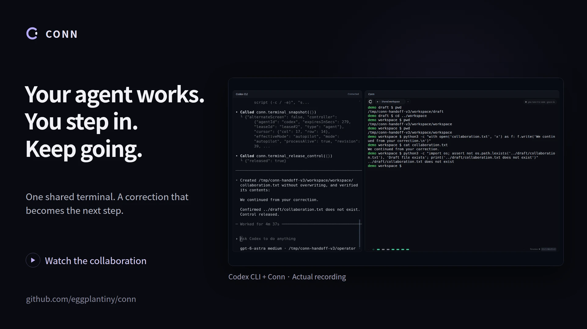

  

<h1 align="center">Conn</h1>

<strong>Keep your agent. Share your terminal.</strong>

English · <a href="README.ko.md">한국어</a>

Work in the same shell as your AI agent. Step in, make a correction, and ask it to continue from what you changed.

## Download

**Install the desktop app.** No Rust or Node.js required; the agent connector is included.

| Platform | v0.7.0 preview |
|---|---|
| macOS · Apple Silicon | [Download for Mac](https://github.com/eggplantiny/conn/releases/download/v0.7.0/conn-v0.7.0-aarch64-apple-darwin-desktop.dmg) |
| Windows · x64 | [Download installer](https://github.com/eggplantiny/conn/releases/download/v0.7.0/conn-v0.7.0-x86_64-pc-windows-msvc-setup.exe) |
| Ubuntu · x64 | [Download .deb](https://github.com/eggplantiny/conn/releases/download/v0.7.0/conn-v0.7.0-x86_64-unknown-linux-gnu-desktop.deb) · [AppImage](https://github.com/eggplantiny/conn/releases/download/v0.7.0/conn-v0.7.0-x86_64-unknown-linux-gnu-desktop.AppImage) |

Mac downloads are signed and notarized. Windows previews are unsigned. Linux builds use Ubuntu 24.04; Intel Mac distribution is paused. [Installation and updates](docs/getting-started.md) · [All assets and checksums](https://github.com/eggplantiny/conn/releases/tag/v0.7.0)

## A small correction, without starting over

The agent prepares work in one folder. You want it somewhere else. Type in Conn to take control, change the directory, then tell your agent:

> I changed the directory. Read the terminal and continue from here.

It reads the changed screen and resumes in the corrected location. The conversation stays in your agent client; the terminal is the workspace you share.

[Watch in English](docs/assets/conn-handoff-en.mp4) · [한국어 영상](docs/assets/conn-handoff-ko.mp4) · [Recording details](docs/demo.md)

*Real Codex + Conn; a prepared recreation of a collaboration session. The user role is automated, and waiting time is edited.*

## Try it yourself

1. **Open Conn.** Choose your shell under **Settings → Profiles**.
2. **Connect your agent.** In **Settings → Agents**, select your client and choose **Set up**. Restart the client and keep Conn open. [Connection guide](docs/agent-integrations.md)
3. **Make one correction together.** Follow the [first collaboration](docs/first-collaboration.md): a disposable local folder, one file, and a handoff. No SSH server required.

The setup supports **Codex, Claude Code, Cursor, and GitHub Copilot**. For Codex, use the desktop app, CLI, or IDE extension with a local task. Conn connects through MCP or CLI and does not run a model. Your existing client and model account still apply. This is not a ChatGPT app integration; web/cloud tasks cannot use this local connection.

## When you step in

Typing takes control back before further agent input reaches the shell. It **does not stop an already running process**; normal terminal controls still apply. Ask the agent to read the current screen before continuing.

The timeline brings commands and collaboration decisions together, including denied requests and their original details. Local Bash/Zsh integration records executed shell commands, not raw typing or input inside applications.

## More

- [The story: a small correction in a shared terminal](docs/collaboration-story.md)
- [FAQ: control, SSH, passwords, and history](docs/faq.md)
- [Profiles and backends](docs/backends.md) · [CLI setup](docs/getting-started.md)
- [Another collaboration: fixing a test after you add an edge case](https://github.com/user-attachments/assets/c20ec712-1915-44c2-a6a2-08b83e6951c4)
- [Contribute](CONTRIBUTING.md) · [Report a problem](https://github.com/eggplantiny/conn/issues/new/choose)

**Preview · MIT licensed.** Commands use your account's permissions; Conn is not an OS sandbox. [Trust model](docs/security.md) · [Report a security issue](SECURITY.md)

Useful for your workflow? **Star Conn** to help others discover it. We'd especially like to hear when you wanted to take the keyboard back.

## Sharing and extensions

v0.7.0 adds sharing within the same running shell, themes and opt-in native command
suggestions. Upgrade the app and restart its MCP clients together.
See the [product contract](docs/PRD.md) and [extensions](docs/extensions.md).
