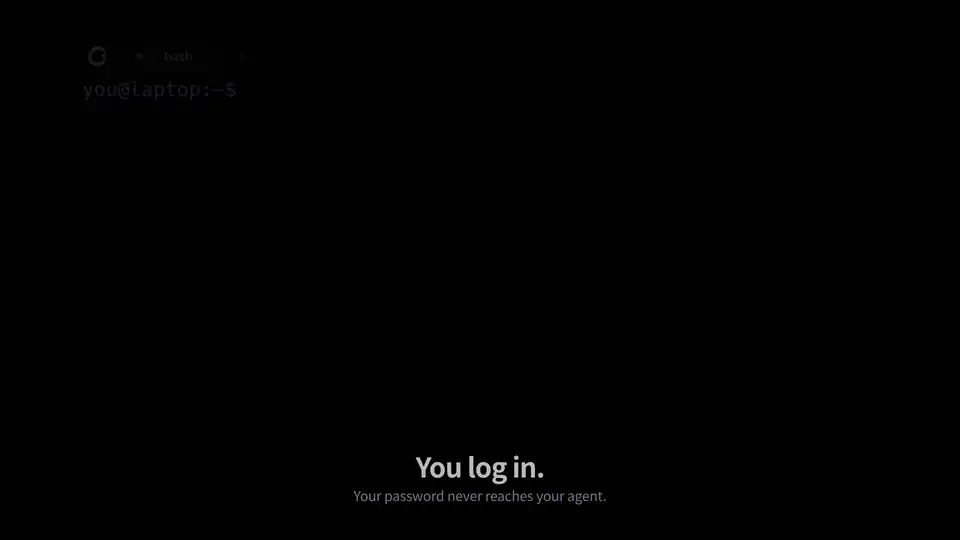

<p align="center">
  
</p>

<h1 align="center">Conn</h1>
<p align="center"><strong>Your agent works in your terminal. You keep the keyboard.</strong></p>
<p align="center"><a href="https://conn.eggp.dev">conn.eggp.dev</a> · <a href="https://conn.eggp.dev/docs/getting-started/">Docs</a> · English · <a href="README.ko.md">한국어</a></p>

Conn is a terminal you share with the AI agent you already use. The agent picks up the shell **you** are in: the server you logged into, the environment you activated, the directory you chose. You watch every command as it runs, approve the risky ones, and take over by typing.

- **It starts where you are.** Open the SSH session, container or virtualenv yourself, then let the agent continue in that live shell. A password typed at a hidden prompt never reaches it.
- **Nothing runs behind your back.** Every command the agent submits carries a one-line reason. By default `rm`, `sudo`, `git push --force`, `kubectl delete` and file overwrites wait for your approval, and one approval covers one action. Inside an SSH session, or any program Conn cannot inspect, **every** agent command waits for your review.
- **Type to take over.** Any keystroke takes control back before the agent's next input reaches the shell. Fix what is wrong, then tell it to read the screen and continue.
- **Your agent, your model.** Works with **Codex, Claude Code, Cursor and GitHub Copilot** over MCP. Conn runs no model and needs no extra subscription.

[](https://conn.eggp.dev/#film)

*You log in to your server. Your agent asks to delete the whole cache. You say no, type the fix yourself, and it finishes the job.* [Watch the full film](https://conn.eggp.dev/#film) ([file](docs/assets/conn-remote-en.mp4)) · [한국어 영상](https://conn.eggp.dev/ko/#film) · [One continuous take: how it was recorded](media/demo/RECORDING-REMOTE.md)

## Install

```sh
# macOS (Apple Silicon)
brew install --cask eggp-dev/tap/conn

# Linux (x86_64): AppImage for your user, checksum verified, no sudo
curl -fsSL https://conn.eggp.dev/install.sh | sh
```

No Rust or Node.js required; the agent connector is included. Both install the same signed release files as the downloads below, and the app updates itself afterwards. Windows: use the installer.

| Platform | v0.8.6 preview |
|---|---|
| macOS · Apple Silicon | [Download for Mac](https://github.com/eggp-dev/conn/releases/download/v0.8.6/conn-v0.8.6-aarch64-apple-darwin-desktop.dmg) |
| Windows · x64 | [Download installer](https://github.com/eggp-dev/conn/releases/download/v0.8.6/conn-v0.8.6-x86_64-pc-windows-msvc-setup.exe) |
| Ubuntu · x64 | [Download .deb](https://github.com/eggp-dev/conn/releases/download/v0.8.6/conn-v0.8.6-x86_64-unknown-linux-gnu-desktop.deb) · [AppImage](https://github.com/eggp-dev/conn/releases/download/v0.8.6/conn-v0.8.6-x86_64-unknown-linux-gnu-desktop.AppImage) |

Mac downloads are signed and notarized. Windows previews are unsigned. Linux builds use Ubuntu 24.04, and the AppImage updates in-app while the `.deb` updates by installing a new package; Intel Mac distribution is paused. [Installation and updates](docs/getting-started.md) · [All assets and checksums](https://github.com/eggp-dev/conn/releases/tag/v0.8.6)

## First five minutes

1. **Open Conn** and pick your shell under **Settings → Profiles**.
2. **Connect your agent.** In **Settings → Agents**, choose your client and press **Set up**, then restart the client. The first time it connects, Conn shows **wants to join**: press **Allow**. [Connection guide](docs/agent-integrations.md)
3. **Work in the terminal as usual**, then ask your agent: *"Look at my Conn terminal and continue from there."*
4. **Interrupt it once.** Type while it holds control and watch it hand the keyboard back. The [first collaboration](docs/first-collaboration.md) walks through this with a disposable folder; no server needed.

For Codex, use the desktop app, CLI or IDE extension with a local task. The conversation stays in your agent client; the terminal is the workspace you share.

## You stay in charge

| | |
|---|---|
| **Three modes** | **Observe**: the agent only reads. **Co-pilot**: it proposes a line and you press Enter. **Autopilot**: it runs commands and the policy asks when it matters. |
| **Approvals** | Deny and confirm rules in a plain YAML policy. A dangerous command chained to others is refused and must be sent alone. On a remote host or inside another program, each command is reviewed one at a time. |
| **Ask before joining** | A new agent connection learns nothing about your sessions until you press Allow. |
| **One tab at a time** | An agent holds control in a single tab, stays in the session it was given, and never follows your view. |
| **A record of what happened** | The timeline keeps commands, handoffs, approvals and refusals together, with the agent's stated reasons. |
| **Private sessions** | Sessions started by an external launcher stay invisible to agents until you share them. |

Typing **does not stop a process that is already running**; normal terminal controls such as Ctrl-C still apply. Conn is **not an operating-system sandbox**: commands run with your account's permissions. Agents connect over a local socket, and Conn opens no network port. [Trust model](docs/security.md) · [Policy](docs/policy.md)

## Another session: you add a test, the agent fixes it

https://github.com/user-attachments/assets/c20ec712-1915-44c2-a6a2-08b83e6951c4

The agent fixes a failing test. You take the keyboard, add an edge case that fails, and ask it to continue from the terminal. 62 seconds. [About this recording](docs/demo-test-repair.md)

## More

- [Changelog](CHANGELOG.md) · [Product contract](docs/PRD.md) · [Extensions](docs/extensions.md). After an update, restart your MCP clients too.
- [Earlier film: the agent starts in the wrong folder, you correct it](docs/demo.md)
- [The story: a small correction in a shared terminal](docs/collaboration-story.md)
- [FAQ: control, SSH, passwords, and history](docs/faq.md)
- [Profiles and backends](docs/backends.md) · [CLI setup](docs/getting-started.md) · [External automation](docs/external-automation.md)
- [Contribute](CONTRIBUTING.md) · [Report a problem](https://github.com/eggp-dev/conn/issues/new/choose) · [Report a security issue](SECURITY.md)

**Preview · MIT licensed.**

If you have ever wanted to grab the keyboard back from an agent, **star Conn** so others can find it, and tell us about that moment in an issue.
