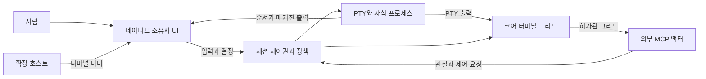

# 구조

**공유 세션 화면 · v0.8.0 프리뷰.** [제품 계약](PRD.ko.md) · [English](architecture.md)

코어의 세션이 PTY·프로세스·정책·제어권·공유 권한과 현재 터미널 화면을 소유합니다.
셸 출력은 코어의 터미널 모델과 UI 렌더러로 전달합니다. 에이전트 스냅샷은 이 코어 화면을
사용하며, UI에서 화면을 역전송하거나 포커스로 권한을 판단하지 않습니다.

## 경계와 소유자

- `conn-core::Engine`이 PTY와 수명을 관리합니다. 세션은 제어권, 모드, 정책, 제안, 유예,
  공유 전환을 하나의 잠금 아래에서 순서대로 처리합니다.
- 네이티브 소유자는 PTY 읽기가 시작되기 전에 순서가 매겨진 출력 콜백을 등록합니다.
  출력 버퍼링이 시작 화면의 렌더링을 보존하며, 콜백은 세션을 다시 잠그지 않습니다.
- Tauri와, 토큰·Origin으로 보호되는 브라우저 하네스는 같은 `conn-frontend::Harness`를 씁니다.
  각 명령에는 어댑터가 확인한 소유 창이 붙으며, 공개 호출자가 주장하는 창 신원은 쓰지 않습니다.
- Svelte/xterm 렌더러는 출력을 보여 줄 뿐 관찰을 허가하지 않습니다. 코어 스냅샷에는
  스크롤백과 숨겨진 셀이 들어가지 않습니다.
- 공개 IPC는 에이전트용 끝점입니다. MCP는 권한을 결정하지 않고, 코어가 요청마다 확인합니다.
  네이티브 소유자 경로는 IPC로 접근할 수 없습니다.

## 협업 서비스 분리 (미배포)

`ConnectionRegistry`는 앱 연결 승인과 살아 있는 연결 ID를, `Hub`는 여러 세션의 제어권을
조율합니다. `Session`은 기존 잠금 안에서 참여 상태와 대기 작업 취소를 관리합니다. 프로토콜
해석과 에이전트 작업은 별도 모듈입니다. 소유자 공유 서비스는 외부 입력 전달을 막아 둔 뒤
입력·선택 revision·기록 준비가 성공해야 전환을 확정합니다.

UI의 앱 연결 계약과 세션 이벤트 계약은 분리됩니다. 공통 상태 갱신기가 이벤트와 스냅샷을
적용하고, 카드·키보드·팔레트는 명시적 세션·요청 ID를 가진 공통 결정 동작을 사용합니다.
[책임 배치·잠금 순서·검증](collaboration-refactor-results.ko.md)을 참고하세요.

## 화면의 식별과 최신성

그리드 revision은 `surfaceId`, `generation`, `revision`, `outputSeq`, 크기, 보이는 텍스트,
없을 수도 있는 커서, 대체 화면 상태를 식별합니다. 코어는 크기가 제한된 터미널 모델로 PTY 출력을
해석합니다. 일반 화면은 소프트 랩과 화면 위치를 유지하기 위해 소유자 터미널과 같은 최대 5,000행의
내부 기록을 크기 변경에 사용합니다. 스냅샷은 현재 그리드의 텍스트만 담으며 기록 조회 기능은 없습니다.
대체 화면은 줄을 재배치하지 않고 크기만 바꾸며, 커서가 있는 논리적 줄은 실행 중인 프로그램이 다시 그립니다.

공유 변경은 generation을 올리고, 출력·커서·크기 변화는 화면 revision을 갱신합니다.
창의 전경 여부, 하트비트, 소유자 렌더러의 화면 게시는 권한 판단에 관여하지 않습니다.

현재 화면은 셸 출력만으로 구성하며 스크롤백·원시 입력·환경변수·메모리를 제공하지 않습니다.
숨김 문자와, 전경색과 배경색이 명시적으로 같은 글자는 관찰에서 제거합니다. 픽셀 스크린샷이나
테마 효과는 이 계약에 포함하지 않습니다. 비밀 입력에는 무표시 입력을 사용합니다.

## 전환

| 전환 | 반드시 일어나는 일 |
| --- | --- |
| 사람 입력 | 충돌하는 제어권을 회수하고, 낡은 제안을 취소하고, 사람 입력을 전달 |
| 공유 시작 | 외부 입력 주체와 큐를 종료하고, 실제 연결을 선택하고, 이전 화면을 무효화. 제어권은 사람에게 남음 |
| 공유 중단 | 에이전트 작업과 관찰을 취소하고 화면을 무효화. PTY와 프로세스는 유지 |
| 숨김·포커스 잃음·가림·탭 이동 | UI 상태만 바뀜. 공유 세션 접근과 제어권은 그대로 |
| PTY 출력 | 크기가 제한된 코어 터미널 그리드와 revision을 갱신 |
| 연결 종료 | 연결 신원을 제거하고 그 연결의 제어권을 회수. 이름으로 선택을 넘겨주지 않음 |
| 창 닫기 | 그 창이 소유한 작업, 입력 주체, 세션을 취소 |

출처와 참여는 서로 독립적입니다. 외부에서 시작한 세션에는 시작 활동 기록도 실행 훅도 없습니다.
공유를 켜면 같은 세션 ID 아래에서 새 협업 기록이 시작될 수 있지만, 이전의 비공유 활동을
되살려 기록하지는 않습니다.

## 확장 호스트

타입이 있는 매니페스트 레지스트리가 API 호환성, 선언된 권한, 검토된 구현의 선택을 담당합니다.
매니페스트에는 테마·제공자·자동완성 종류가 있지만 구현된 것은 테마뿐이고, 다른 종류의
매니페스트는 거절합니다. 테마는 크기가 제한된 데이터입니다. 임의 코드와 전역 이벤트 버스는
확장 계약이 아닙니다. 선택한 테마와 설치한 테마는 `extensions.json`에 저장합니다.
확장 호스트는 PTY나 소유자 경로를 받지 않습니다.

[확장 계약](extensions.ko.md), [프로토콜](protocol.md), [신뢰 모델](security.md)을 참고하세요.
