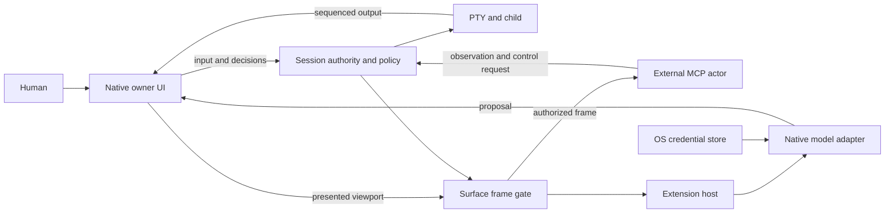

# Architecture

**Shared-surface hard cut · unreleased.** [Product contract](PRD.md) · [한국어](architecture.ko.md)

## Ports and owners

- `conn-core::Engine` manages the PTY and lifetime. Session serializes authority,
  mode, policy, proposals, grace and sharing transitions under one lock.
- The native owner supplies a sequenced output callback before PTY reading begins.
  Output buffering preserves startup rendering; callbacks never relock Session.
- Tauri and the token/Origin-protected browser harness use `conn-frontend::Harness`.
  Each command carries the adapter-established owning window, never a public
  caller's claimed window identity.
- The Svelte/xterm renderer publishes the actual DOM viewport after rendering.
  Offscreen scrollback and hidden cell data are not a second observation channel.
- Public IPC is an agent endpoint. MCP does not decide permission; core checks it
  for every request. The native owner bridge is not available through IPC.

## Frame identity and freshness

A frame identifies `surfaceId`, `generation`, `revision`, `outputSeq`, terminal
size, visible lines, nullable cursor and alternate-screen state. A raster image is
optional and explicitly unavailable when the renderer cannot capture it. Text must
come from presented cells, never from the private terminal buffer as a fallback.

Output is monotonically sequenced. Sharing, attention and explicit invalidation
advance the surface generation. Consumers require a current generation, current
output sequence, visible owner surface and a recent publication. Periodic refresh
keeps an unchanged visible frame alive; it does not authorize stale output.

No frame provider means no agent observation. Internal VT parsing remains only
where command-policy tracking requires it. It is never a replacement observation.

## Transitions

| Transition | Required effects |
| --- | --- |
| Human input | Revoke conflicting authority; cancel stale proposals; deliver human input |
| Start sharing | End external writer and queue; select actual connections; invalidate old frame; human retains control |
| Stop sharing | Cancel agent work/observations; invalidate frame; keep PTY/process |
| Hide/blur/cover | Invalidate observation; pause agent execution; cancel completion jobs. Existing human decisions require a fresh frame to continue |
| New visible frame | Validate owner/generation/sequence; replace bounded frame |
| Disconnect | Remove connection identity; revoke its authority; never transfer selection by name |
| Close | Cancel jobs, writer and sessions owned by that window |

Origin and participation are independent. An external-origin session has no
startup activity audit or execution hooks. Sharing can start new collaboration
history under the same session ID; it never reconstructs prior private activity.

## Extension host

A typed manifest registry owns API compatibility, declared capabilities and
reviewed implementation selection. The first extension kinds are theme, provider
and completion. Themes are bounded data; arbitrary code and global event buses are
not extension contracts.

Native mediation constructs visible context from the core frame while its
cancellation is registered in the same session transaction. Workers obtain a key
from the OS store and make bounded, cancellable requests. Results carry the session,
surface, generation and frame identity. Acceptance checks them again and uses the
normal human-input path, without Enter. Theme and provider configuration persist;
keys, private frames and completion jobs do not enter configuration files.

See [extension contract](extensions.md), [protocol](protocol.md) and [trust model](security.md).
