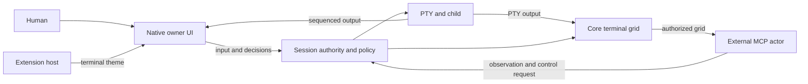

# Architecture

**Shared session screen · v0.8.0 preview.** [Product contract](PRD.md) · [한국어](architecture.ko.md)

## Ports and owners

- `conn-core::Engine` manages the PTY and lifetime. Session serializes authority,
  mode, policy, proposals, grace and sharing transitions under one lock.
- The native owner supplies a sequenced output callback before PTY reading begins.
  Output buffering preserves startup rendering; callbacks never relock Session.
- Tauri and the token/Origin-protected browser harness use `conn-frontend::Harness`.
  Each command carries the adapter-established owning window, never a public
  caller's claimed window identity.
- The Svelte/xterm renderer displays output; it does not authorize observation.
  Core snapshots exclude scrollback and suppressed cells.
- Public IPC is an agent endpoint. MCP does not decide permission; core checks it
  for every request. The native owner bridge is not available through IPC.

## Collaboration services (unreleased)

`ConnectionRegistry` owns app admission and live IDs; `Hub` coordinates authority across sessions.
`Session` owns participation and pending-work cleanup under its existing lock. Protocol parsing and
agent operations are separate modules. The owner sharing service fences external delivery and commits
only after input, selection revision and history preflight succeed.

The UI has separate app-admission and session-event contracts. Shared reducers reconcile snapshots
and events; decision actions supply explicit session/request IDs to reusable cards, keyboard and
palette commands. See [ownership, lock order and validation](collaboration-refactor-results.md).

## Frame identity and freshness

A grid revision identifies `surfaceId`, `generation`, `revision`, `outputSeq`,
size, visible text, nullable cursor and alternate-screen state. The core parses PTY
output with a bounded terminal model. Normal-buffer resize uses up to 5,000 internal
history rows, matching the owner's terminal, to preserve soft wraps and viewport position.
Snapshots remain text-only projections of the current grid; there is no history query.
Alternate screens resize without reflow, and the application redraws the cursor's logical line.

Sharing changes advance the generation; output, cursor and resize changes update the
screen revision. No foreground,
heartbeat or owner-renderer publication participates in authorization.

## Transitions

| Transition | Required effects |
| --- | --- |
| Human input | Revoke conflicting authority; cancel stale proposals; deliver human input |
| Start sharing | End external writer and queue; select actual connections; invalidate old frame; human retains control |
| Stop sharing | Cancel agent work/observations; invalidate frame; keep PTY/process |
| Hide/blur/cover/tab switch | UI state only; shared-session access and leases remain unchanged |
| PTY output | Update bounded core terminal grid and revision |
| Disconnect | Remove connection identity; revoke its authority; never transfer selection by name |
| Close | Cancel jobs, writer and sessions owned by that window |

Origin and participation are independent. An external-origin session has no
startup activity audit or execution hooks. Sharing can start new collaboration
history under the same session ID; it never reconstructs prior private activity.

## Extension host

A typed manifest registry owns API compatibility, declared capabilities and
reviewed implementation selection. The manifest names theme, provider and completion
kinds; only themes are implemented, and a manifest of another kind is rejected.
Themes are bounded data; arbitrary code and global event buses are not extension
contracts. The selected theme and installed themes persist in `extensions.json`.

See [extension contract](extensions.md), [protocol](protocol.md) and [trust model](security.md).
