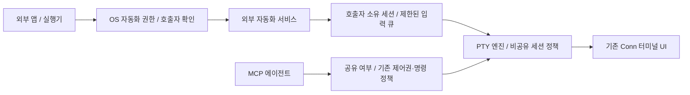

# 작업 기록을 남기지 않는 외부 자동화 설계

**과거 설계 기록입니다.** 영구 비공유와 향후 공유 설계는 2026-09-17의
[공유 화면 계약](PRD.ko.md), [아키텍처](architecture.ko.md), [자동화 사용법](external-automation.ko.md)으로
대체되었습니다. 아래 날짜별 검증 기록은 그대로 보존합니다.

[English](automation-design.md) · [미배포 구현 사용법](external-automation.ko.md)

**로컬 구현 완료 · macOS 실기 검증 대기 · 2026-09-16.** 기준은 v0.5.1,
커밋 `b3fba46fe14f456d7032d44c50ffe3e09d89d88f`입니다.
직접 실행, 비공유 세션, 외부 입력 회수와 UI 변경을 이 체크아웃에 구현했습니다.
Linux에서 실제 PTY·IPC·프런트엔드 테스트를 통과했습니다. 실제 Apple Events,
OS 동의와 서명된 macOS 앱은 별도 실기 검증이 필요합니다.
**v0.5.1에는 아래 보호 기능이 없으며, 이번 변경은 아직 배포하지 않았습니다.**

## 1. 결정과 범위

외부 앱이 Conn을 열고 프로그램이나 입력을 전달할 수 있도록 합니다.
**AppleScript 작업을 AI 에이전트 활동으로 처리하거나 작업 이력으로 남기지 않습니다.**
기존 창·PTY 엔진·터미널 UI를 사용합니다. 첫 대상은 macOS Apple Silicon이며,
Linux D-Bus 어댑터도 같은 내부 계약을 사용하며, Windows 어댑터는 추후 구현합니다.

암호 저장소, 실제 외부 앱 후킹, 암호 패턴 분석기, 로그인 성공 자동 감지,
별도 웹 터미널, iTerm 전체 객체 모델은 만들지 않습니다.

[iTerm2 공식 문서](https://iterm2.com/documentation-scripting.html)처럼
시작 명령은 프로필의 실행 프로그램을 대체하고, `write text`는 터미널 입력으로
구분합니다. 아래에 정한 범위만 지원하며 완전한 호환을 주장하지 않습니다.

### 필수 조건

1. 자식 프로세스를 시작하기 **전에** 외부·비공유 세션 정책을 적용합니다.
2. AppleScript를 에이전트로 등록하지 않습니다. 제어 승인·제안·명령 승인·Grace를 거치지 않습니다.
3. 자동화 활동·호출자·요청 원문·결과를 감사 로그, 타임라인, 진단, 설정, 크래시 첨부물, 복원 데이터에 저장하지 않습니다.
4. 비공유 세션의 내용을 MCP나 일반 로컬 IPC API로 제공하지 않습니다.
5. 각 작업은 OS에서 확인한 호출자와 그 호출자가 만든 정확한 세션에 귀속됩니다.
6. 사람은 외부 입력을 중단할 수 있습니다. 포커스 변경으로 입력 대상이 바뀌지 않습니다.
7. 실제 AI 에이전트에는 기존 제어권·명령 정책이 계속 적용됩니다.
8. 같은 OS 계정의 다른 도구까지 격리하는 기능이라고 설명하지 않습니다.

## 2. v0.5.1 경로의 변경

| v0.5.1 | 이 체크아웃의 변경 |
| --- | --- |
| `automation.rs`가 에이전트를 등록하고 `request_control/type/send_key` 호출 | 전용 네이티브 자동화 경로와 입력 출처 |
| 셸을 연 뒤 시작 명령을 타이핑 | 새 PTY에서 지정 프로그램 직접 실행 |
| 엔진이 시작 인자와 `exec`를 기록 | 어떤 기록보다 먼저 비공유 실행 정책 적용 |
| 요청 목록에 `Job.text` 보관 | 전달·취소 즉시 원문 해제, 상태 조회에는 최소 메타데이터만 유지 |
| Enter까지의 사용자 입력을 명령으로 기록 | 외부 출처 세션은 공유 후에도 원시 사용자 입력을 기록하지 않음 |
| 입력에서 탭 제목 생성 | 고정 이름 사용, 자동화 원문에서 제목을 만들지 않음 |
| 설정에 최근 자동화 요청 표시 | 허용 설정만 유지하고 최근 활동 목록 제거 |

타임라인에서 숨기거나, 에이전트 이름을 바꾸거나, 기존 `human_input` 경로로
우회하는 것만으로는 충족되지 않습니다. 다른 기록 경로가 남기 때문입니다.

## 3. 구조



내부 책임을 다음처럼 분리합니다. 새 네트워크 API를 만드는 것이 아닙니다.

- `SessionOrigin`: 일반 세션 / 외부 자동화. 생성 후 출처를 바꾸지 않습니다.
- `Sharing`: 비공유 / 전환 중 / 공유. AI 접근 여부를 담당합니다.
- `InputSource`: 사람 / 호출자에 귀속된 외부 입력 / 임대받은 에이전트 입력.
  외부 입력을 사람 입력으로 위장하지 않습니다.
- `LaunchSpec`: 프로필 기본값 또는 실행 파일과 인자 목록.
- `PrivatePayload`: 일반 디버그 출력·직렬화를 제공하지 않는 일시적 원문 버퍼.
  네이티브 해석과 PTY 전달 지점에서만 명시적으로 꺼내 사용합니다.
- 소유권 핸들: 호출자 프로세스 식별값, 앱 실행별 난수, 세션 ID와 세대 번호를 결합합니다.
  영구적인 원래 외부 앱 인증정보나 MCP 토큰으로 사용하지 않습니다.

이번 단계는 `Session`의 변경 불가능한 `external_private`와 외부 입력 회수 상태,
엔진의 `LaunchSpec`, 자동화 서비스의 호출자 연결과 일회성 `Payload`로 구현합니다.
공유 전환·세대 카운터·공개 공유 API는 아직 없으며, 아래 공유 자료형과 세대 경계는
후속 단계의 설계입니다.

MCP에 `origin=external`, `skipAudit=true` 같은 우회 옵션을 추가하지 않습니다.
공유 변경은 네이티브 UI의 별도 경로에서만 가능합니다. 이것은 앱 내부 경계이며
같은 OS 사용자가 UI 자동화를 수행하는 것까지 차단하는 보안 격리는 아닙니다.

## 4. 실행 계약

### 새 창과 시작 프로그램

사진의 문법을 유지합니다.

```applescript
tell application "Conn"
    create window with default profile command "/bin/sh -c '__RUN_COMMAND__ ; echo \"Press [Enter] key to exit.\"; read ANSWER;'"
end tell
```

`__RUN_COMMAND__` 치환은 외부 앱이 담당합니다. Conn이 다른 앱을 후킹하거나
인증정보를 가져오지 않습니다.

- 명령이 없으면 허용된 기본 프로필을 비공유 상태로 엽니다.
- 명령이 있으면 macOS용 POSIX 단어 분리기로 실행 파일과 인자를 구성합니다.
  따옴표·이스케이프만 해석하고 변수 확장·명령 치환·와일드카드·암묵적 셸은 실행하지 않습니다.
  잘못된 따옴표나 따옴표 밖 셸 연산자는 원문 없는 오류로 거절합니다.
- 예시는 `/bin/sh`에 `-c`와 내부 스크립트 그대로를 전달합니다.
  스크립트는 기존 프롬프트에 타이핑하지 않으며 뒤에 기본 셸 실행을 붙이지 않습니다.
- 허용된 로컬 프로필의 작업 디렉터리·환경·화면 설정을 사용하되, 실행 파일과 인자만
  해당 세션에서 대체합니다. 일시적 명령을 프로필이나 기본값에 저장하지 않습니다.
- 첫 범위는 **로컬 macOS 프로필의 명령 대체**입니다. SSH·WSL·Docker 프로필에 대한
  대체는 실행 위치를 추측하지 않고 거절합니다. 후속 OS 어댑터는 명시적인 인자 목록을 사용합니다.
- 기존 한 줄·16 KiB 제한을 유지하고 NUL·제어문자를 거절합니다.
  이것은 입력 형식 검사이며 암호 탐지가 아닙니다.
- 창을 만들고 비공유 렌더러가 준비된 뒤 프로세스를 시작합니다. 대기 중 기본 셸을
  중복 생성하지 않으며, 창 준비 실패·종료 후 시작 명령을 백그라운드로 실행하지 않습니다.
- 성공적으로 프로세스를 시작하면 세션 ID를 반환합니다. 로그인·명령 성공을 뜻하지 않습니다.
  응답이 유실된 타임아웃에서는 이미 실행됐을 수 있으므로 자동 재시도하지 않습니다.
- 지정한 프로그램이 끝나면 종료된 터미널 화면을 유지합니다. 사용자가 닫을 때까지
  기본 셸을 새로 시작하거나 명령을 반복하지 않습니다. 예시의 Enter는 `read`를 끝내고,
  이후 `/bin/sh`가 종료될 수 있습니다.

### 텍스트 입력

`write text ... to session ... [newline ...]`은 같은 호출자가 만든 준비된 비공유
세션에만 전달합니다. 한 줄 UTF-8과 선택적인 Return을 지원합니다.
명령 복원·정책 분석·에이전트 등록·Conn 자체의 입력 에코를 추가하지 않습니다.
실행 중인 프로그램이 입력을 화면에 에코하는 것은 여전히 가능합니다.

세션별로 입력을 직렬화합니다. PTY 준비는 암호 프롬프트나 인증 성공의 증거가 아니므로
Conn이 다음 인증정보를 넣을 시점을 추측하지 않습니다.

사람의 입력·제어권 회수·공유 시작·자동화 끄기·프로필 허용 해제·취소·창 종료 시
대기 중 입력을 취소하고 해당 외부 입력 핸들을 폐기합니다. 이미 전달한 바이트는
되돌릴 수 없습니다. 다음 큐 작업보다 사람 입력을 우선 처리하고 큰 입력은 제한된
조각으로 전달해 중단 지연을 줄입니다. AI 입력과 외부 입력을 동시에 허용하지 않습니다.
폐기된 호출자는 기존 탭을 재탈취할 수 없고 새 세션을 만들어야 합니다.

## 5. 권한과 수명

설정 → 자동화의 활성화·허용 프로필 목록을 유지합니다. **프로필 허용은 실행 파일
허용 목록이 아닙니다.** 해당 프로필 설정으로 임의의 시작 프로그램을 실행할 권한임을
설정 설명에서 한 번 안내합니다. 매번 AI 명령 승인 카드를 띄우지 않습니다.
기본값은 비활성화입니다.

macOS 자동화 동의와 OS가 제공하는 호출자 정보를 사용합니다. 앱 이름이나 PID만
신뢰하지 않고 프로세스 수명에 귀속시켜 전달 시점에도 검사합니다.
외부 앱이 `osascript`를 호출한다면 식별 대상은 그 중간 프로세스이지 원래 외부 앱가 아닙니다.
[Apple 자동화 권한 안내](https://support.apple.com/en-euro/guide/mac-help/mchl108e1718/mac).

시작 후 실행기가 종료되어도 사람의 터미널은 유지합니다. 검증할 수 없는 호출자의
대기 중 쓰기는 중단합니다. 창을 닫으면 그 창의 프로세스·큐만 종료합니다.
앱 재시작에서는 허용 설정만 복원하고 프로세스·원문·작업·핸들은 복원하지 않습니다.

## 6. 남기지 않는 정보와 필요한 일시 상태

| 정보 | 처리 |
| --- | --- |
| 명령·입력 원문 | 수신·실행 버퍼에만 존재, 완료·취소 즉시 해제 |
| 호출자·요청 ID | 소유권 검사와 제한된 상태 조회를 위한 메모리 상태만 유지 |
| 결과 | 상태·일반 오류 코드만 반환, 인자·의도·출력·경로·인증정보 제외 |
| 터미널 출력 | 사람의 화면·메모리 스크롤백에 표시, 자동 녹화·내보내기 금지 |
| 비공유 탭 이름 | `외부 세션` 또는 저장된 프로필 표시 이름, 자식의 동적 제목을 IPC·진단에 전달하지 않음 |
| 감사 로그·타임라인 | 비공유 세션과 AppleScript 활동을 기록하지 않음. “자동화 실행됨” 같은 대체 행도 만들지 않음 |
| 이후 공유된 AI 작업 | 새로 발생한 에이전트 작업의 기존 승인·명령 기록만 유지 |

메모리·OS·자식 프로그램까지 포함한 “무보관”을 보장하는 것은 아닙니다.
사람에게 보여줄 출력 버퍼는 필요합니다. 자동 아카이브를 만들지 않고, 비공유 터미널
출력이 클립보드에 자동으로 쓰는 기능을 막습니다. 사람이 직접 복사하는 것은 허용합니다.

기존 스크립트의 상태 조회는 유지합니다. 세션별 대기 쓰기 16개, 살아 있는 외부 소유권
32개, 앱 실행별 요청 ID 256개, 쓰기 대기 포함 120초 제한을 유지합니다.
완료 상태에는 원문을 보관하지 않습니다. 같은 ID의 중복 입력 비교는 실행별 임의 키를
사용한 메모리 HMAC으로 수행하고 호출자·세션·옵션까지 묶습니다. 암호의 일반 해시를
저장하지 않습니다. 실행 중 ID를 버렸다 재사용하지 않고 한도를 넘으면 일반 오류를 반환합니다.

성공·실패·취소·타임아웃 모두에서 원문을 해제합니다. 가능한 버퍼 덮어쓰기는 하되
Cocoa 문자열 복사본·OS 버퍼·크래시 덤프까지 완전 삭제된다고 보장하지 않습니다.

## 7. 비공유 상태와 이후의 AI 협업

비공유 세션은 에이전트 탭 목록에서 제외하고, 명시적인 ID 접근에도 일반적인 사용 불가
오류를 반환합니다. 연결 바인딩, 스냅샷, 상세 상태, 화면·이벤트 구독, 입력, 제목·cwd,
진단·내보내기 경로 모두에 적용합니다. 감사 로그 복원으로 비공유 세션을 재구성하지 않습니다.
출력을 소유 창으로만 보내야 하며 UI에서 숨기는 것만으로 대체할 수 없습니다.

**첫 수정 배포에서는 외부 세션을 비공유로만 제공합니다.** 아래 전환 검증을 통과하기
전에는 공유 버튼을 활성화하지 않습니다. 일반적으로 직접 연 Conn 세션의 협업은 유지합니다.
외부 앱으로 창을 여는 기본 기능을 먼저 완성하고, 검증되지 않은 공유 보호를 약속하지 않습니다.

후속 단계에서 기존 제어 패널에 `에이전트와 공유`를 둡니다. 인증 마법사나 로그인 성공
자동 판정은 만들지 않습니다. 공유 시 로컬 화면 기록이 지워지고 이후 출력이 전달된다는
점을 버튼 주변에 안내합니다. 스크립트나 MCP에서 공유를 켤 수 없습니다.

| 상태 | 외부 입력 | 사람 입력 | AI 접근 | 기록 |
| --- | --- | --- | --- | --- |
| 비공유·외부 소유자 유효 | 허용 | 허용하며 외부 입력권 폐기 | 차단 | 세션 활동 기록 없음 |
| 비공유·사람만 사용 | 폐기됨 | 허용 | 차단 | 세션 활동 기록 없음 |
| 공유 전환 중 | 폐기됨 | 잠깐 직렬화, 명령으로 재생하지 않음 | 차단 | 없음 |
| 공유 | 영구 폐기 | 기존 인간 우선권 적용 | 기존 모드·정책 | 새 AI 작업만 기록, 원시 사람 입력은 제외 |
| 종료 | 거절 | 거절 | 차단 | 자동화 재생 없음 |

전환은 PTY 출력·구독·UI 사이에 직렬화된 경계를 만들어야 합니다.
외부 큐 취소 → 공유 세대 번호 증가 → 이전 이벤트 폐기 → 백엔드 화면·대체 화면·입력
추적기·UI 화면과 스크롤백 초기화 → 소유 UI의 완료 응답 → 새 AI 구독 허용 순서입니다.
**초기화는 로컬에서 수행하고 자식 프로세스에 Ctrl-C·Ctrl-U·`clear`·다시 그리기 키를
보내지 않습니다.** 실패하면 비공유로 남습니다. 이전 스냅샷·제목·파서 조각·큐·기록을
새 AI 화면의 초기값으로 사용하지 않습니다.

전환 도중 사람이 입력하면 공유를 취소하고 그 입력을 비공유 상태에서 한 번만 전달합니다.
입력을 버리거나 공유 후 재생하지 않습니다. 늦게 도착한 UI 응답으로 취소된 세대의 공유를
완료하지 못하게 합니다. 공유한 외부 세션의 실행 환경은 알 수 없는 상태로 취급합니다.
AI 명령에는 명령별 검토를 적용하고 세션 전체 허용은 제공하지 않습니다. 프로필이
로컬이라고 해서 이미 다른 서버에 연결한 자식 프로그램까지 로컬 셸로 추정하지 않습니다.

공유 중지 시 먼저 AI 권한을 회수하고 대기 쓰기를 취소합니다. 이미 에이전트에게
전달된 데이터를 회수하거나 외부 앱 입력권을 부활시키지 않습니다. 재공유도 같은 경계를
거칩니다. 자식이 공유 후 예전 내용을 다시 출력한다면 새 출력으로 관찰될 수 있습니다.
암호가 보이지 않아도 로그인된 원격 권한을 AI에 넘기는 행위임을 분명히 합니다.

## 8. 일반 세션의 암호 입력 문제

일반·비공유 세션 모두에서 사람의 원시 입력 추적을 제거했습니다. 입력은 자식에 전달하지만
명령 이력이나 원문 디버그 추적으로 만들지 않습니다. 내용 없는 입력 중 상태만 보관해
에이전트가 이어 쓰지 못하게 하며 Enter·Ctrl-C·Ctrl-U로 끝냅니다. 이 키 처리는
자식이 실제 셸 프롬프트에 있다는 증거가 아닙니다.

에이전트가 명시적으로 제출한 명령·요청 원문은 검토 기록으로 유지합니다. 사람 명령은
일반 로컬 Bash·Zsh의 [실행 경계 연동](shell-integration.ko.md)으로 복원했습니다.
미지원 셸·인증 입력·편집기 입력을 키 입력으로 추정하여 기록하지 않습니다.
노출 경로와 남은 한계는 [보안 문서](security.md)에 정리했습니다.

`ECHO`가 꺼졌는지만 보는 것은 충분하지 않습니다. raw 모드 앱도 이를 끄며, 외부
SSH·tmux 터미널 상태만으로 내부 암호 입력을 구분할 수 없습니다.
[termios 문서](https://www.man7.org/linux/man-pages/man3/termios.3.html).
프롬프트 문구나 정규식만으로 안전한 입력이라고 판정하지 않습니다.

## 9. 호환성·업그레이드·한계

- 창·세션 생성, 입력, 상태 조회, 반환 명령 이름과 불투명 ID를 유지합니다.
  기존 `intent` 인자는 문법 호환을 위해 받되 사용하지 않고 즉시 버립니다.
- 쓰기 상태는 `queued`, `delivering`, `delivered`, `cancelled`, `failed`로 정리합니다.
  승인·Grace·제안 상태는 없어집니다. 전달 완료는 PTY 쓰기 수락이며 명령 완료가 아닙니다.
- 새 결과에서 `detail.proposed`와 원문 오류를 제거하고 예제를 갱신합니다.
  `release session`은 프로세스를 종료하지 않고 외부 쓰기 권한만 폐기합니다.
  취소는 남은 대기 쓰기도 중단합니다.
- 업그레이드에서는 허용 프로필을 보존하되 자동화를 한 번 다시 켜도록 합니다.
  기존 승인은 명령별 검토를 전제로 했으므로, 새 직접 실행 권한으로 조용히 확대하지 않습니다.
- 과거 감사 로그·타임라인·백업을 자동으로 검색·업로드·삭제하지 않습니다.
  소유자가 직접 관리하는 정리는 별도로 다룹니다. 실제 노출이 있었다면 회사 정책에
  따른 인증정보 폐기·교체가 필요할 수 있습니다.
- 프로세스 인자, 환경변수, 셸 추적·히스토리, 자식 출력, 클립보드, OS 진단, 외부 앱 기록까지
  없어진다는 보장이 아닙니다. 회사의 필수 감사 기능을 끄지 않습니다.
- 같은 OS 사용자의 셸·파일·자동화 도구까지 막는 샌드박스가 아닙니다.
  그 위협까지 다뤄야 한다면 OS 차원의 분리가 필요합니다.

## 10. 구현 순서와 검증

| 단계 | 변경 | 완료 근거 |
| --- | --- | --- |
| A: 실행과 출처 | 직접 실행 명세, 생성 전 비공유 정책, 네이티브 소유권 | 실제 PTY로 인자·한글·따옴표·콜드/웜 시작·종료·정리 검증 |
| B: 기록 제거 | 외부 입력 분리, 에이전트·Grace·로그·원문 보관 제거, 외부 사람 입력 추적 끄기 | 성공·거절·실패·취소 경로의 모든 Conn 관리 기록에서 가짜 비밀정보 부재 |
| C: 접근 경계와 UI | AI 탐색·읽기·쓰기 차단, 소유 창 출력, 최근 활동 제거, 업그레이드 안내, 영·한 UI | 창·호출자 경쟁, 기존 AI의 접근 거절, 다른 세션 영향 없음 |
| D: 네이티브 검증 | 사전·예제·사용법·릴리스 문서 수정 | 서명된 Apple Silicon 앱에서 동의 허용/거절·실제 Apple Events와 가짜 실행기 검증, OS별 CI |
| E: 후속 공유 | 공유 세대 경계와 로컬 화면 초기화 | 버퍼·늦은 이벤트·UI 실패·재공유·구독 경쟁 검증 |
| F: 일반 입력 추적 (구현, 미배포) | 원시 입력 기록 제거, 미완료 입력 여부만 유지 | 비표시 암호 PTY·붙여넣기·유니코드·혼합 입력·화면 권한 테스트, 원시 입력 기록 중단, 로컬 Bash·Zsh 실행 경계에서 명령 기록 |

**A–D를 하나의 배포 단위로 묶습니다.** 타임라인만 지운 중간 상태를 안전한 자동화로
배포하지 않습니다. E·F는 별도 변경이며, 외부 비공유 터미널을 여는 데 숨겨진 의존성을
만들지 않습니다. 실제 외부 앱 연동은 사용자가 허용된 템플릿으로 확인하기 전까지 미검증으로
표시합니다. 개발에는 회사 계정·암호·통신 후킹·운영 서버가 필요하지 않습니다.

필수 검증 시나리오:

1. 한글·따옴표를 포함한 고유한 가짜 암호를 전달해 감사 로그, 타임라인 저장소, 설정,
   제목, 오류, 진단, 에이전트 응답, 완료된 요청 메모리에 남지 않는지 검사합니다.
   실행 실패·일부 전달·취소·재시작도 포함합니다.
2. 가짜 암호를 의도적으로 에코해 사람에게는 보이지만 MCP·일반 IPC로는 보이지 않는지
   검사합니다. 화면을 숨기거나 Observe 모드로 바꾸는 것만으로 통과 처리하지 않습니다.
3. 다른 호출자·PID 재사용·늦은 쓰기·설정 해제·사람 개입·시작 중 닫기·동시 호출에서
   세션 경계를 넘지 않아야 합니다.
4. 프로세스 종료 후 대체 셸이 생기지 않고 불확실한 결과를 자동 재실행하지 않아야 합니다.
   기존 일반 에이전트 정책 테스트도 통과해야 합니다.
5. macOS에서 실제 Apple Event 전달을 검사합니다. 예제 컴파일과 Linux 테스트만으로
   네이티브 검증을 대체하지 않습니다. Linux D-Bus 어댑터는 별도의 네이티브 검증을 수행하며, Windows 어댑터는 아직 미구현입니다.

## 11. 문서·커밋·PR 표현 원칙

문서, 커밋 메시지, PR에서는 **외부 앱 자동화**, **실행기**, **터미널 연동** 같은
중립적인 용어를 사용합니다. 회사의 업무 시스템, 업체명, 인증정보 관리 제품군,
실제 배포 환경을 식별할 수 있는 표현을 넣지 않습니다. 예제에는 가짜 데이터만 사용합니다.

## 12. 구현 파일

- [공통 자동화](../crates/frontend/src/automation.rs): 에이전트 연결 제거, 원문 보관 작업과 최근 활동 제거.
- [하네스](../crates/frontend/src/lib.rs): 생성 전 비공유 정책, 창 범위, 비공유 기록 복원·일반 클라이언트 직렬화 차단.
- [엔진](../crates/core/src/engine.rs)·[백엔드](../crates/core/src/backend.rs): 직접 실행 명세와 저장된 프로필·시작 로그 분리.
- [세션](../crates/core/src/session.rs)·[IPC](../crates/core/src/ipc.rs): 입력 출처, 소유권·입력 중재, 기록·AI 접근 제한.
- [macOS 어댑터](../frontends/tauri/src-tauri/src/macos.rs)·[사전](../frontends/tauri/src-tauri/Conn.sdef): 문법 호환과 원문 없는 오류.
- [UI](../frontends/tauri/src/App.svelte)·[타임라인](../frontends/tauri/src/lib/timeline.ts): 고정 제목, 자동화 카드·저장 제거, 비공유 상태 번역.
- 사용법·보안 모델·아키텍처·예제도 미배포 구현에 맞춰 수정했습니다.
  macOS 실기 검증은 배포 전에 별도로 통과해야 합니다.

Linux D-Bus 어댑터도 동일한 공통 서비스를 사용합니다. 실행 파일 허용 목록, 버스가 제공한 호출자 식별과 연결별 소유권 검사를 적용하며, 세부 계약은 [외부 자동화 안내](external-automation.ko.md)를 참고하세요.
