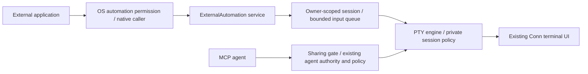

# External automation without activity recording

[한국어](automation-design.ko.md) · [Unreleased automation guide](external-automation.md)

**Implemented locally; native acceptance pending · 2026-09-16.** Baseline: v0.5.1,
commit `b3fba46fe14f456d7032d44c50ffe3e09d89d88f`.
The direct launch, private session, input revocation and UI changes are implemented
in this checkout. Real PTY, IPC and frontend tests pass on Linux. Actual Apple Events,
OS consent and a signed macOS build still require native acceptance. These protections
are **not present in v0.5.1**. This work has not been released.

## 1. Decision and scope

External applications may open Conn and supply a startup program or terminal
input. Conn must not turn those operations into AI-agent activity or retain an
automation activity history. The first adapter is AppleScript on macOS Apple
Silicon. Linux D-Bus also uses this internal contract; a Windows adapter remains future work.

Use the existing native window, PTY engine and terminal UI. No separate terminal
implementation, credential vault, inspection of another application, password-pattern classifier,
automatic authentication-success detector, or full iTerm object model is needed.

The distinction between a startup command and typed text follows the documented
[iTerm2 scripting interface](https://iterm2.com/documentation-scripting.html): a
startup command replaces the profile program; `write text` supplies terminal input.
Conn will support the documented subset below, not claim complete equivalence.

### Required properties

1. Set the external/private session policy **before spawning** the child.
2. Do not register AppleScript as an agent. No agent control grant, proposal,
   policy approval or Grace card for an authorized automation operation.
3. Do not persist automation activity, payloads, identities or request results in
   audit, timeline, diagnostics, preferences, crash attachments or restoration data.
4. Do not publish private session content through MCP or the public local IPC API.
5. Bind every operation to the verified native caller and its exact session.
6. The human can stop external input; changes of focus never retarget it.
7. Agent policy and control rules continue to apply to actual agent operations.
8. Do not claim protection against other tools running as the same OS user.

## 2. Replacement of the v0.5.1 path

| v0.5.1 implementation | Replacement in this checkout |
| --- | --- |
| `automation.rs` registers an agent and calls `request_control/type/send_key` | Dedicated native automation entry point and input source |
| `window.create` starts a shell, then queues the command as text | Spawn the supplied program on a new PTY |
| `Engine::spawn` records startup argv and an `exec` event | Explicit private launch policy, established before any record |
| `Job.text` survives in the request map | Payload lives only until delivery/cancellation; status holds metadata only |
| `track_human` interprets Enter as a command | No raw human input recording in an external-origin session, including after sharing |
| `HumanExec` may also become a tab title | Stable local label; never derive labels from automation payloads |
| Automation settings list recent requests | Settings contain permissions only; no recent-activity panel |

Removing a timeline row, renaming the actor, or calling `human_input` instead of
`agent_type` cannot satisfy these requirements. All three leave other paths open.

## 3. Architecture and internal contract



Architecture concepts, not a new public network API:

- `SessionOrigin::Interactive | ExternalAutomation` is immutable per session.
- `Sharing::Private | Transitioning | Shared` controls agent access.
- `InputSource::Human | External(OwnerHandle) | Agent(Lease)` controls arbitration
  and recording independently. External data must never be relabeled as human.
- `LaunchSpec::ProfileDefault | Program { executable, argv }` describes execution.
- `PrivatePayload` is move-owned, has no general `Debug`/`Serialize` implementation,
  and cannot be put in an audit event. Native decoding and PTY delivery are explicit.
- An owner handle includes native caller identity, app-run nonce, session ID and
  session generation. It is neither a reusable vendor credential nor an MCP token.

This increment implements immutable `external_private` and revocable external
input in `Session`, `LaunchSpec` in the engine, and owner bindings plus move-owned
`Payload` in the automation service. It deliberately has no sharing transition,
generation counter or public sharing endpoint yet; the sharing types and epoch
boundary below specify a later increment.

Keep the narrow Rust/native bridge. Do not expose an `origin=external` or
`skipAudit=true` argument through the agent protocol. An ordinary IPC caller cannot
select this execution path or turn sharing on. The trusted UI route is separate;
this is an application boundary, not protection from same-user UI automation.

## 4. Launch and input semantics

### Create a window

Preserve this syntax:

```applescript
tell application "Conn"
    create window with default profile command "/bin/sh -c '__RUN_COMMAND__ ; echo \"Press [Enter] key to exit.\"; read ANSWER;'"
end tell
```

The external application performs placeholder substitution. Conn does not look up credentials or
inspect another application's command construction.

- Without `command`, launch the allowed default profile in private mode.
- With `command`, use a tested POSIX word tokenizer on macOS: quotes and escapes
  form argv; there is **no** variable expansion, command substitution, globbing,
  or implicit shell. Reject malformed quotes and unquoted shell operators with a
  payload-free error. Shell syntax belongs inside an explicit `/bin/sh -c` argument.
- The example becomes executable `/bin/sh` and two arguments: `-c` and the exact
  inner script. Never append `exec <profile-shell>` or type this string at a prompt.
- Preserve the allowed local profile's cwd, environment and visual preferences;
  replace its executable and arguments for this session only. Never save an
  ephemeral launch spec into `profiles.json` or defaults.
- First target: command override on a **local macOS profile**. Reject override on
  SSH/WSL/Docker profiles; do not guess where a nested command should execute.
  Future adapters accept explicit argv with platform-specific serialization.
- Retain the one-line, 16 KiB limit, reject NUL/control characters, and report no
  offending text in errors. This is protocol validation, not password detection.
- Create the window and attach its private renderer before launching the child;
  an unready/closed window must not launch a background startup command. No default
  shell is accidentally spawned while the launch is pending.
- Return the opaque session ID after successful spawn. It means the process was
  started, not that login or the command succeeded. An uncertain timeout must not
  trigger automatic retry; a lost reply may follow a successful process start.
- When the supplied program exits, retain a finished terminal view until the human
  closes it. Do not start a fallback shell or automatically repeat the command.
  The example's `read` waits for Enter; after it, `/bin/sh` can exit.

### Write to an owned session

`write text ... to session ... [newline ...]` remains, with one-line UTF-8 text and
an explicit optional Return. It writes via a dedicated external-input method;
no command reconstruction, policy analysis, agent registration or input echo is
added by Conn. The child may still echo bytes as part of normal terminal behavior.

Delivery is ordered and serialized per session, only to a live, ready, private
session owned by this caller. PTY readiness is not a password prompt or proof of
authentication; Conn never guesses when to inject the next credential.

Human input, explicit takeover, sharing, disabling automation, removing the
allowed profile, cancellation or close cancels queued external writes and revokes
the writer handle. Bytes already delivered cannot be recalled. Human input is
processed before the next queued write; bounded chunks limit interruption latency.
There is no implicit reacquisition or mixing with an active agent writer. After
revocation, the caller must create a new session; it cannot claim an existing tab.

## 5. Permissions and lifecycle

Settings → Automation keeps enable/disable and the allowed profile list. Permission
to launch an arbitrary supplied program with a profile is **not** an executable
allowlist. State this once in the setting's description; do not show a per-command
agent approval UI. Default remains disabled.

Use macOS Automation consent and OS-supplied sender identity. Bind the identity to
process lifetime, not a display name or PID alone. Revalidate ownership on delivery
and avoid treating recycled PIDs as owners. If the external application uses `osascript`, Conn identifies
that intermediary, not the original application. See [Apple's Automation settings](https://support.apple.com/en-euro/guide/mac-help/mchl108e1718/mac).

Once the child has started, launcher exit does not kill the user's terminal.
Pending writes from a caller that can no longer be validated fail closed. Closing
the terminal terminates its child and cancels its queue, preserving other windows.
Restart restores permissions only, not processes, payloads, owner handles or jobs.

## 6. No activity history; minimal operational state

| Data | Permitted handling |
| --- | --- |
| Command/text | Native decoding → launch/write buffer → release immediately on completion or cancellation |
| Owner and request ID | Volatile ownership and bounded polling state only; not settings history |
| Request result | State and generic error code only; no argv, intent, output, path or credential |
| Terminal output | Human's in-memory terminal view while private; no automatic recording/export |
| Private title | Stable `External session` or saved profile display name; child titles stay out of IPC/diagnostics |
| Audit/timeline | No private-session or AppleScript activity events, including sanitized “automation ran” rows |
| Shared agent actions | Existing command/approval records for new agent actions only |

Private output can necessarily appear on the human's screen. Do not call this
“zero retention”: PTY buffers, the child, the OS, and in-memory terminal scrollback
exist. Do not automatically archive them. Disable programmatic clipboard writes
from private terminal output; explicit human copy remains possible.

Keep bounded queue/status behavior for existing scripts: 16 waiting writes per
session, 32 live owner bindings, 256 request IDs per app run, 120-second write
deadline. Completed status entries contain no payload. Payload comparison for an
explicit duplicate ID uses an in-memory keyed digest with a fresh per-run key,
bound to owner/session/options; never a persisted hash of a password. No ID eviction
and reuse within the run; capacity errors are generic. Clear payload on every
success, failure, cancellation and timeout path. Best-effort buffer zeroing reduces
copies but does not promise erasure from Cocoa strings, OS buffers or crash dumps.

## 7. Private sessions and deliberate AI sharing

Private sessions are absent from agent tab lists. Explicit access returns a generic
unavailable error. Block agent hello binding, snapshots, status detail, screen/event
subscriptions, commands, title/cwd metadata and debug/export routes. Audit-tail and
saved timeline imports must not reconstruct private sessions. Routing output only
to the owning native window is necessary; frontend hiding alone is insufficient.

The first privacy release will support **private external sessions only**. Do not
display an enabled sharing action until the transition below passes its tests.
This keeps ordinary external launch usable without making an unproven sharing promise.
Normal, manually opened Conn sessions retain their existing collaboration flow.

For a subsequent sharing increment, place `Share with agent` in the existing
control center. No authentication wizard or automatic “login complete” detector.
Explain at the action that local terminal history will be cleared and new output
will be shared. Sharing is a human UI action, never a script/MCP operation.

| State | External writes | Human input | Agent access | History |
| --- | --- | --- | --- | --- |
| Private, owner active | Allowed | Allowed; revokes owner | None | No session activity recording |
| Private, human only | Revoked | Allowed | None | No session activity recording |
| Transitioning | Revoked | Briefly serialized; never replayed as a command | None | None |
| Shared | Revoked permanently | Allowed; normal agent takeover priority | Existing mode/policy | New agent actions only; never raw human input |
| Closed | Rejected | Rejected | None | No automation replay |

Transition requires a serialized boundary across PTY output, subscriptions and the
UI: cancel external work; increment the sharing generation; discard pending private
events; reset backend screen/alternate screen, input trackers and terminal UI
screen/scrollback; wait for the owning UI's acknowledgement; then allow fresh agent
subscription. Reset locally, **do not send Ctrl-C, Ctrl-U, `clear` or redraw keys to
the child**. Failure leaves the session private. Do not seed the new agent view
from an old snapshot, saved title, queue, parser fragment or timeline.

If a human types during the transition, cancel sharing and deliver that input
once in private mode; never discard it or replay it after sharing. A stale UI
acknowledgement cannot complete a cancelled generation. A freshly shared external
session has unknown execution context: retain per-command review for agent
operations, with no session-wide allow. Do not infer a trusted local shell from
the profile when the child may have connected elsewhere.

Stopping sharing revokes the agent before accepting further output and cancels
pending writes. It does not erase data already delivered to an agent or restore an
old automation handle. Re-sharing repeats the boundary. A child may reprint old
content after sharing; newly produced output is visible and is not automatically
classified as safe. Authenticated remote privileges are shared even if no password
was ever shown.

## 8. Human password input outside automation

The raw human-input tracker has now been removed from both ordinary and private
sessions. Human typing is delivered without generating command history or a
payload-bearing debug trace. A content-free unfinished-input flag prevents agents
from appending to human input; Return, Ctrl-C or Ctrl-U ends that flag. These are
input semantics, not proof that the child is at a shell prompt.

Agent-submitted commands and original requests still have their explicit review
and audit records. Ordinary local Bash/Zsh sessions now restore human command
history through [shell execution hooks](shell-integration.md). Unsupported contexts
never fall back to reconstructing input. See [the exposure matrix](security.md#secret-exposure-scenarios-unreleased-hardening).

Checking ECHO alone is insufficient: raw terminal applications also disable ECHO,
and an outer SSH/tmux terminal does not reliably identify inner password entry.
See [termios](https://www.man7.org/linux/man-pages/man3/termios.3.html). Neither a
password-looking prompt nor a regular expression proves the input is safe to log.

## 9. Compatibility, migration and limits

- Preserve window/create/write/status/release spellings and opaque IDs. Existing
  `intent` remains accepted for compatibility but is ignored and immediately dropped.
- Keep asynchronous write status: `queued`, `delivering`, `delivered`, `cancelled`,
  `failed`. Approval/Grace/proposal states no longer apply. Define delivery as PTY
  write acceptance, never command completion. Failures use generic codes.
- Remove `detail.proposed` and raw error details from new results; update examples
  to handle terminal states. `release session` revokes the external writer and
  leaves the process for the human. Cancellation revokes remaining queued writes.
- After upgrading from the recorded/agent-based adapter, require one explicit
  re-enable in Settings: the grant now permits direct execution without per-command
  review. Retain the profile selection. Do not reuse an old grant silently.
- Existing audit files, saved timeline records and backups do not disappear.
  Do not scan, upload or automatically delete historical content in this change.
  Offer owner-controlled cleanup separately; actual exposure may require revocation
  of the affected credential under the organization's policy.
- Command-line arguments, shell tracing/history, child output, environment values,
  clipboard, OS diagnostics and external application logs remain outside the no-activity-history
  promise. Do not disable the organization's required audit system.
- Same-user tools can use independent shells, automation and files. Even with MCP
  gates, Conn is not a sandbox against an AI CLI with those permissions. OS-level
  separation is needed if that adversary is in scope.

## 10. Implementation sequence and evidence

| Increment | Changes | Completion evidence |
| --- | --- | --- |
| A: launch and origin | Typed launch spec, direct local process, private policy before spawn, native ownership | Real PTY fixture, exact argv, Unicode/quotes, cold/warm launch, exit and cleanup |
| B: unrecorded operation | Separate external input; remove agent/Grace/log paths and payload retention; disable external human tracking | Unique synthetic secrets absent from every Conn-managed sink, including denied/error/cancel paths |
| C: private boundary and UI | Agent discovery/read/write gates, owner-only rendering, no recent activity, upgrade opt-in, EN/KO copy | Multiwindow/caller races, existing agent cannot attach, no effect on other sessions |
| D: native acceptance | Update `.sdef`, examples, public docs and release notes | Signed Apple Silicon app: first consent allow/deny, real Apple Events with dummy launcher; platform CI |
| E: later sharing | Generation boundary and local screen reset described above | Buffered output, stale events, UI failure, re-sharing and subscription race tests |
| F: ordinary human tracking (implemented, unreleased) | Remove raw-input history; retain only an unfinished-input flag | Hidden-password PTY, paste/Unicode, mixed input and snapshot-permission tests; no new human timeline entries |

A–D are one releasable unit. Do not ship partial log removal as credential-safe
automation. E and F are separately visible changes, not hidden prerequisites for
opening an external private terminal. Compatibility with a real external application remains unverified
until the owner tests their allowed template; synthetic tests need no corporate
account, password, traffic interception or production server.

Release gates for A–D:

1. Unique test secrets never reach audit, timeline persistence, settings, labels,
   errors, diagnostics, agent responses or retained completed jobs; cover Unicode,
   shell quotes, launch failure, partial delivery, cancellation and restart.
2. An echoed test secret remains visible to the human but unavailable to MCP/IPC;
   hiding the UI or setting the agent to Observe is not accepted as isolation.
3. Same-session ownership, wrong process, PID reuse, late writes, config revocation,
   human takeover, close-during-launch and two callers cannot cross sessions.
4. Direct child exit does not spawn a fallback shell; retries never duplicate a
   command after an uncertain outcome. Existing non-automation agent policy tests pass.
5. macOS tests execute Apple Events; `osacompile` and green Linux tests alone do not
   establish native behavior. The Linux D-Bus adapter uses native sender credentials; the Windows adapter remains unimplemented.

## 11. Documentation and publication language

Use generic terms such as **external application automation**, **launcher** and
**terminal integration** in documentation, commit messages and pull requests.
Do not identify workplace systems, vendors, credential-management product
categories or real deployment details. Use synthetic examples only.

## 12. Implementation files

- [Shared automation](../crates/frontend/src/automation.rs): eliminate agent binding,
  replace payload-retaining jobs and settings history.
- [Harness](../crates/frontend/src/lib.rs): private origin at creation, window scope,
  no private audit-tail restoration or session serialization to ordinary clients.
- [Engine](../crates/core/src/engine.rs) and [backend](../crates/core/src/backend.rs):
  separate direct launch spec from saved profile and startup audit behavior.
- [Session](../crates/core/src/session.rs) and [IPC](../crates/core/src/ipc.rs): input
  source, ownership arbitration, no private history and agent visibility gates.
- [Native adapter](../frontends/tauri/src-tauri/src/macos.rs) and
  [dictionary](../frontends/tauri/src-tauri/Conn.sdef): argument compatibility and generic errors.
- [UI](../frontends/tauri/src/App.svelte) and [timeline](../frontends/tauri/src/lib/timeline.ts):
  stable labels, no automation cards or persistence, localized private-session state.
- Automation guides, security model, architecture and examples describe the
  unreleased replacement. Native macOS acceptance remains a release gate.
