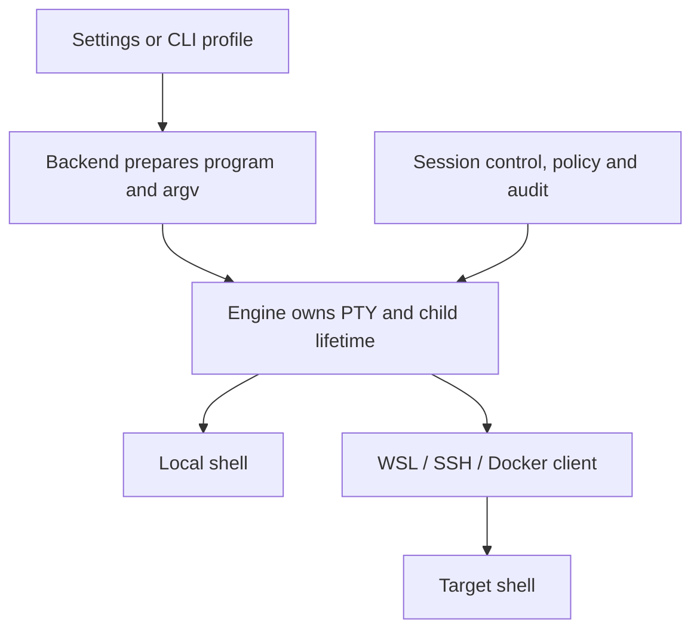

# Shell backends and profiles

Conn separates the **host** (the computer running Conn), the **backend** (how a
terminal reaches an execution environment), and the **shell** (the program and
command syntax inside that environment). Profiles are named, saved combinations
of these choices. Adding another target adapter does not change session control,
human takeover, audit attribution, or the agent JSON protocol.

## Use the desktop

1. Open **Settings → Terminal profiles**. Use the island menu or `⌘,` on macOS;
   Windows/Linux use `Ctrl+Shift+,`.
2. Detect installed shells, or add a profile and choose its execution environment.
3. Set the executable, one argument per line, startup directory, and environment
   variables (`NAME=value`, one per line). For remote profiles these fields belong
   to the target environment.
4. Run **Test connection**, choose the default profile in settings, then save.
   The tab bar keeps a single `+` button, which opens that saved default profile.

Profile management stays inside settings; the tab bar contains no profile settings menu.
Saved changes affect new tabs. Existing sessions keep their original profile.
Disabled or unavailable profiles remain visible with an explanation and cannot be
launched. An unavailable default produces an error and opens settings for recovery.
Choose another default before disabling or deleting the current default.

| Backend | Host requirements | Target and shell |
|---|---|---|
| `local` | Executable installed on the host | bash, zsh, sh, fish, PowerShell, cmd, or a custom executable |
| `wsl` | Windows, `wsl.exe`, installed distribution | Distribution name; Linux executable, arguments, cwd, environment |
| `ssh` | OpenSSH client on PATH | Host, `user@host`, or SSH config alias; optional port |
| `docker` | Docker CLI and access to its configured daemon | An existing running container; executable inside that container |

Local discovery finds common shells on PATH and Git Bash in standard Windows
installation paths. WSL distribution discovery has a five-second limit. Users can
add executables at other paths manually. Detection merges newly found entries and
does not overwrite saved profile edits.

### SSH details

Leave the executable empty and use `custom` to enter the server's default shell,
including a Windows server. In that mode, set its startup directory and environment
on the server; Conn rejects profile cwd/env/args that would otherwise be ignored.

An explicit SSH startup command currently requires a **POSIX server login shell**.
Choose `posix`, for example `/bin/bash` with `-l`. Conn quotes each remote argument,
sets the target environment and directory, and executes the selected shell.
PowerShell-specific remote startup commands are not implemented; use the server's
default shell for that case.

SSH uses the existing SSH config, keys and agent. The connection test is
noninteractive (`BatchMode=yes`) and does not accept new host keys automatically.
Open an actual tab to complete an ordinary interactive SSH login when needed.

### What the test verifies

- Local: executable lookup and the existence of the startup directory. It does
  not start the configured program or validate its arguments.
- SSH/WSL/Docker: a bounded connection attempt returning a marker, with an
  eight-second limit. It does not validate the configured interactive shell,
  remote cwd or environment. Open a tab to verify those settings.
- The catalog's available flag means local prerequisites are present. A remote
  target may still be offline, require authentication, or reject startup options.

## CLI

```sh
conn profiles list
conn profiles detect
conn profiles export > profiles.json
# Edit profiles.json, then:
conn profiles import profiles.json
conn profiles set-default local-bash
conn profiles disable remote-dev
conn profiles enable remote-dev
conn profiles test remote-dev
```

IDs come from `profiles list`; they need not match the examples. Use
`--profiles-file PATH` for an isolated config. The app and CLI normally share
`~/.conn/profiles.json` (`%USERPROFILE%\.conn\profiles.json` on Windows).

Open the profile from the desktop app after configuring it. The unreleased shared-surface
version removes CLI terminal/headless startup: agents observe the terminal grid of
a session shared from the desktop app. External launch commands use the [native automation adapter](external-automation.md).

### File format

```json
{
  "version": 1,
  "revision": 0,
  "defaultProfile": "local-bash",
  "profiles": [
    {
      "id": "local-bash", "name": "Bash", "enabled": true,
      "backend": "local", "shell": "posix", "program": "/bin/bash",
      "args": ["-l"], "cwd": "~/dev", "env": {}, "target": null, "port": null
    },
    {
      "id": "remote-dev", "name": "Development server", "enabled": true,
      "backend": "ssh", "shell": "custom", "program": "",
      "args": [], "cwd": null, "env": {}, "target": "dev-server", "port": null
    }
  ]
}
```

On Windows, a local PowerShell profile uses `"shell": "power_shell"`,
`"program": "pwsh.exe"` and `"args": ["-NoLogo"]`; Windows PowerShell uses
`powershell.exe`. A cmd profile uses `"shell": "cmd"`, `"program": "cmd.exe"`
and `"args": ["/D"]`. WSL uses `"backend": "wsl"`, `"target": "Ubuntu"`,
`"shell": "posix"` and a Linux program such as `/bin/bash`.

Local executables are resolved against the profile's PATH when supplied, otherwise
the host PATH. Relative executable paths are resolved against the configured cwd.
Local `~` paths expand to the host home. Remote path strings are passed to the
target unchanged; explicit SSH cwd does not expand `~`, so use an absolute path.

Saving validates IDs, the enabled default, arguments and target fields, then uses
a process lock and an atomic replacement. The revision detects stale writers;
reload if another process saved first. Unix config files use mode 0600. Invalid
files produce an error instead of silently discarding settings. Environment values
are stored in this JSON file in plain text; use existing authentication agents for
SSH credentials.

## Execution and policy boundaries



`portable-pty` provides the Unix PTY and Windows ConPTY execution paths. The
console frontend uses Unix terminal input on macOS/Linux and crossterm console
events on Windows. The desktop shares the same Engine with xterm.js rendering.
Closing a tab terminates its child process; it does not assume every shell accepts
Ctrl-D as an exit command.

Local POSIX shells retain existing command and filesystem policy analysis. Every
remote or non-POSIX profile requires human review for each agent command, even
when the normal policy default is allow. Session-wide approvals cannot remove
that requirement. Deny matches still block execution; compound commands are
rejected when command isolation is enabled. Remote cwd and file targets are not
invented from the host filesystem.

The non-POSIX parser recognizes simple commands and dialect quoting for review;
it does not expand PowerShell aliases, functions, nested scripts, or certify
arbitrary syntax. As with existing policy, this is a guard against mistakes,
not a security sandbox. Choosing a shell kind must match the executable.
Starting a nested SSH client manually inside a local POSIX tab does not change
that tab's profile; use an SSH profile for the remote review boundary.

The existing line-delimited JSON protocol uses Unix sockets on macOS/Linux and
local Windows named pipes with an owner-only DACL and remote clients rejected.
`status` adds `profileId`, `profileName`, and `reviewRequired`; existing methods
and human/agent authority remain unchanged.

## Extend with another backend

Implement `Backend::prepare(&Profile) -> Result<LaunchPlan, String>` in
`crates/core/src/backend.rs`, add a `BackendKind`, then add its validation,
availability/probe behavior and settings fields. A launch plan keeps executable,
argv, local cwd and environment separate. Remote adapters must not reinterpret
target paths as host paths. Add argument construction, failure, child lifetime
and policy-boundary tests before enabling the adapter.

Adapters are compiled into Conn. Runtime loading of third-party binary plugins
is not part of this implementation. A backend that cannot be driven through a
PTY-compatible client would need a separate stream/lifecycle abstraction.

## Build and verification

Install the platform's [Tauri prerequisites](https://v2.tauri.app/start/prerequisites/),
then use `npm ci` and `npm run tauri dev` in `frontends/tauri`.
`npm run tauri build -- --debug --no-bundle` builds a runnable desktop executable.
The wrapper builds and copies a correctly named CLI sidecar for the selected Rust
target. Windows uses `.exe` and the NSIS bundle configuration; Linux uses deb.
Windows requires a ConPTY-capable OS (see Microsoft's
[CreatePseudoConsole requirements](https://learn.microsoft.com/en-us/windows/console/createpseudoconsole)).

The added CI workflow runs core tests and desktop builds on Linux, macOS and
Windows. It must run in a Git hosting environment before its results can be
claimed. See [backend verification](backend-verification.md) for the local evidence
and the remaining native and remote checks.
