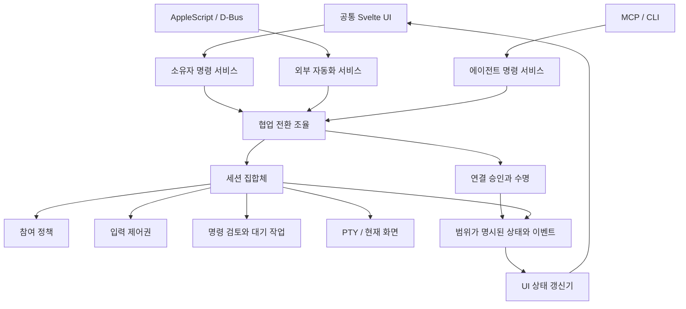

# 협업 경계 리팩터링 — 설계와 스프린트

[English](collaboration-refactor-plan.md)

상태: **S0–S3 구현 / S4 로컬 검증 완료, 네이티브 인수 검증 대기** · 2026-09-21.
실제 완료 범위와 증거는 [구현 결과](collaboration-refactor-results.ko.md)를 따른다.
이 문서는 작업 범위와 완료 조건을 정한다. 구현 완료나 배포 승인을 의미하지 않는다.
현재 동작의 기준은 [제품 계약](PRD.ko.md), [아키텍처](architecture.ko.md),
[제어권 모델](control-lease-model.ko.md)이다. 아래 목표 타입과 모듈명은 제안이다.

## 1. 목표와 범위

사용자가 외부 자동화로 연 터미널을 그대로 유지하면서 다음 흐름을 끝낼 수 있어야 한다.

> 비공개 터미널 → 에이전트 연결 허용 → 참여자 선택 → 공유 시작 → 제어권 요청 →
> 사람의 승인과 개입 → 공유 중단

현재의 공통 `Harness`, 네이티브/브라우저 전송 어댑터, `Authority`, 터미널 화면 모델은
유지한다. 책임을 분리할 대상은 **연결 승인, 세션 참여, 입력 제어, 상태 전환, UI 상태**다.
파일 분리 자체나 코드 줄 수 감소를 완료 기준으로 삼지 않는다.

### 유지할 계약

- 공유를 바꿔도 세션 ID, PTY, SSH 연결, 자식 프로세스는 유지한다.
- 앱 연결 허용은 비공개 터미널 접근 허가나 제어권 부여가 아니다.
- 일반 탭의 기존 기본 참여 정책과 외부 생성 세션의 비공개 시작을 유지한다.
- 참여 선택은 살아 있는 연결 ID에 속한다. 이름으로 복원하거나 재접속에 상속하지 않는다.
- 공유 세션의 관찰·입력 권한을 창 포커스, 최소화, 활성 탭에 다시 묶지 않는다.
- 사람의 입력은 충돌하는 쓰기 권한보다 우선한다. 종료·공유 중단 이후 지연 입력은 실행하지 않는다.
- 원시 사람 입력과 외부 주입 값은 기록하지 않는다. 비공개 구간을 나중에 복원하지 않는다.
- 숨김 입력은 노출하지 않고, 별표 마스킹은 표시된 별표만 관찰한다. 화면에 출력된 값은 참여자에게 보인다.
- AppleScript 명령 이름·이벤트 코드·반환 형식, D-Bus 계약, 기존 설정을 유지한다.
- 브라우저 테스트는 같은 UI와 Harness를 사용한다. OS 어댑터를 브라우저 결과로 검증했다고 주장하지 않는다.

### 이번 범위에서 제외

- 새 플러그인 실행 환경, 내부 모델 제공자/자동완성 복원, 새로운 shell backend.
- TUI의 미완성 입력 판정 알고리즘 교체. 기존 `input_pending`을 없애거나 우회하지 않는다.
  대신 이유를 보존하고 복구 방법을 설명한다. 입력 판정 개선은 별도 작업으로 재현·설계한다.
- Intel Mac 재지원, 설치 방식 변경, 마케팅·영상 개편, 모든 기존 UI 경고 일괄 수정.
- 사용자 연결 승인 정책을 끄거나 비공개 탭을 자동 공유하는 임시 해결책.

## 2. 검토 결과와 작업 연결

| ID | 확인한 문제 | 근거 위치 | 해결 스프린트 |
| --- | --- | --- | --- |
| R1 | 앱 연결 승인 UI가 현재 탭의 `shared` 조건 아래 있어 비공개 창에서 숨겨짐 | `App.svelte`, `AdmissionRequest.svelte` | S0 |
| R2 | 앱 전체 연결 설정이 비공개 탭에서 숨겨지는 Agents 카테고리에 포함됨 | `SettingsSheet.svelte` | S0, S3 |
| R3 | 연결 승인 호출 실패 시 카드 제거, 공유 실패 메시지를 목록 갱신이 삭제 | `AdmissionRequest.svelte`, `SharingDialog.svelte` | S0, S3 |
| R4 | 공유 가능 여부를 최종 검사하기 전에 외부 작성자를 영구 중단 | `surface_commands.rs`, `Session::set_shared_with_agents` | S2 |
| R5 | 한 연결의 다중 세션 lease 정리가 IPC 요청 처리에 의존 | `ipc.rs::leave_other_tabs` | S1, S2 |
| R6 | 회수 사유별 승인·제안·Grace 정리와 이벤트 발행이 여러 메서드에 분산 | `session.rs` | S1, S2 |
| R7 | UI가 초기 조회·이벤트·폴링에서 같은 상태를 따로 갱신하며 이벤트 타입은 `any` 중심 | `App.svelte`, `bridge.ts`, `store.svelte.ts` | S1, S3 |
| R8 | 승인 테스트가 백엔드 이벤트와 명령 성공을 검증하나 비공개 화면의 실제 버튼 표시까지 보장하지 않음 | `admission_harness.rs`, 프런트엔드 테스트 구성 | S0, S4 |

R1~R4는 코드에서 확인한 실패 경로다. R5~R8은 책임 배치·검증 범위의 결함이며,
각각을 모두 새로운 실사용 장애로 재현했다는 뜻은 아니다.

## 3. 책임과 의존 방향



서비스들이 같은 실행 기반을 사용하더라도 호출자의 권한 경로는 구분한다.
외부 자동화는 소유자 명령을 임의로 실행하지 못하고, 에이전트는 자기 연결을 승인하지 못한다.

| 책임 | 소유할 상태와 동작 | 소유하지 않을 것 |
| --- | --- | --- |
| `ConnectionRegistry` | 연결 ID, 승인 대기/허용/거절/종료, 승인 정책 | 탭 공개 여부, PTY 쓰기 |
| `Participation` | 비공개 또는 공유 대상, 참여 세대, 참여 검사 | 앱 연결 승인, lease |
| `Authority` | 사람/에이전트 lease, TTL, 회수 | UI 표시, 외부 자동화 큐 |
| `PendingWork` | 제어 요청, 명령 승인, 제안, Grace의 각각의 수명 | 네 가지 행위를 하나의 승인으로 취급하기 |
| `CollaborationCoordinator` | 여러 세션의 lease 조율, 전환 전제조건, 회수·취소 순서 | 요청 문자열 파싱, 카드 렌더링 |
| 외부 자동화 서비스 | OS 호출자 소유권, 외부 작성자 핸들·입력 큐 | 에이전트 참여·승인을 우회하기 |
| UI 상태 계층 | 초기 상태와 이벤트의 일관된 적용, 요청 진행·실패 상태 | 권한을 최종 허가하기 |
| 표시 컴포넌트 | 정보·버튼·포커스·접근성·모션 | 활성 탭을 추측해 명령 대상 정하기 |

### 기존 crate 안에서 시작

- `conn-core`: 연결 레지스트리와 여러 세션 제어 서비스를 IPC 디코딩에서 분리한다.
  `Session` 내부의 participation, pending-work 로직은 하위 모듈로 나누되 일관성 경계는 유지한다.
- `conn-frontend`: 소유 창 검사, 외부 작성자 중단, 기록 자원 준비를 포함한 공유 작업을 조율한다.
  OS 어댑터는 신원 확인과 요청/응답 변환을 담당한다.
- 프런트엔드: typed contract, 앱 연결 저장소, 세션 저장소, 결정 요청 동작,
  공통 카드·dock 표시로 나눈다.
- 모듈마다 별도 crate, mutex, 백그라운드 작업을 만들지 않는다. 추출한 로직의 기존 복사본은 제거한다.

## 4. 상태 모델과 API

독립적인 축을 `privateMode` 같은 하나의 플래그에 다시 합치지 않는다.

```text
ConnectionAdmission = Pending | Granted | Denied | Closed
SessionOrigin       = Local | External                     (불변)
Participation       = Private | Shared(AllAdmitted | Selected(connectionIds))
AgentController     = Human | Agent(lease)
ExternalWriter      = Active(ownerHandle) | Revoked
```

외부 작성자 권한과 에이전트 lease는 서로 다른 수명·정책을 가진다. 하나의 lease 타입으로
강제로 통합하지 않고, PTY 입력 경계에서 동시에 활성화되지 않도록 전환 서비스가 보장한다.
표시용 연결 이름은 식별자가 아니다.

### 명시적 명령 대상

- 앱 명령: `decideAdmission(connectionId, decision)`.
- 세션 명령: `startSharing(sessionId, selection, expectedRevision)`.
- 제어 명령: `requestControl(connectionId, sessionId, reason)`.
- 결정 명령: `resolveCommandApproval(sessionId, requestId, decision)`.

실제 타입명은 구현하면서 정하되, 협업 관련 새 API는 `st.active`를 암묵적으로 덧붙이지 않는다.
공개 MCP 메서드와 AppleScript 형태는 어댑터에서 호환 유지한다. 내부 타입 정리가 공개 계약
변경을 요구하면 같은 리팩터링에 숨기지 않고 별도 호환성 항목으로 기록한다.

### 상태·이벤트·오류

- UI 이벤트는 `AppEvent`, `WindowEvent`, `SessionEvent`로 범위를 명시한다.
  공개 에이전트 이벤트는 기존 참여 검사와 전송 직전 세대 검사를 유지한다.
- 협업 상태에는 revision을 부여하고 동일한 갱신기가 snapshot과 event를 적용한다.
  구독 후 초기 조회 사이의 경쟁, 중복·과거 이벤트, 재연결을 테스트한다.
- 작업 오류는 `input_pending`, `connection_gone`, `request_already_resolved`,
  `history_unavailable` 등의 타입과 가능한 다음 행동으로 전달한다.
- 에이전트 목록 조회 오류와 공유 적용 오류는 별도 상태다. 목록 갱신으로 작업 오류를 지우지 않는다.
- 통신 결과가 불확실하면 권위 있는 상태를 재조회한다. 승인·주입·실행을 자동 재시도하지 않는다.
- 진단은 단계, 정적 오류 코드, 비밀값이 아닌 식별자로 제한한다. 입력·명령 인자·자격 증명을
  오류 개선의 명목으로 새로 저장하지 않는다.

## 5. 전환 설계

### 비공개 → 공유

1. 실제 소유 창, 살아 있는 세션, 선택한 승인 연결, 입력 상태를 검사한다.
2. 필요한 기록 자원을 준비한다. 여기서 실패하면 기존 권한을 바꾸지 않는다.
3. 해당 외부 작성자 작업과 세션 상태를 순서대로 보호하는 짧은 전환 구간에 들어간다.
   기존 `operation → Session` 잠금 순서를 보존하며 네트워크·파일 I/O·사용자 응답을 기다리지 않는다.
4. 입력 상태, 세션/참여 revision, 선택 연결의 수명을 다시 검사한다.
   검증 실패는 전환 전 상태를 유지한다. 그동안 발생한 사람의 선점·연결 종료는 되돌리지 않는다.
5. 하나의 전환으로 외부 작성자를 폐기하고 큐의 배달을 막고 참여자를 적용한다.
   제어권은 사람에게 두고 세대를 갱신한다. 어느 시점에도 두 작성자가 활성화되지 않는다.
6. 완료 상태와 이벤트를 발행한다. 이후 UI 전달이 실패하면 재조회로 복구하며 외부 작성자를 복원하지 않는다.

외부 큐 항목이 이미 꺼내진 경우도 전환 경계에서 배달 가능 여부를 다시 검사해야 한다.
연결이 동시에 종료되면 새 소켓에 선택이 상속되지 않아야 한다.
여러 잠금을 필요로 하는 구체적 순서와 콜백 규칙은 S2 구현 전 설계 검토 항목이다.

### 회수·취소 규칙

| 사건 | 필요한 결과 |
| --- | --- |
| 사람 입력/명시적 제어 회수 | 충돌하는 작성자와 실행 대기를 무효화. 사람 입력 전에 처리하며 사람의 입력 내용은 저장하지 않음 |
| 공유 중단/참여자 제거 | 영향받는 연결의 권한·승인·제안·Grace·제어 요청 취소. PTY 유지 |
| 에이전트의 탭 이동/다른 탭 제어 요청 | 한 연결이 다른 세션에 남긴 lease와 대기 작업을 공통 서비스에서 정리 |
| 연결 종료 | 그 연결의 모든 세션 작업 정리. 같은 이름의 다른 연결은 독립 |
| lease 만료 | 만료된 권한으로 지연 실행 불가. 기존 승인 대기 중 갱신 정책은 명시적으로 유지 |
| 프로세스/창 종료 | 해당 세션/소유 창 범위 정리. 다른 창의 세션은 유지 |
| 창 포커스/가림/최소화 변경 | 참여와 lease 변화 없음 |

S1에서 기존 동작을 테스트로 고정하고 각 사건의 승인·제안·제어 요청 처리 차이를 표로 만든다.
수동 회수 뒤 승인 생존 등 애매한 동작은 제품 불변식에 비춰 결정하고 변경 이력을 남긴다.
취소 헬퍼를 통합한다는 이유만으로 서로 다른 사건을 같은 처리로 바꾸지 않는다.
셸/TUI의 입력을 지우는 키도 임의로 추가하지 않는다.

여러 세션의 lease 규칙은 IPC 요청뿐 아니라 소유자의 제어 허용·돌려주기 경로에도 적용한다.
짧은 권한 변경만 직렬화하고, 사람 입력이 다른 세션의 승인 대기 때문에 막히지 않도록 한다.

## 6. UI 구성과 공통화

```text
AppShell
├─ ApplicationRequests     연결 승인: 비공개/공유/빈 창과 독립
├─ SessionWorkspace
│  ├─ Terminal
│  └─ SessionInteractions  제어 요청·명령 검토·제안·Grace
├─ SharingDialog           참여자 선택, 전환 결과
└─ Settings
   ├─ AppConnections       에이전트 설치·연결 승인 정책
   └─ SessionPolicy        모드·명령 검토·속도
```

두 요청 영역은 공통 dock 레이아웃과 공간 확보 모션을 쓴다. `private` 조건은 앱 요청 영역을
숨길 수 없다. S0에서는 기존 모션을 유지하고 S3에서 레이아웃을 공통화한다.

공통 `DecisionCard`는 heading, 설명, 상세, action slot, 처리 중·오류 표시, 포커스를 담당한다.
연결 승인, 제어권 부여, 명령 승인은 각각의 view model과 handler를 유지한다.
카드마다 CSS와 통신 처리 코드를 복사하지 않고, 하나의 거대한 permission component도 만들지 않는다.

- 실패하면 카드와 원인을 유지한다. 이미 해결된 요청만 제거한다.
- 다른 창에서 처리하면 모든 창의 같은 요청이 정리된다.
- 선택은 연결 ID로 유지하고 재접속한 에이전트는 다시 선택한다.
- 연결 후보가 없으면 연결 대기/승인 필요/연결 없음의 차이를 표시한다.
- 적용 완료는 최신 백엔드 상태로 반영한다. 색·토스트만 바꾸어 성공을 표현하지 않는다.
- 영어/한국어, 키보드, 좁은 창, reduced motion을 같은 컴포넌트에서 검증한다.

## 7. 스프린트 계획

기간은 1인 구현·검토 기준 **순수 작업량 추정**이다. 플랫폼 검증 대기와 CI 대기는 별도이며,
자동 실행 일정이나 배포 약속이 아니다. 전체 예상은 7~9 작업일, S2의 동시성 검토가 가장 큰 변수다.

| 스프린트 | 목표 | 추정 | 의존 | 독립 산출물 |
| --- | --- | --- | --- | --- |
| S0 | 막힌 승인·공유 UI 복구 | 1일 | 없음 | 긴급 수정 가능한 작은 변경 |
| S1 | 권한 범위·전환·타입 계약 고정 | 1일 | S0 | 설계 결정, 회귀 기준, 내부 타입 |
| S2 | 전환 서비스와 lease 수명 공통화 | 2~3일 | S1 | 공통 백엔드, 경쟁·실패 테스트 |
| S3 | UI 상태와 결정 컴포넌트 공통화 | 2일 | S1, S2 계약 | 공통 UI, 타입 검사, 상호작용 테스트 |
| S4 | 플랫폼·설치 배포판 검증 | 1~2일 | S0~S3 | 후보 검증 보고서, 릴리즈 준비 |

### S0 — 사용자가 막힌 흐름 복구

- S0-1: 연결 승인 표시를 공유 조건 밖으로 이동. 일반/비공개/세션 준비 중 창에서 유지.
- S0-2: 전역 연결 설정을 private 조건과 분리. 세션 정책 제한은 유지.
- S0-3: 실패한 승인 카드를 유지하고 재조회 경로 제공. 공유 작업 오류와 목록 오류 분리.
- S0-4: **현재 코드에서 실패하는** 비공개 화면 승인 테스트를 먼저 만들고 수정 후 통과 확인.

완료 조건: 새 연결 대기 → 실제 허용 클릭 → 비공개 화면은 여전히 접근 불가 → 참여자 선택 →
공유 → 스냅샷 가능. 통신 실패·다른 창에서 먼저 처리한 요청도 회복 가능.
이 단계에서 S2의 부분 전환 문제까지 해결했다고 주장하지 않는다.

### S1 — 경계와 계약 고정

- S1-1: 연결, 세션, 창, 요청, lease 식별자와 범위가 있는 이벤트/오류 타입 정의.
- S1-2: 권한·회수 진입점 목록화. `request_control`, 제어 허용, `hand_back`, 이동, 종료 포함.
- S1-3: 전환 표 및 검증/취소 순서 작성. 현재 동작 보존 항목과 결함 수정 항목 분리.
- S1-4: 기존 테스트를 진입점과 불변식에 연결. AppleScript/D-Bus/public IPC 계약 fixture 보존.

완료 조건: 연결 승인과 세션 참여가 타입과 API에서 구분되고, 모든 lease 부여/회수 경로의
담당 서비스가 지정됨. 기능 변경이 필요한 모호한 항목을 문서에 숨겨두지 않음.

### S2 — 백엔드 전환 공통화

- S2-1: 연결 관리와 여러 세션 lease 조율을 IPC 파싱에서 추출.
- S2-2: pending work 정리를 회수 사유별로 공통화하고 기존 중복 경로 제거.
- S2-3: 외부 작성자·공유·기록 준비를 조율하는 전환 구현. 실패 전제조건은 기존 권한 유지.
- S2-4: 프로세스 종료, 연결 종료, 사람 입력, 공유 변경과의 경쟁을 barrier/fault injection으로 검증.
- S2-5: OS 어댑터·Harness·IPC가 같은 규칙을 호출하는지 확인. 오류에 입력 값이 포함되지 않도록 검증.

완료 조건: 한 연결의 여러 lease가 어떤 부여 경로에서도 생기지 않음. 실패한 공유 시작이
작성자만 중단하지 않음. 공유 성공 후 이전 외부 핸들의 입력과 취소된 지연 ENTER가 실행되지 않음.
전환 중 사람의 입력을 장시간 막지 않으며 동일 세션·프로세스가 유지됨.

### S3 — UI 상태와 컴포넌트 공통화

- S3-1: 앱 연결 상태와 세션 협업 상태 분리. 협업 영역의 `any` 이벤트와 암묵적 active-session 명령 제거.
- S3-2: snapshot/event/reconnect를 같은 상태 갱신기로 처리. 오래된 응답이 최신 상태를 되돌리지 못하게 함.
- S3-3: 공통 결정 동작과 카드/dock primitive 추출. 비즈니스 결정 종류는 유지.
- S3-4: 설정 범위 정리, 실패 이유·다음 행동·비활성 이유의 i18n 적용.
- S3-5: 여러 창, 빠른 탭 이동, 키보드, 작은 창, reduced motion 및 기존 공간 확보 모션 검증.

완료 조건: 어느 창에서도 앱 연결 승인 요청이 세션 조건 때문에 사라지지 않음. 실패·재연결·중복
이벤트에도 요청과 상태가 일관됨. 새 컴포넌트가 기존과 별도의 권한 판단을 갖지 않음.

### S4 — 실제 설치 경로와 릴리즈 준비

- S4-1: 같은 Harness의 브라우저에서 아래 수용 시나리오를 자동 검증.
- S4-2: macOS Apple Silicon **서명된 후보 앱**을 설치 경로로 지정해 AppleScript 생성·인증·공유를 검증.
  앱 종료 상태와 실행 중 상태 모두 포함. 앱 이름 선택 문제는 정확한 bundle identity/path로 구분.
- S4-3: Linux의 네이티브 D-Bus 흐름, Windows의 네이티브 MCP 연결·공유 흐름 검증.
  없는 OS 어댑터를 새로 구현하는 스프린트는 아님.
- S4-4: 기존 설정에서 업그레이드, 앱/MCP 재시작, 공유 선택 비상속, 서명·설치·업데이트 점검.
- S4-5: PRD/아키텍처/프로토콜/사용법/변경 기록의 실제 변경분을 영문·한국어로 갱신.

완료 조건: commit, 후보 버전, OS, 설치 방법, 시나리오 결과, 미검증 항목이 있는 보고서.
개발 앱 성공과 서명된 설치 앱 성공을 별도로 표기. 필수 플랫폼 검증 미완료는 완료로 처리하지 않음.

## 8. 수용 테스트

| ID | 시나리오 | 반드시 확인할 결과 |
| --- | --- | --- |
| A1 | 외부 자동화 비공개 창에서 새 에이전트 접속 | 허용 카드가 보이고 클릭 가능. 연결 허용만으로 화면 공개 안 됨 |
| A2 | 허용된 연결을 선택하고 공유 시작 | 동일 세션·PTY·SSH 유지. 선택된 연결만 화면 관찰, 제어는 별도 요청 |
| A3 | 선택 없음/선택 연결 종료/미완성 입력/기록 준비 실패 | 구체적 이유 유지. 시작 전 검증 실패로 작성자만 중단하지 않음 |
| A4 | 공유 전환과 외부 큐 배달 경쟁 | 전환 후 주입 차단. 원시 주입 값은 기록·공개 응답에 없음 |
| A5 | 승인 클릭 통신 실패, 다른 창에서 먼저 승인, 과거 snapshot 도착 | 미해결 요청 유지·재조회. 중복 실행·최신 상태 되돌림 없음 |
| A6 | 사람 선점/명시적 회수/연결 종료/탭 이동 중 승인·제안·Grace 대기 | 사건별 취소 규칙 충족. 지연 ENTER와 다른 탭의 숨은 lease 없음 |
| A7 | 공유 중단 후 재공유, 같은 이름의 재접속 | 비공개 구간 기록 복원 없음. 새 연결 자동 선택 없음 |
| A8 | 포커스 잃음/최소화/다른 탭 보기 | 참여 권한과 lease 유지. 사람의 현재 탭을 에이전트가 자동 추종하지 않음 |
| A9 | 인증 입력 무표시/별표/화면에 보이는 합성 값 | 각 렌더링 계약대로 관찰. 숨김 값은 snapshot·기록·오류에서 검출되지 않음 |
| A10 | AppleScript 앱 이름/정확한 경로, cold/warm launch | 앱 선택 문제와 실행 오류 구분. 해당 후보 bundle의 사전·실행 모두 검증 |
| A11 | 영어/한국어·키보드·좁은 창·reduced motion | 승인·공유 흐름 완료, 카드가 터미널 입력을 가리지 않음 |

합성 인증 데이터만 사용한다. 자동화 테스트가 외부 시스템에 실제 계정으로 접속하지 않게 한다.
조합 전체를 무작정 늘리기보다 각 경계 실패와 핵심 종단 흐름을 검증한다.

## 9. 전달과 완료 관리

- S0를 먼저 독립 변경으로 만든다. 후속 구현은 검토 가능한 크기로 순차 통합한다.
  겹치는 PR을 여러 개 열어두지 않는다.
- 구현 완료, 자동 테스트, 브라우저 검증, 네이티브 후보 검증, 배포를 각각 기록한다.
- 순수 구조 변경은 행동을 보존하는 테스트를 먼저 두고, 의도적 행동 수정은 별도 변경으로 식별한다.
- 릴리즈 작업을 한다면 저장소의 기존 [릴리즈 절차](../scripts/release.py)를 따른다.
  이 계획만으로 push·merge·tag·공개 배포를 실행하지 않는다.
- 예상 밖의 회귀는 버그 수정 또는 해당 스프린트 변경의 되돌리기로 대응한다.
  승인 정책을 끄거나 비공개 경계를 완화해서 통과시키지 않는다.

### 추적할 후속 항목

- 2026-09-21 실사용 피드백의 신규 항목·우선순위·완료 기준은 [제품 백로그](product-backlog.ko.md)에서 관리한다.

- TUI에서 `input_pending`이 실제 입력 상태와 어긋나는 사례의 별도 재현·설계.
- 자동화 실패를 비밀값 없이 단계별로 설명하는 native 진단 개선.
- 협업 범위를 벗어난 UI 경고와 기타 설정 UX 개선.

## 10. 계획 수립 시 검증 범위

코드와 기존 문서·테스트를 검토하여 작성했다. 이번 문서 작성으로 구현, 새 테스트 실행,
네이티브 앱 재현 또는 배포가 수행된 것은 아니다. 각 스프린트의 완료 조건은 앞으로 검증할 항목이다.
