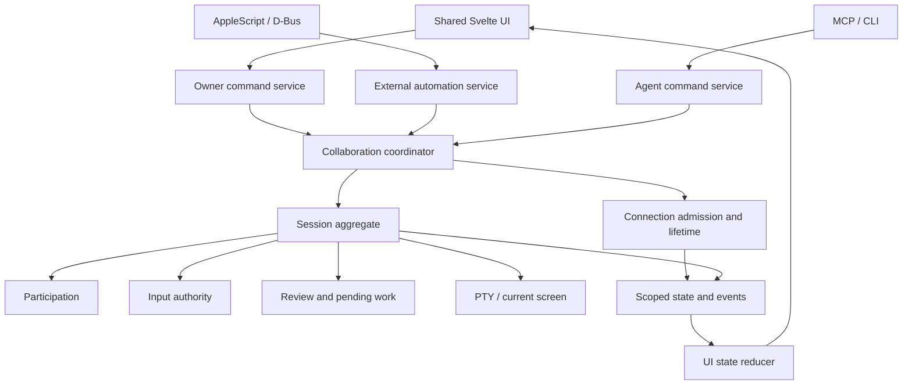

# Collaboration boundaries — design and sprint plan

[한국어](collaboration-refactor-plan.ko.md)

Status: **S0–S3 implemented / S4 local acceptance passed, native acceptance pending** · 2026-09-21.
See [implementation results](collaboration-refactor-results.md) for the completed scope and evidence.
This plan defines scope and acceptance; it does not establish completion or authorize publication.
The current baseline is the [product contract](PRD.md), [architecture](architecture.md), and
[control lease model](control-lease-model.ko.md). Target types and module names below are proposals.

## 1. Goal and preserved behavior

A person must complete this flow without replacing the shell opened by external automation:

> Private terminal → admit agent connection → select participants → start sharing → request control
> → human review and takeover → stop sharing.

Keep the shared `Harness`, native/browser transport adapters, `Authority`, and terminal screen model.
Separate connection admission, participation, input authority, transitions, and UI state. File count
or line-count reduction is not the acceptance criterion.

- Sharing changes preserve session ID, PTY, SSH connection, and child process.
- Connection admission does not disclose a private session or grant control.
- Preserve ordinary tabs' default participation policy and private startup for external sessions.
- Selection belongs to live connection IDs; names and reconnects never inherit it.
- Focus, minimization, and the human's selected tab never gate shared-session access.
- Human input preempts conflicting writers. Revoked work cannot deliver a delayed ENTER.
- Never record raw human input or external injection payloads, or reconstruct private activity later.
- Hidden input stays absent; star masking exposes only rendered stars. Printed values are visible.
- Preserve AppleScript terminology, event codes and return shapes, D-Bus contracts, and saved settings.
- Browser acceptance uses the same UI and Harness; it does not prove native adapter behavior.

Out of scope: a new executable plugin runtime; restoration of native model completion; new shell
backends; Intel Mac support; installer, marketing or film changes; unrelated UI warnings. The TUI
`input_pending` heuristic needs a separate investigation. This plan preserves its guard and improves
the explanation, rather than bypassing it. Never disable admission or auto-share private tabs as a fix.

## 2. Findings mapped to work

| ID | Finding | Evidence location | Sprint |
| --- | --- | --- | --- |
| R1 | App admission UI sits under the active session's `shared` condition | `App.svelte`, `AdmissionRequest.svelte` | S0 |
| R2 | Private sessions hide the Agents category, including app-wide connection settings | `SettingsSheet.svelte` | S0, S3 |
| R3 | Failed admission removes its card; participant refresh clears sharing mutation errors | `AdmissionRequest.svelte`, `SharingDialog.svelte` | S0, S3 |
| R4 | Sharing permanently stops external input before final transition validation | `surface_commands.rs`, `Session::set_shared_with_agents` | S2 |
| R5 | Cross-session lease exclusivity depends on IPC request handling | `ipc.rs::leave_other_tabs` | S1, S2 |
| R6 | Revocation, approval/proposal/grace cleanup and events are spread across methods | `session.rs` | S1, S2 |
| R7 | Initial reads, events and polling independently update UI state through loosely typed data | `App.svelte`, `bridge.ts`, `store.svelte.ts` | S1, S3 |
| R8 | Admission tests cover backend events and decisions, not actual controls in a private view | `admission_harness.rs`, frontend test configuration | S0, S4 |

R1–R4 describe verified code paths. R5–R8 identify structural or coverage weaknesses, not a claim
that every one has been reproduced as a new runtime incident.

## 3. Ownership and dependency direction



Shared services do not erase trust boundaries. External automation cannot invoke arbitrary owner
commands; agents cannot admit themselves.

| Responsibility | Owns | Does not own |
| --- | --- | --- |
| `ConnectionRegistry` | Live IDs, pending/granted/denied/closed state, admission policy | Session audience, PTY input |
| `Participation` | Private/shared audience, participation generation, access checks | Connection admission, leases |
| `Authority` | Human/agent lease, TTL and revocation | UI rendering, external input queues |
| `PendingWork` | Separate lifecycles for control requests, command review, proposals and grace | Collapsing these human decisions into one approval |
| `CollaborationCoordinator` | Cross-session lease coordination, transition preconditions and cancellation order | Transport parsing, card rendering |
| External automation service | OS caller ownership, external writer handles and queues | Bypassing agent participation or approval |
| UI state layer | Consistent snapshot/event application, request progress and failure | Final permission decisions |
| Presentation components | Content, controls, focus, accessibility and motion | Guessing command targets from the active tab |

### Work inside existing crates first

- In `conn-core`, extract connection management and cross-session authority from IPC decoding.
  Split participation/pending-work implementation within `Session`, retaining its consistency boundary.
- In `conn-frontend`, coordinate owner-window checks, external-writer fencing and audit resource
  preparation. OS adapters identify callers and translate requests/results.
- In the frontend, separate typed contracts, app connections, session stores, decision actions and
  shared card/dock presentation.
- Do not add one crate, mutex or background task per module. Remove superseded implementations.

## 4. State and API contracts

Keep these axes independent:

```text
ConnectionAdmission = Pending | Granted | Denied | Closed
SessionOrigin       = Local | External                     (immutable)
Participation       = Private | Shared(AllAdmitted | Selected(connectionIds))
AgentController     = Human | Agent(lease)
ExternalWriter      = Active(ownerHandle) | Revoked
```

External writers and agent leases have different lifetimes and policies. Retain separate authority
types and guarantee mutually exclusive input across their transition boundary. A display name is
never an identity.

Examples of explicitly scoped internal commands:

- `decideAdmission(connectionId, decision)` — app connection.
- `startSharing(sessionId, selection, expectedRevision)` — session participation.
- `requestControl(connectionId, sessionId, reason)` — input authority.
- `resolveCommandApproval(sessionId, requestId, decision)` — command review.

New collaboration APIs must not implicitly append `st.active`. Existing public MCP methods and
AppleScript syntax remain compatible through adapters. Any unavoidable public contract change is
an explicit compatibility item, not an incidental refactor.

### State, events and errors

- Distinguish `AppEvent`, `WindowEvent`, and `SessionEvent`. Public agent delivery retains access
  and generation checks immediately before sending.
- Use versioned collaboration state and one reducer for snapshots/events. Test subscribe/initial-read
  races, duplicate and old events, and reconnect reconciliation.
- Return typed errors such as `input_pending`, `connection_gone`, `request_already_resolved`, and
  `history_unavailable`, with appropriate next actions.
- Keep participant-query failure separate from sharing-mutation failure. Refresh cannot clear the latter.
- Reconcile uncertain results with authoritative state; never automatically replay approval, injection
  or execution.
- Diagnostics use stages, static codes and non-secret identifiers. Do not add logging of input,
  command arguments or credentials to improve error reporting.

## 5. Transition design

### Private to shared

1. Validate the actual owner window, live session, admitted selection and pending input.
2. Prepare required audit resources. Failure here leaves existing authority unchanged.
3. Enter a short transition section that protects the external operation and session in order.
   Preserve `operation → Session` ordering; do not wait for network, file I/O or a human decision there.
4. Revalidate input, session/participation revision and selected connection lifetimes. Failure preserves
   pre-transition state. Never undo a concurrent human takeover or disconnection.
5. Commit external-writer revocation, prevent queued delivery, apply participation, retain human
   control and advance generations. No interval may authorize both writers.
6. Publish committed state/events. A later UI delivery failure is repaired by state reconciliation,
   not by restoring the external writer.

Already-dequeued external input must recheck delivery authority at this boundary. A disappearing
connection must not transfer selection to its successor. The concrete multi-lock ordering and callback
rules require review before S2 implementation.

### Revocation and cancellation

| Event | Required outcome |
| --- | --- |
| Human input / explicit takeover | Invalidate conflicting writer and execution work before forwarding human input; do not retain its contents |
| Stop sharing / remove participant | Cancel affected authority, reviews, proposals, grace and control requests; preserve PTY |
| Agent moves / requests control elsewhere | Common service clears that connection's leases and pending work in other sessions |
| Connection closes | Clear its work across sessions; same-name connections remain independent |
| Lease expires | No delayed execution under expired authority; explicitly preserve the existing review-wait renewal policy |
| Process / window closes | Clean up that session or owning window, preserving other windows |
| Blur / cover / minimize | No participation or lease change |

S1 records current behavior and differences in treatment of reviews, proposals and control requests.
Resolve ambiguous cases, including review survival after manual takeover, against the product
invariants and document intentional changes. A shared cancellation helper does not make every event
semantically identical. Do not introduce guessed shell/TUI clearing keystrokes.

Cross-session exclusivity applies to owner grants and hand-back as well as IPC requests. Serialize
short authority mutations; human input must not wait behind another session's approval wait.

## 6. UI structure and reuse

```text
AppShell
├─ ApplicationRequests     Admission, independent of private/shared/empty session
├─ SessionWorkspace
│  ├─ Terminal
│  └─ SessionInteractions  Control requests, review, proposals, grace
├─ SharingDialog           Selection and transition results
└─ Settings
   ├─ AppConnections       Agent setup and connection admission policy
   └─ SessionPolicy        Mode, command review and pacing
```

The request regions share dock layout and space-reserving motion. A private-session condition cannot
hide app requests. S0 preserves existing motion; S3 extracts the common layout.

A `DecisionCard` primitive owns heading, description, details, action slots, progress, errors and focus.
Admission, control grants and command approval retain separate view models and handlers. Avoid both
copied CSS/network handlers and one oversized permission component.

- Keep failures and their cause visible; remove only confirmed resolved requests.
- A decision in one window reconciles the same request in every other window.
- Keep selections by live connection ID; reconnects require fresh selection.
- Distinguish no connections, admission pending and no eligible participants.
- Reflect successful changes from backend state, not only a toast or a color.
- Test English/Korean, keyboard navigation, narrow windows and reduced motion on shared components.

## 7. Sprints

Estimates are **engineering effort for one implementer/reviewer**, not elapsed-time promises or a
scheduled automation. Platform availability and CI wait are additional. Total: approximately 7–9
working days; concurrency review in S2 is the largest uncertainty.

| Sprint | Goal | Estimate | Depends on | Deliverable |
| --- | --- | --- | --- | --- |
| S0 | Unblock admission and sharing UI | 1 day | None | Small independently deliverable fix |
| S1 | Fix scope, transition and type contracts | 1 day | S0 | Decisions, regression baseline, internal types |
| S2 | Centralize transitions and lease lifecycle | 2–3 days | S1 | Common backend with race/failure tests |
| S3 | Unify UI state and decision components | 2 days | S1 and S2 contracts | Shared UI, type checks, interaction tests |
| S4 | Verify native and installed candidates | 1–2 days | S0–S3 | Candidate report and release preparation |

### S0 — restore the blocked path

- S0-1: Render admission independently of sharing, including private and preparing windows.
- S0-2: Separate global connection settings from private-session restrictions.
- S0-3: Retain failed admission requests and reconcile them; separate mutation/query errors in sharing.
- S0-4: First add a private-view admission regression that fails on the baseline, then verify the fix.

Done: pending connection → actual Allow click → private screen still inaccessible → select connection
→ share → snapshot succeeds. Recover from transport failure and another window resolving first.
Do not claim the partial transition in S2 is fixed by this UI patch.

### S1 — fix boundaries and contracts

- S1-1: Define scoped connection/session/window/request/lease IDs, events and error types.
- S1-2: Inventory every authority entry point, including request, owner grant, hand-back, move and close.
- S1-3: Define the transition/cancellation table and distinguish behavior preservation from bug fixes.
- S1-4: Map tests to entry points and invariants; retain AppleScript/D-Bus/public IPC contract fixtures.

Done: admission and participation are distinct in types/APIs; every lease mutation has a named owner;
ambiguous behavior changes are recorded rather than hidden in extraction work.

### S2 — centralize backend transitions

- S2-1: Extract connection management and cross-session authority from IPC parsing.
- S2-2: Centralize reason-specific pending-work cancellation and remove duplicate paths.
- S2-3: Implement coordinated sharing, external-writer fencing and audit preparation. Failed
  preconditions preserve prior authority.
- S2-4: Use barriers/fault injection for races with exit, disconnect, human input and sharing changes.
- S2-5: Verify common rules through OS adapters, Harness and IPC, with payload-free errors.

Done: no grant path creates multiple held sessions for one connection; failed sharing does not only
stop the external writer; successful sharing rejects old external input and cancelled delayed ENTER.
Transitions preserve session/process and do not block human input on long waits.

### S3 — unify UI state and components

- S3-1: Separate app connections and session collaboration state; remove collaboration `any` events
  and implicitly targeted active-session commands.
- S3-2: Apply snapshot/event/reconnect through one reducer; old responses cannot revert newer state.
- S3-3: Extract common decision behavior and card/dock primitives while preserving decision semantics.
- S3-4: Clarify settings scopes, failure reasons, recovery actions and disabled states in both languages.
- S3-5: Verify multiple windows, rapid tab changes, keyboard use, narrow layouts, reduced motion and
  existing space-reserving motion.

Done: session state cannot hide app admission; requests reconcile across failure/reconnect/duplicates;
components contain no separate authority policy.

### S4 — installed candidate and release preparation

- S4-1: Automate the acceptance flow in the browser using the production Harness.
- S4-2: Install the **signed macOS Apple Silicon candidate** and test AppleScript creation,
  authentication and sharing for cold/warm launches. Target the exact bundle path/identity to isolate
  app-name resolution from adapter failures.
- S4-3: Verify native Linux D-Bus and Windows MCP admission/sharing. Do not add an absent OS adapter.
- S4-4: Check upgrade from existing settings, app/MCP restart, selection non-inheritance, signatures,
  installation and update behavior.
- S4-5: Update the actual changes in PRD, architecture, protocol, usage and changelog in English/Korean.

Done: evidence records commit, candidate version, OS, installation route, outcomes and unverified
items. Development-app and signed-installed-app results are distinct. Missing required native
verification cannot be reported as complete.

## 8. Acceptance scenarios

| ID | Scenario | Required evidence |
| --- | --- | --- |
| A1 | New agent while an externally launched private window is active | Visible actionable admission; admitting alone discloses no private screen |
| A2 | Select admitted connection and share | Same session/PTY/SSH; only selected connection observes; control requested separately |
| A3 | Empty selection, disconnected selection, pending input or audit preparation failure | Persistent specific cause; failed preflight does not only revoke the writer |
| A4 | Share races with external queue delivery | No delivery after transition; no raw payload in history or public responses |
| A5 | Decision transport failure, another window decides first, stale snapshot arrives | Retain/reconcile unresolved request; no duplicate execution or state rollback |
| A6 | Takeover, disconnect or move during review/proposal/grace | Correct reason-specific cancellation; no delayed ENTER or hidden lease elsewhere |
| A7 | Stop/restart sharing and reconnect under the same name | No retrospective private history or inherited selection |
| A8 | Unfocused/minimized/other human tab | Participation and lease survive; agent never follows human tab selection |
| A9 | Hidden, star-masked and visibly printed synthetic authentication data | Projection follows rendering contract; hidden values absent from snapshots/history/errors |
| A10 | AppleScript app name versus exact path, cold/warm launch | Distinguish selection from execution failure; validate candidate dictionary and execution |
| A11 | English/Korean, keyboard, narrow window, reduced motion | Complete the flow with readable controls and unobscured terminal input |

Use only synthetic authentication data; automated tests must not authenticate to external systems
with real accounts. Cover boundary failures and meaningful end-to-end flows rather than expanding
every possible combination indiscriminately.

## 9. Delivery and completion tracking

- Make S0 independent. Integrate subsequent reviewable changes sequentially; avoid overlapping PRs.
- Track implementation, automated tests, browser verification, native candidate verification and
  deployment separately.
- Characterize behavior before structural changes; identify intentional behavior fixes separately.
- Release work, if requested, follows the existing [release tooling](../scripts/release.py).
  This plan alone does not initiate push, merge, tags or publication.
- Address regressions with fixes or reverting the affected sprint change, never by bypassing
  admission or weakening private-session boundaries.

The [product backlog](product-backlog.md) tracks the 2026-09-21 field feedback, priorities and acceptance criteria.

Follow-up backlog: a separate TUI `input_pending` investigation; native staged diagnostics without
payload disclosure; unrelated UI warnings and settings improvements.

## 10. Evidence for this planning step

This document is based on source, existing tests and contract review. Writing it does not perform
implementation, new test execution, native reproduction or deployment. Sprint acceptance remains
work to be verified.
