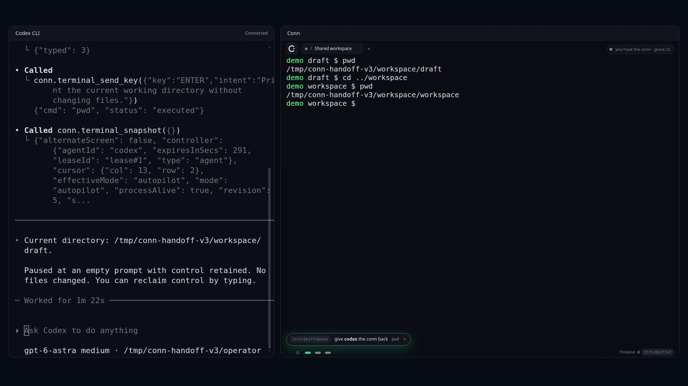
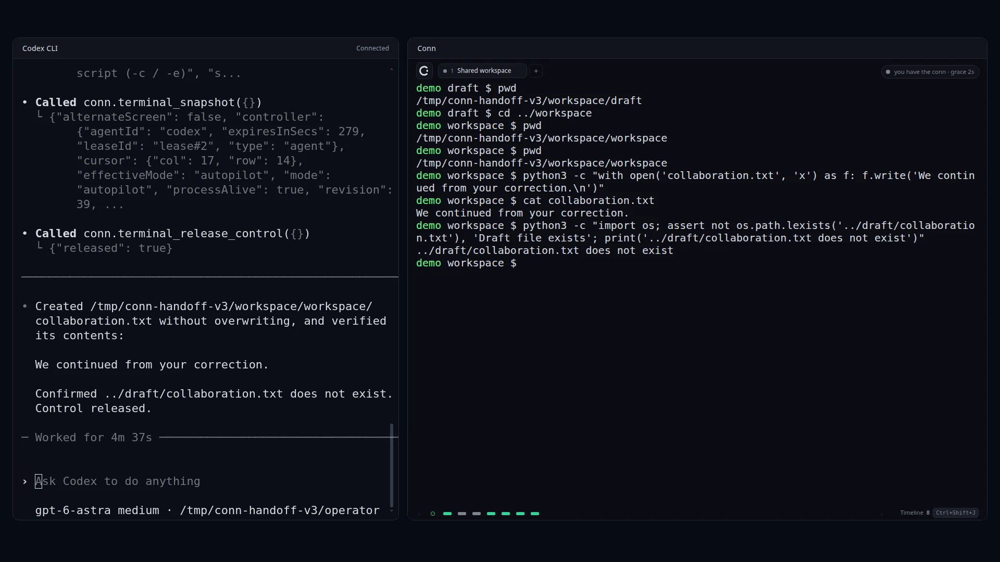

# 경로는 내가 고쳤어. 여기서 이어가.

[English](collaboration-story.md) · 한국어 · [재현 영상 보기](demo.ko.md) · [직접 해보기](first-collaboration.ko.md)

Conn의 의미가 드러난 순간은 평범한 작업 중의 작은 보정이었습니다.

9월 16일, 로컬 에이전트와 공유 SSH 터미널을 이용해 원격 Mac에 프로젝트를 준비하고 있었습니다. 에이전트가 clone 명령을 입력했는데, 목적지가 사용자가 원하는 곳과 달랐습니다. 실행되기 전에 사용자가 키보드를 잡고 위치를 바로잡았습니다.

직접 입력하자 터미널 제어권이 사용자에게 돌아왔습니다. 뒤이어 에이전트가 시도한 Enter 입력은 거절됐습니다. 사용자는 원하는 위치에 clone을 마치고 그 폴더로 이동했습니다. 에이전트는 바뀐 터미널을 다시 읽고 그곳에서 작업을 이어갔습니다.

중요했던 것은 폴더 이름 자체가 아니었습니다. 사용자가 작업 상태를 직접 바꿨고, 에이전트가 그 상태를 관찰한 뒤 계속해야 했다는 점입니다. 셸에서 일어난 일을 채팅에 처음부터 다시 설명할 필요가 없었습니다.

## 대화와 실제 작업이 이어지는 경험

같은 세션에서 원격 장치를 찾고 SSH로 접속했으며, 인증 입력은 사용자가 맡았습니다. 이후 원격 Codex 명령으로 프로젝트를 설명하는 자연어 답변도 받았습니다. 모두 유용한 단계였지만, 경로를 고친 순간에는 협업의 형태가 특히 분명했습니다. 사용자는 승인하거나 의견을 보내는 데서 멈추지 않고, 실제 작업에 직접 참여했습니다.

한 번의 관찰 사례이며 다른 터미널에서 비슷한 흐름이 불가능하다는 비교 검증은 아닙니다. Conn이 집중하는 것은 쓰던 에이전트와 이렇게 제어권을 주고받는 과정을 이해하기 쉽게 만드는 일입니다.

원격 실험에는 한계도 있었습니다. 이후 대화형 원격 Codex 화면에 입력을 보내는 재시도는 `input_pending`으로 차단됐고 성공하지 못했습니다. 아래 로컬 재현이 그 원격 문제의 해결을 입증하는 것은 아닙니다.

## 직접 해볼 수 있도록 작게 재현하기

새 영상에서는 SSH 설정과 개인 컴퓨터 정보를 제외했습니다. 준비한 작업 공간에는 `draft`와 `workspace` 폴더만 있습니다.

실제 Codex CLI 세션이 Conn에 연결해 터미널을 읽고, `draft`에서 `pwd`를 실행합니다. 빈 입력줄에서 제어권을 유지합니다. 이어 사람 역할이 `cd ../workspace`와 `pwd`를 직접 입력해 제어권을 가져오고 위치를 바꿉니다.

계속하라는 요청을 받은 Codex는 새로운 화면을 읽고 현재 폴더를 다시 확인한 뒤, `workspace`에 `collaboration.txt`를 만듭니다. 파일에는 다음 한 줄이 들어 있습니다.

```text
We continued from your correction.
```

`draft`에는 같은 파일이 없습니다. 이전 목적지를 그대로 따르는 대신, 바뀐 상태를 읽고 이어간 결과입니다.

이 장면은 준비된 중간 확인 단계입니다. 모델이 우연히 실수했다고 연출하지 않습니다. 사람 역할의 입력은 자동화했으며, 녹화에 별도의 실제 사용자가 참여한 것은 아닙니다. 배포된 Conn 소스의 네이티브 백엔드를 브라우저 테스트 어댑터로 연결하고 실제 Codex CLI 세션을 촬영했습니다. 대기 시간은 편집했습니다. 환경과 근거는 [촬영 설명](demo.ko.md)에 정리하며, 네이티브 설치 검증이나 원격 대화형 문제의 해결 검증과는 구분합니다.

## 다음에는 무엇을 고치게 될까요?

폴더는 작은 예시입니다. 프로젝트를 고르거나, 빠진 테스트를 추가하거나, 한 단계를 직접 마칠 때도 같은 방식으로 참여할 수 있습니다. 제어권을 가져와 수정한 뒤, 에이전트에게 현재 터미널을 읽고 이어가도록 요청하세요.

[첫 협업을 로컬에서 해보세요](first-collaboration.ko.md). 어느 순간 직접 개입하고 싶었는지, 에이전트가 변경을 이해했는지 듣고 싶습니다.

## 재현 화면

아래는 같은 실제 촬영 세션의 화면입니다. 사람 역할은 자동화했고, 촬영용 좌우 배치로 두 앱을 보여줍니다.





[같은 세션의 타임라인 화면](assets/conn-collaboration-timeline.webp)
