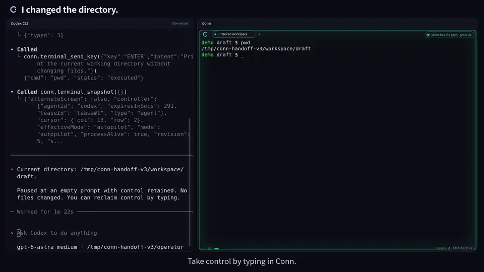

# A correction, then continue

English · [한국어](demo.ko.md) · [Back to Conn](../README.md)

[70-second film](assets/conn-handoff-en.mp4) · [15-second cut](assets/conn-handoff-short-en.mp4) · [Captions](assets/conn-handoff-en.vtt) · [Try it yourself](first-collaboration.md)

## One shell, a change of direction

1. **Codex checks the starting point.** The external client requests control through Conn, runs `pwd` in `draft`, then waits.
2. **The human role changes the directory.** Typing directly in Conn reclaims control. `cd ../workspace` and `pwd` put the shared shell where the work should happen.
3. **Codex reads the new state.** The follow-up is “I changed the directory. Read the terminal and continue here.” A fresh snapshot comes before the next control request and command approvals.
4. **The work continues there.** Codex creates and reads `workspace/collaboration.txt`, checks that `draft/collaboration.txt` is absent, and returns control.

The resulting file contains `We continued from your correction.` followed by a newline. A separate byte-level check confirmed the exact contents and that no file was created in the original directory.

## What you are watching

Recorded on September 17, 2026, with **Codex CLI 0.153.0**, **gpt-6-astra**, medium reasoning effort, and Conn's native Rust backend on Ubuntu. The actual Svelte interface runs through the browser test adapter; the captured application code matches v0.6.0. The side-by-side wrapper is recording tooling, not an additional Conn product interface.

This is a prepared reconstruction of a collaboration we experienced: the operator supplies the task and automates the human-role approvals, directory change and follow-up. **There is no independent human participant in this recording.** Codex selects its commands and runs them through Conn's MCP server; its terminal output and the application's responses are real.

Capture instructions define the pause point and the one-file continuation task in advance. That is why the visible follow-up can be short. The [first-collaboration guide](first-collaboration.md) gives a self-contained prompt for a fresh session. In this take, Codex chose exclusive file creation with Python 3; the guide does not require that exact command.

## The edit

- Fixed framing, no camera zooms or pans. Titles and captions sit outside both terminals.
- The opening previews the real correction, then explicitly returns to **“A moment earlier.”** The rest preserves event order while removing waits.
- Control permission and command-policy approval are separate real steps. The longer cut shows the renewed control request and the file-creation approval; the short cut moves from the correction to the verified result.
- Both languages use the same footage. The [recording notes](../media/demo/RECORDING-HANDOFF.md) and [edit contract](../media/demo/HANDOFF.md) document the selected intervals and limits.

The repository poster links to the video file. GitHub inline playback requires uploading the reviewed film and using the resulting attachment URL at publication; a repository MP4 link alone does not provide that player.

## Reading the result

Typing reclaims control and blocks subsequent agent writes. It does not stop a process already running. Here, the agent deliberately waits before the correction, and rereads the screen when asked to continue.

A timeline entry records a command or collaboration decision; it does not store terminal output or scrollback, and delivery to the shell is not proof of success. This example verifies the result from the live shell and an independent file check.

This capture establishes the local Ubuntu flow shown. It does not validate every client, native installer or remote workflow. The original remote experiment also hit an unresolved interactive `input_pending` case; the [case study](collaboration-story.md) keeps that limitation separate from the successful handoff.

See the [trust model](security.md), [browser adapter](browser-testing.md), and the earlier [test-repair demonstration](demo-test-repair.md).
