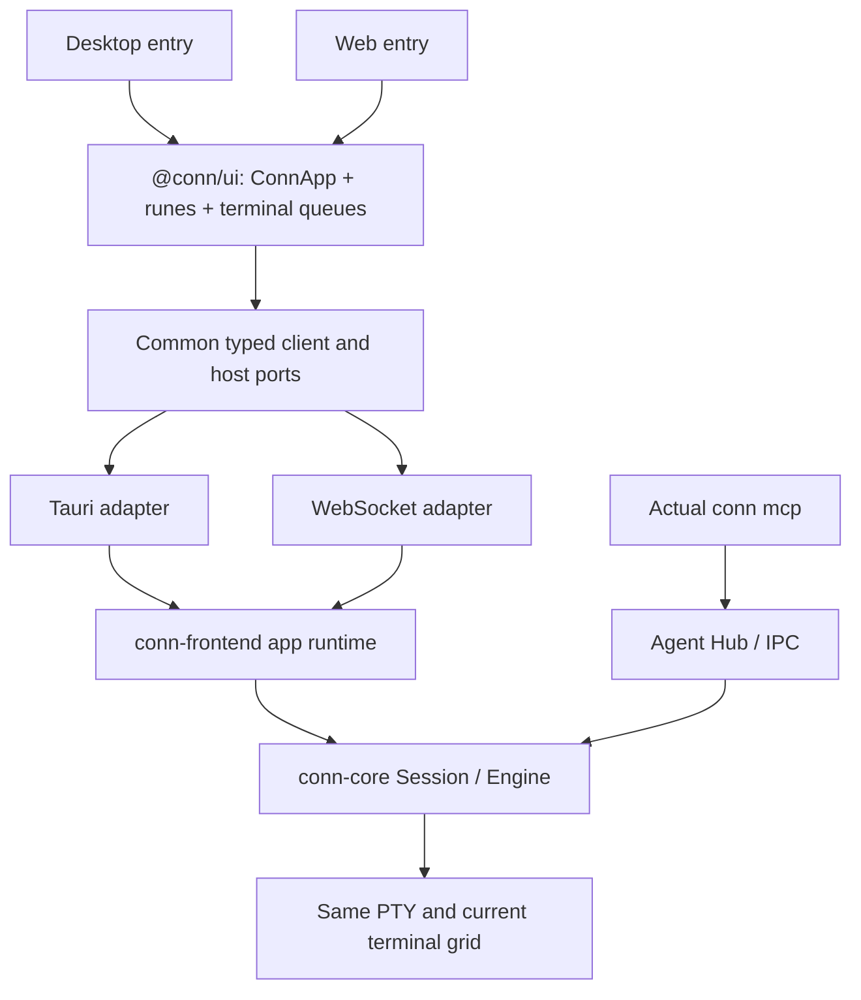

# 공통 앱과 운영 가능한 웹 하네스 설계

[English](web-harness-design.md) · [현재 아키텍처](architecture.ko.md) · [현재 브라우저 테스트](browser-testing.md)

**구현 상태:** 로컬 공통 앱·실행 경계와 독립 웹 패키지를 하드컷으로 구현했습니다(미배포). 아래는 구현의 기준이 된 설계이며, 현재 실행 방법과 검증 범위는 [웹 호스트 안내](browser-testing.ko.md)를 따릅니다. 원격 운영과 네이티브 macOS 재검증은 후속 범위입니다.

2026-09-22 · 기준 소스 `6470ba5` / v0.8.6 · **하드컷 구현의 기준 설계**

범위: 로컬 사용부터 완성하고, 이후 원격 운영을 추가할 수 있도록 설계한다. 아래 패키지명과 명령은 기준 설계이며 현재 실행 방법은 연결된 운영 안내를 따른다. 이번 문서는 배포나 운영 준비 완료를 뜻하지 않는다.

## 1. 목표와 판단 기준

웹 하네스를 모노레포의 정식 실행 패키지로 만든다. 사용자는 같은 Conn 화면으로 실제 셸에서 에이전트와 작업하고, 개발자는 그 실행 경로에 검증 시나리오를 적용한다. 테스트용 화면이나 정책 구현을 따로 두지 않는다.

공통화의 단위는 컴포넌트뿐 아니라 **앱 상태의 소유자, 명령 처리 순서, 출력 전달, 세션 수명, 권한 전환**이다. Tauri IPC와 WebSocket은 운송 수단이며 업무 규칙을 소유하지 않는다. 플랫폼 차이는 명시적인 기능 계약으로 남긴다.

- 사람과 에이전트는 같은 PTY와 현재 터미널 그리드를 사용한다. 공유 전환은 SSH·프로세스를 교체하지 않는다.
- 연결 허용, 세션 참여, 제어권 lease, 명령 승인은 코어의 기존 책임을 유지한다.
- 창 포커스·선택 탭·렌더러 heartbeat를 에이전트 접근 조건으로 추가하지 않는다.
- 새 연결은 같은 이름이라는 이유로 기존 권한을 상속하지 않는다.
- 기존 UI·모션·영문/한국어·위험도 정책을 공통 구현에서 제공한다.
- 패키지 수 증가보다 책임 소유와 실행 경로의 일치를 우선한다.

## 2. 현재 코드에서 출발하는 이유

현재 `conn-frontend::Harness`와 `conn-core`는 이미 양쪽에서 사용된다. Svelte 앱도 하나다. 다만 다음 경계가 아직 공통 계약이 아니다.

| 현재 위치 | 문제 | 목표 |
| --- | --- | --- |
| `frontends/tauri/src/lib/transport.ts` | 공통 UI가 Tauri와 `tests/browser`를 직접 선택 | 앱 진입점에서 adapter 주입 |
| `attention.ts`, `nativeUpdates.svelte.ts` | Tauri import와 `browser-test` 분기가 상태 로직에 섞임 | 공통 상태 + host 기능 구현 |
| `store.svelte.ts`, request action map | 모듈 전역 상태·타이머가 앱 인스턴스에 묶이지 않음 | 앱별 룬 상태와 명시적인 정리 |
| `crates/browser-harness` | WebSocket마다 runtime 생성, 명령 대기 중 이벤트 송신 정지 | 프로세스 수명의 runtime + 독립 송신 |
| `tests/browser/transport.ts` | 웹만 출력 재전송·timeout 규칙을 가짐 | 양쪽이 따르는 출력·응답 계약 |
| `scripts/browser-test.mjs` | CLI를 함께 빌드하지 않고 개발 서버에 의존 | 같은 빌드의 서버·UI·MCP CLI를 실행 |

이미 공통인 `Session`, 정책, 공유 전환, shell integration을 웹에서 다시 구현하지 않는다. 별도로 발견한 빈 Enter/Ctrl-C 후 프롬프트 상태 오류도 공통 코어에서 고친다. 패키지 이동만으로 그 버그가 해결되지는 않는다.

## 3. 패키지 구성

```text
packages/
  ui/                         @conn/ui — 공통 Conn 앱
    src/ConnApp.svelte
    src/components/           터미널, 탭, 승인, 설정, 팔레트, 알림
    src/state/                앱·세션·요청별 .svelte.ts 룬 조합
    src/runtime/              타입, client, 이벤트 조정, host 계약
    src/terminal/             입력·resize·출력 큐
    src/i18n/                 영문·한국어
    src/styles/               공통 토큰·레이아웃·모션
  themes/                     기존 @conn/themes
  brand/                      기존 @conn/brand
frontends/
  tauri/                      기존 데스크톱 진입점 + Tauri adapter
  web/                        @conn/web — 웹 진입점 + WebSocket adapter
crates/
  core/                       기존 PTY·화면·권한·정책
  frontend/                   공통 앱 runtime·owner dispatch·view 수명
  web/                        conn-web — 웹 host library + 실행 파일
  cli/                        기존 conn mcp
tests/
  collaboration/              공통 시나리오·fixture·host별 실행 binding
```

`@conn/ui`와 `@conn/web`을 npm workspace로 추가한다. 기존 `conn-browser-harness`는 `conn-web`으로 전환하고, 같은 역할의 서버를 두 개 유지하지 않는다. `conn-frontend` crate는 유지하되 테스트처럼 읽히는 `Harness`의 역할을 실제 앱 runtime API로 명확히 한다. 필요 시 이름을 옮기면서 내부 호출부를 함께 변경하며, 동작이 다른 wrapper를 덧붙이지 않는다.

초기에는 transport 중립 client와 계약을 `@conn/ui/runtime`에 둔다. 별도 비-Svelte 소비자가 없는데 범용 상태 프레임워크나 여러 작은 패키지를 만들지 않는다. 공개 npm 배포는 이 모노레포 분리의 필수 조건이 아니다.



그림의 공통 runtime은 같은 구현을 뜻한다. 실행 중인 desktop과 standalone web이 자동으로 같은 프로세스가 된다는 뜻은 아니다.

## 4. UI와 룬 상태의 소유

`ConnApp`은 한 번만 구현한다. 양쪽 진입점은 연결과 host 기능을 구성해 같은 root에 전달한다. 공통 컴포넌트는 `frontends/*`, `@tauri-apps/*`, 테스트 코드, 빌드 모드를 import하지 않는다.

```ts
// 목표 형태. Tauri와 Web 진입점의 차이는 ports 구성뿐이다.
mount(ConnApp, { target, props: { ports } });
// ConnApp 초기화 안에서 createConnApp(ports)를 만들고 context로 제공한다.
```

| 소유자 | 내용 |
| --- | --- |
| `createConnApp` | 세션 목록·활성 탭·connection 상태·앱 전체 요청·설정 열림 상태 |
| 세션별 룬 조합 | backend snapshot의 UI 투영, 타임라인, 해당 셸의 표시·모션 |
| 요청별 룬 조합 | session/request ID에 묶인 busy/error/retry; 카드·단축키·팔레트가 공유 |
| 공통 client | 구독·snapshot/event 조정·호출 결과·중복 응답·연결 상태 |
| 터미널 모듈 | 실제 사용자 입력과 단말 응답의 구분, resize 요청, 순서 있는 출력 적용 |
| host ports | OS 알림·창 작업·업데이트·clipboard 등 환경 기능 |
| backend | 참여·제어권·명령 허용의 유일한 권위 |

앱 root가 구독과 타이머를 시작하고 dispose한다. 모듈 전역 singleton 때문에 다른 mount의 상태나 오래된 요청이 섞이지 않게 한다. 세션 종료 시 세션별 큐와 요청 상태도 정리한다. Svelte effect의 수명도 root/component에 귀속시킨다.

기존 reducer와 `Reconciler`, `decision()` 및 terminal queues를 옮기고 보완한다. 한 번에 새로운 상태 라이브러리로 대체하지 않는다. snapshot을 받았다고 UI가 권한을 임의 복원하거나, 현재 활성 탭을 읽어 과거 요청의 승인 대상을 바꾸지 않는다.

테마·i18n·layout·motion은 공유한다. 웹 전용 승인 카드, PRIVATE 전용 별도 앱, 테스트 전용 store를 만들지 않는다. PRIVATE와 origin의 차이는 같은 컴포넌트가 실제 상태를 받아 표시한다.

## 5. 명령·이벤트 계약과 플랫폼 경계

owner 명령/응답/이벤트 DTO의 기준은 공통 Rust runtime이다. 그 schema에서 TS 계약을 생성하고 CI에서 일치를 확인한다. 버전 handshake에는 protocol, runtime instance, build, UI와 CLI의 호환 정보가 포함된다. 같은 경로의 구버전 CLI도 진단할 수 있어야 한다.

호환되지 않는 protocol은 명확한 오류를 반환한다. 서로 호환되는 빌드의 차이는 진단으로 표시하며 버전 문자열 차이를 임의의 접근 제한으로 쓰지 않는다. 재현 시험과 공식 묶음은 같은 소스 빌드를 사용한다.

호스트 adapter는 실제 Tauri window 또는 인증된 웹 attachment에서 owner view 신원을 결정한다. payload의 `window`, `viewId`를 믿지 않는다. owner 경로는 기존 agent IPC와 별도로 유지하며, agent 도구가 owner 승인을 호출할 수 없게 한다. UI capability는 기능 표시를 위한 것이며 backend 권한 검사를 대신하지 않는다.

### 실행 순서

- 느린 연결 검사·파일 조회가 다른 세션의 입력이나 이벤트 전송을 막지 않도록 독립 작업으로 실행한다.
- 같은 세션의 사람 입력·단말 응답·resize는 공통 client와 runtime에서 순서 규칙을 갖는다. attachment epoch와 작업 sequence로 오래된 입력을 거절하고, 승인 결과와 제어권 변경은 core의 현재 상태에서 다시 검증한다.
- 최신 크기로 합치는 최적화는 연속된 대기 resize에만 적용한다. 중간의 입력·응답을 건너뛰어 순서를 바꾸지 않는다. agent 쓰기와 owner 작업은 최종적으로 같은 Session 권한·출력 경계에서 처리된다.
- 결과 전송과 이벤트 송신은 별도 경로다. 출력 callback이 네트워크를 기다리며 Session lock을 잡지 않는다. 큐는 유한하게 두고, 느린 소비자는 명시적인 재동기화 상태로 이동한다.
- 출력의 `generation`, `outputSeq`, 적용 크기와 renderer write 완료 순서는 양쪽 client에서 같은 규칙으로 처리한다. 중복·낡은 frame은 버리고, 전달 누락은 명시적인 stream sequence로 감지한다. 현재 `outputSeq`가 반드시 1씩 증가한다고 가정하지 않는다.
- timeout은 실패 확정이나 취소 완료를 뜻하지 않는다. 전송 후 응답을 잃은 mutation은 같은 operation ID로 결과를 조회하며 자동 재실행하지 않는다. 서버의 제한된 dedup 기록이 사라졌으면 결과 미확인으로 표시하고 상태를 재조회한다.

명령마다 새 MCP를 실행하거나, 네이티브 전체를 직렬화하여 웹과 맞추는 방식은 사용하지 않는다.

### host 기능

| 기능 | Desktop | Web |
| --- | --- | --- |
| 화면·요청·정책 표시·모션 | 공통 | 공통 |
| OS attention | Dock/taskbar adapter | 공통 앱 알림; 브라우저 알림은 지원·허용 상태를 표시 |
| 앱 업데이트 | 기존 native updater | 서버 패키지 버전/업데이트 안내; 없는 updater를 성공으로 반환하지 않음 |
| 외부 실행기 | 실제 OS adapter | 로컬 웹 host에서 지원하는 실제 경로만 표시; fixture는 테스트 runner에만 존재 |
| 창 관리 | native window | 브라우저 owner view; 창 기능과 PTY 종료를 구분 |

기능 차이는 같은 설정 UI에 capability와 이유로 표현한다. `browser-test` 조건문으로 화면이나 정책을 갈라놓지 않는다.

## 6. 출력, 새로고침, 같은 셸로 돌아오기

웹 서버가 runtime과 PTY를 소유한다. WebSocket 수명은 renderer attachment 수명이다. 새로고침·일시 단절로 Engine을 폐기하지 않는다. 셸 종료, owner view 연결 해제, 앱 종료를 공통 runtime의 서로 다른 연산으로 둔다. Desktop의 명시적인 창 닫기 동작은 기존 의미를 보존하고 이 공통 종료 연산에 연결한다.

재연결에는 양쪽 adapter에서 검증하는 **공통 renderer attach 계약**이 필요하다.

1. 인증·owner view 소유를 확인한 후 runtime instance와 살아 있는 세션을 확인한다.
2. 같은 락 경계에서 terminal checkpoint와 출력 sequence 기준점을 취하고 그 이후 사건을 이어 붙인다.
3. 크기·커서·스타일·wrap·alternate screen·단말 모드 등을 복원하고 뒤이은 출력은 정확한 순서로 적용한다.
4. 동기화 완료 뒤 입력을 활성화한다. 오래된 attachment의 지연 입력·resize·단말 응답은 거절한다.

현재 agent용 텍스트 snapshot이나 임의의 최근 512KiB 재전송은 renderer 복구 계약이 아니다. checkpoint 지원 상태를 먼저 조사하고, 상태 복원 전후의 실제 xterm/core 화면과 후속 입력 동작으로 검증한다. 불완전한 byte stream을 재생한 화면을 정상으로 표시하지 않는다. 이 검증은 운영용 웹 제공의 완료 조건이다.

agent 관찰 API는 계속 공유 세션의 현재 그리드만 제공한다. renderer 복구는 인증된 owner 내부 경로이며 새 history/비공유 관찰 도구로 노출하지 않는다. 숨겨진 입력이나 비공유 활동을 복원용 기록으로 수집하지 않는다.

렌더러 연결 단절을 포커스 기반 접근 제한의 대체 수단으로 쓰지 않는다. 살아 있는 core의 참여·lease·승인 TTL이 계속 기준이다. 재접속은 권한을 추가하거나 만료된 권한을 재생성하지 않는다. 실제 agent 연결 종료는 기존처럼 그 연결의 권한을 정리한다. 서버 프로세스 재시작 뒤 PTY·SSH·공유 권한까지 복원된다고 약속하지 않는다.

동일 PTY에 서로 다른 크기를 보내는 두 owner 화면을 무작정 붙이지 않는다. 첫 로컬 웹 버전은 같은 셸 집합에 한 활성 입력·크기 소유 view와 명시적인 view 인계를 지원한다. 복제 브라우저는 동시 writer가 되지 않으며, handoff는 backend에서 신원을 확인해 이전 attachment를 fence한다. 서로 다른 셸을 소유하는 기존 desktop 다중 창은 유지한다. 이는 MCP의 백그라운드 탭 관찰을 제한하는 규칙이 아니다. 동일 셸의 다중 owner 동시 편집은 별도 기능이다.

## 7. 로컬 운영과 원격 확장

### 로컬 사용자 실행

목표 사용자 명령은 `conn-web serve`이다. 기본은 웹 전용 persistent state이며 `--state-dir <directory>`로 작업별 위치를 지정할 수 있다. 서버는 빌드된 UI와 WebSocket을 같은 origin으로 제공한다. 설치 패키지에 서버·정적 UI·호환되는 `conn mcp` CLI와 build manifest를 함께 제공하여 사용자 실행에 Vite/Node/Rust 개발 환경이 필요하지 않게 한다. 초기 배포는 실제 검증한 플랫폼에 한하며 기존 desktop 지원 표를 그대로 복사하지 않는다.

- persistent state 디렉터리와 전용 agent endpoint를 사용하고 중복 인스턴스는 명확히 거절한다. desktop의 설정·socket을 암묵적으로 덮어쓰지 않는다.
- 기본은 loopback이다. 최초 owner 인증을 간단한 로컬 bootstrap으로 처리하고 재연결 가능한 인증 attachment로 바꾼다. 인증 재료를 query string이나 로그에 남기지 않고 Host/Origin과 세션을 검증한다.
- 사용자 셸은 서버 프로세스를 실행한 계정 권한으로 동작한다. 설정 디렉터리 분리는 파일시스템 sandbox가 아니다.
- 앱에는 어느 호스트·셸인지 명확히 표시하고, 버전·endpoint·연결 신원 같은 진단은 필요할 때 펼쳐 본다.
- 사용자의 실제 에이전트 설정은 명시적인 설정 작업으로만 바꾼다. 자동 탐색 결과를 곧바로 설치하거나 덮어쓰지 않는다.

개발자는 목표상 `npm run dev -w @conn/web`로 같은 앱과 서버를 실행한다. 테스트 runner는 임시 state·합성 profile·격리 agent setup 경로를 주입한다. 이 차이는 실행 옵션이며 다른 앱·정책·transport 구현이 아니다. 기존 `test:browser`는 이 경로로 위임하는 호환 명령으로 바꾼다.

Desktop와 standalone web은 기본적으로 별도 runtime instance다. 브라우저에서 이미 열린 desktop 셸을 보려면 미래에 **그 runtime에 owner adapter를 부착**해야 하며 새 PTY를 복제해 같은 셸인 것처럼 보이면 안 된다. 이를 위해 `conn-web`의 웹 host는 library와 얇은 binary로 나누되 desktop 웹 접근을 이번 로컬 버전에서 자동으로 켜지 않는다.

### 원격 운영을 위한 경계

host의 인증 단계가 principal과 workspace/owner view를 결정하고 공통 runtime에 전달하도록 한다. 이후 TLS·설정된 공개 origin·원격 인증·세션 폐기·접근 기록을 갖춘 배포 host를 추가해도 컴포넌트·룬·정책을 복제하지 않는다. query의 경로나 view 이름으로 임의 workspace를 열 수 없어야 한다.

원격 셸은 서버 쪽에서 실행되며 브라우저 이용자 PC의 셸과 구별한다. 에이전트 endpoint도 해당 runtime을 가리킨다. 다중 tenant, 원격 계정 관리, 인터넷 공개 배포는 초기 로컬 완료 범위에 포함하지 않는다. 원격 지원 전에 그 인증·격리 경계를 별도로 검증한다.

## 8. 이행 순서와 완료 기준

각 단계에서 desktop과 web이 함께 실행 가능해야 한다. 파일 이동과 행동 변경을 구분하여 검토한다.

| 단계 | 작업 | 완료 근거 |
| --- | --- | --- |
| W0 | 이번 감사의 재현을 회귀 검사로 남기고 core 프롬프트 상태 오류 수정 | 빈 Enter/Ctrl-C/history 제외/실제 MCP에서 정책·프롬프트 복구; 지연 hook과 foreground 입력은 잘못 신뢰하지 않음 |
| W1 | 공통 UI 패키지와 앱별 룬 수명, host ports 추출 | 양쪽이 같은 root·components·state 사용; UI 패키지의 Tauri/테스트/host import 없음; EN/KO와 기존 모션 유지 |
| W2 | owner 계약·실행 순서·독립 이벤트 송신 공통화 | 느린 작업 중 다른 입력/출력/승인 처리, 병렬 resize/input, 오래된 응답·취소·중복 mutation 검증 |
| W3 | conn-web와 @conn/web, 공통 attach/복구, 로컬 패키지 | Vite 없는 설치 실행, 한 번 연결한 실제 MCP로 다단 작업, reload 후 동일 PTY·SSH·정확한 화면, view 인계와 종료 검증 |
| W4 | 기존 시험을 공통 시나리오로 이동하고 CI·Mac 수용 검사 연결 | 아래 행렬 통과; 실제 외부 실행기와 사용자 SSH 경로를 구분한 결과 기록 |

| 공통 시나리오 | 필요한 검증 |
| --- | --- |
| 연결→참여→제어→명령→반환 | 실제 persistent MCP, 실제 PTY, 실제 공통 UI; 위험 명령·세션 허용·다른 위험도·거절 |
| 사람 개입 | 타이핑·빈 Enter·Ctrl-C·커서 편집·탭 변경·제어 회수 중 오래된 agent 작업 실행 방지 |
| 터미널 표시 | 고정 창에서 승인바 motion, 긴 ASCII/Unicode, 빠른 열기/거절, 행·열·커서·화면 비교 |
| 셸 경로 | 일반 탭, UI PRIVATE→공유, 외부 origin→공유, 직접 SSH, nested SSH; Bash와 별도 sh fixture |
| 수명/복구 | output 중 reload/단절/재접속, checkpoint 후 단말 모드·입력, alt screen, 명시 종료, 새 agent 연결의 신규 허용 |
| 구현 일치 | source import 경계, 생성 DTO, UI/server/CLI manifest, 같은 packaged web build의 시험과 운영 |
| 실제 Mac | WebKit/Tauri IPC, OS 외부 실행기, 실제 원격 셸 식별, native 입력·IME·알림 |

단위 검사나 raw socket probe는 계속 유용하지만, 실제 MCP+UI+PTY 경로를 대신하지 않는다. 새 원격 기능 전까지도 Linux 브라우저 성공을 Mac 외부 실행기 수용 완료로 보고하지 않는다. 실패·미검증 항목은 릴리스 근거에 분리한다.

설계의 완료 기준은 “웹에서도 실행된다”가 아니라 **같은 상태 전이가 같은 공통 코드를 지나며, 사용자가 셸과 제어권을 잃지 않고 작업을 이어갈 수 있다**는 것이다.


[구현 및 검증 결과](web-harness-refactor-results.ko.md).
