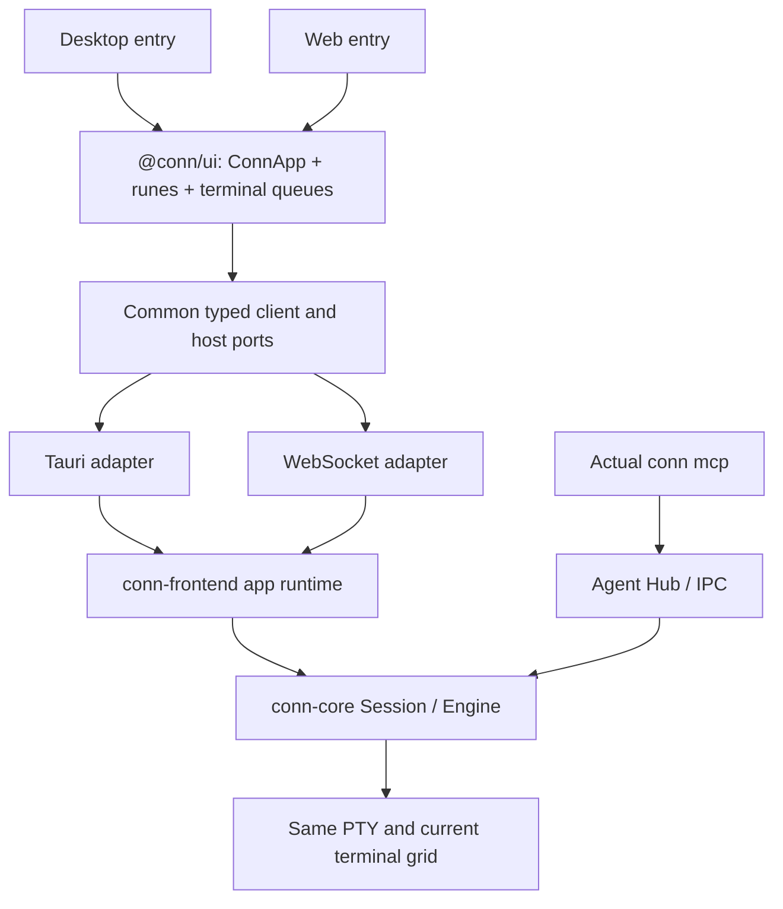

# Shared app and an operable web harness

[한국어](web-harness-design.ko.md) · [Current architecture](architecture.md) · [Current browser testing](browser-testing.md)

**Implementation status:** The shared local app/runtime boundary and standalone web package have been implemented as a hard cut (unreleased). The design below records the implementation baseline; see [the web host guide](browser-testing.md) for current commands and evidence limits. Remote operation and native macOS revalidation remain separate work.

2026-09-22 · Baseline `6470ba5` / v0.8.6 · **Design baseline for the hard cut**

Scope: complete local use first, with boundaries that allow remote operation later. Package names and commands below are targets, not current installation instructions. This document is not a deployment or operational-readiness claim.

## 1. Goal and constraints

Make the web harness a first-class executable package in the monorepo. Users collaborate with agents in a real shell through the same Conn app; developers apply verification scenarios to that execution path. There is no separate test UI or policy implementation.

Share **state ownership, command ordering, output delivery, session lifetime and permission transitions**, as well as components. Tauri IPC and WebSocket carry messages; they do not own collaboration rules. Platform differences remain explicit capabilities.

- Human and agent use the same PTY and current terminal grid. Sharing preserves SSH and child processes.
- Admission, participation, control leases and command approval retain their existing core owners.
- Focus, selected tabs and renderer heartbeats do not become agent access conditions.
- A fresh connection cannot inherit permissions through a matching name.
- Components, motion, English/Korean strings and risk policy have common implementations.
- Prefer clear owners and matching execution semantics over more packages.

## 2. Starting from the current code

Both hosts already use `conn-frontend::Harness`, `conn-core` and one Svelte app. These remaining boundaries lack a common contract:

| Current location | Problem | Target |
| --- | --- | --- |
| `frontends/tauri/src/lib/transport.ts` | Shared UI selects Tauri or `tests/browser` directly | Inject adapters at app entry points |
| `attention.ts`, `nativeUpdates.svelte.ts` | Platform imports and build-mode branches mixed into state | Shared state with host implementations |
| `store.svelte.ts`, request action map | Module-global state and timers lack app-instance ownership | App-scoped runes and explicit disposal |
| `crates/browser-harness` | Runtime per socket; command waits stall events | Process-owned runtime and independent delivery |
| `tests/browser/transport.ts` | Browser-only replay and timeout rules | Common output and response contracts |
| `scripts/browser-test.mjs` | Builds no matching CLI; depends on dev server | Run matching server, UI and MCP CLI builds |

Do not reimplement Session, policy, sharing transitions or shell integration for the web. The separately reproduced empty-Enter/Ctrl-C prompt recovery defect belongs in the common core. Moving packages does not fix it.

## 3. Package layout

```text
packages/
  ui/                         @conn/ui — shared Conn app
    src/ConnApp.svelte
    src/components/           terminal, tabs, decisions, settings, palette, notices
    src/state/                app/session/request .svelte.ts rune compositions
    src/runtime/              types, client, reconciliation, host contracts
    src/terminal/             input, resize and output queues
    src/i18n/                 English and Korean
    src/styles/               tokens, layout and motion
  themes/                     existing @conn/themes
  brand/                      existing @conn/brand
frontends/
  tauri/                      existing desktop entry and Tauri adapter
  web/                        @conn/web — web entry and WebSocket adapter
crates/
  core/                       existing PTY, screen, authority and policy
  frontend/                   common app runtime, owner dispatch, view lifetime
  web/                        conn-web — web host library and executable
  cli/                        existing conn mcp
tests/
  collaboration/              shared scenarios, fixtures and host bindings
```

Add `@conn/ui` and `@conn/web` to npm workspaces. Evolve `conn-browser-harness` into `conn-web`; do not retain two equivalent servers. Keep the `conn-frontend` crate and clarify that its current `Harness` is the actual app runtime. If its API is renamed, migrate callers together instead of adding wrappers with different behavior.

Initially keep the transport-neutral client and contracts under `@conn/ui/runtime`. Without a separate non-Svelte consumer, no generic state framework or extra small packages are needed. Public npm publication is not required for this monorepo separation.



The diagram represents a shared implementation. Running desktop and standalone web does not automatically put them in the same process.

## 4. Component and rune ownership

Implement `ConnApp` once. Each entry point constructs transport and host ports and passes them to that root. Shared components must not import `frontends/*`, `@tauri-apps/*`, tests or host-selecting build modes.

```ts
// Target shape; only the construction of ports differs between hosts.
mount(ConnApp, { target, props: { ports } });
// ConnApp creates createConnApp(ports) during initialization and provides context.
```

| Owner | Responsibility |
| --- | --- |
| `createConnApp` | Session catalog, active tab, connection state, app-wide requests, open settings |
| Session rune composition | UI projection of backend snapshots, timeline, display and motion |
| Request rune composition | Busy/error/retry keyed by session/request; shared by cards, keys and palette |
| Common client | Subscriptions, snapshot/event reconciliation, results, duplicate responses, connection state |
| Terminal module | Human input versus terminal replies; resize requests; ordered output application |
| Host ports | Native attention, window operations, updates and clipboard capabilities |
| Backend | Sole authority for participation, control and command permission |

The app root starts and disposes subscriptions and timers. Another mount must not inherit module-global state or stale requests. Session closure disposes its queues and request state. Reactive effects belong to the root/component lifetime.

Move and improve the existing reducers, `Reconciler`, `decision()` and terminal queues. Do not replace them with a new state library wholesale. Snapshots cannot restore authority on the client's initiative, and changing the active tab cannot change the target of an earlier approval.

Share themes, i18n, layout and motion. Do not introduce web-only approval cards, a separate PRIVATE app or test-only stores. The same components display actual participation and origin state.

## 5. Commands, events and platform boundaries

Common Rust runtime DTOs are the authority for owner commands, responses and events. Generate their TypeScript contracts and check consistency in CI. The handshake includes protocol, runtime instance, build and UI/CLI compatibility information, including an old CLI at an unchanged path.

Incompatible protocols return a clear error. Compatible build differences are diagnostic, not an arbitrary access restriction. Reproduction tests and official bundles use matching source builds.

The adapter establishes owner-view identity from the actual Tauri window or authenticated web attachment, never a claimed `window`/`viewId` in payloads. Keep the owner boundary separate from agent IPC; agent tools cannot invoke owner approvals. UI capabilities describe availability and never replace backend authorization.

### Ordering and execution

- Slow profile tests and file operations run independently of other sessions' input and event delivery.
- Human input, terminal responses and resize for one session follow a common client/runtime ordering contract. Attachment epochs and operation sequences reject stale input. Approval and authority transitions revalidate current core state.
- Coalesce only adjacent pending resize operations. Never move a resize across intervening input/replies. Agent writes and owner operations ultimately meet the same Session authority/output boundary.
- Results and events have independent delivery paths. Output callbacks do not wait on a network while holding Session locks. Queues are bounded; slow consumers explicitly enter resynchronization.
- Both clients use the same rules for output `generation`, `outputSeq`, applied dimensions and renderer write completion. Discard duplicate/stale frames and detect delivery gaps through an explicit stream sequence. Do not assume the existing `outputSeq` always increments by one.
- A timeout is not proof of failure or cancellation. A sent mutation with a lost response is queried using the same operation ID rather than automatically re-executed. If bounded deduplication history has expired, report an unknown outcome and reconcile state.

Do not restart MCP for each command or globally serialize native execution to match the browser.

### Host capabilities

| Capability | Desktop | Web |
| --- | --- | --- |
| Screens, decisions, policy display, motion | Common | Common |
| Attention | Dock/taskbar adapter | Common in-app notices; browser notification support/permission shown truthfully |
| Updates | Existing native updater | Server package version/update guidance; no simulated successful updater |
| External launch | Actual OS adapter | Only genuinely supported local host routes; fixtures belong in the test runner |
| Windows | Native windows | Browser owner views; distinguish view operations from PTY termination |

Explain availability through the same settings UI. Do not fork screens or policy with `browser-test` conditionals.

## 6. Output, reload and returning to the same shell

The web server owns the runtime and PTYs. WebSocket lifetime represents renderer attachment, not Engine lifetime. Reload or temporary disconnection must not destroy shells. Distinguish shell close, owner-view detach and app shutdown in the common runtime. Preserve the desktop's existing explicit window-close semantics through the common close operation.

Both adapters need a verified **common renderer attach contract**:

1. Authenticate and verify owner-view ownership, runtime instance and live sessions.
2. Obtain a terminal checkpoint and output watermark atomically, then stream subsequent events.
3. Restore dimensions, cursor, style, wrapping, alternate screen and terminal modes, then apply continuation in order.
4. Enable input after synchronization. Reject delayed input, resize and replies from old attachments.

The agent text snapshot and an arbitrary last 512KiB replay are not renderer recovery contracts. First audit checkpoint support, then compare actual xterm/core state and subsequent input behavior after restoration. Do not label a partial replay synchronized. This is a prerequisite for an operable web release.

Agent observation remains the shared session's current grid. Renderer recovery is an authenticated owner operation, not a new history/private observation tool. Do not collect hidden input or reconstruct prior private activity for recovery.

Renderer disconnection must not substitute for the rejected focus gate. The live core remains authoritative for participation, leases and approval TTLs. Reattachment adds no permissions and revives none that expired. Actual agent disconnect cleans up that connection's authority as before. Server process restart does not promise PTY/SSH or sharing restoration.

Do not attach two owner displays that race to size the same PTY. The first local web version has one active input/size view per shared set of shells with explicit view handoff. A duplicated browser cannot silently become another writer; authenticated handoff fences the old attachment. Existing desktop windows owning separate shells remain supported. This does not restrict MCP observation of background tabs. Concurrent human owners of the same shell are a separate feature.

## 7. Local operation and future remote hosting

### Local user execution

The proposed user command is `conn-web serve`, defaulting to dedicated persistent web state with an optional `--state-dir <directory>` override. Serve built UI assets and WebSocket from the same origin. Package the server, static UI, compatible `conn mcp` CLI and build manifest together, so users need no Vite/Node/Rust toolchain. Initially distribute only for verified platforms; do not copy the desktop support matrix without testing.

- Use persistent state and a dedicated agent endpoint; reject conflicting instances clearly. Do not silently overwrite desktop settings/socket.
- Bind to loopback by default. A simple local bootstrap establishes authenticated, reconnectable owner attachment. Keep authentication material out of query strings/logs and validate Host, Origin and sessions.
- Shells run with the server account's filesystem permissions. State-directory isolation is not an OS sandbox.
- Identify the host and shell clearly. Keep build, endpoint and connection diagnostics in progressive disclosure.
- Change actual agent-client configuration only through an explicit setup action, not automatic discovery.

The proposed contributor command is `npm run dev -w @conn/web`, using the same app/server. Tests inject temporary state, synthetic profiles and isolated agent-setup locations as runtime options, not alternate app/policy/transport code. Keep `test:browser` as a compatibility entry delegating to this path.

Desktop and standalone web have separate runtime instances by default. Future browser access to an existing desktop shell must **attach an owner adapter to that runtime**, never clone a PTY and claim it is the same shell. Split the web host into a library and thin binary to allow this, but do not automatically enable desktop web access in the initial version.

### Remote-hosting boundary

Host authentication resolves the principal and workspace/owner view before invoking the common runtime. A later deployment host can add TLS, a configured public origin, remote authentication, credential-session revocation and access records without duplicating UI, runes or policy. Query-supplied paths or view names cannot open arbitrary workspaces.

Remote shells run on the server, which must be distinguished from the browser user's computer. Agent endpoints refer to the same runtime. Multi-tenancy, remote account management and public internet deployment are outside the initial local release. Validate their authentication and isolation boundaries before claiming remote support.

## 8. Migration and acceptance

Keep desktop and web runnable throughout migration. Separate file movement from behavior changes for review.

| Stage | Work | Required evidence |
| --- | --- | --- |
| W0 | Preserve audit regressions and fix core prompt recovery | Empty Enter/Ctrl-C/history suppression/actual MCP recover correctly; delayed hooks and foreground input remain untrusted where appropriate |
| W1 | Extract shared UI, app-scoped runes and host ports | Same root/components/state; no Tauri/test/host imports in UI; EN/KO and motion retained |
| W2 | Common owner contracts, ordering and independent event delivery | Slow work does not block other input/output/decisions; parallel resize/input, stale results, cancellation and duplicate mutations tested |
| W3 | conn-web, @conn/web, common reattach and local distribution | Runs without Vite; real persistent MCP collaboration; same PTY/SSH and faithful screen after reload; view handoff and explicit termination |
| W4 | Shared scenarios, CI and Mac acceptance | Matrix below passes with actual external launch and user SSH coverage distinguished |

| Shared scenario | Verification |
| --- | --- |
| Admission → participation → control → commands → release | Actual persistent MCP, real PTY, shared UI; risky commands, session allowance, distinct risk, denial |
| Human intervention | Typing, empty Enter, Ctrl-C, cursor editing, tab switching and takeover; no delayed revoked agent writes |
| Terminal rendering | Fixed window with approval motion; long ASCII/Unicode; rapid open/deny; rows, columns, cursor and screen comparisons |
| Shell paths | Ordinary tabs, UI PRIVATE→shared, external-origin→shared, direct SSH, nested SSH; Bash and separate sh fixtures |
| Lifetime/recovery | Reload/disconnect during output; checkpoint continuation and terminal-mode input; alternate screen; close; fresh agent admission |
| Implementation parity | Import boundaries, generated DTOs, UI/server/CLI manifest, same packaged web build tested and used |
| Actual Mac | WebKit/Tauri IPC, OS external launcher, identified remote shell, native input/IME/attention |

Unit tests and raw-socket probes remain useful but cannot replace actual MCP+UI+PTY coverage. Even before remote features, Linux browser success is not Mac external-launch acceptance. Report failures and untested scope separately in release evidence.

Completion means **the same state transitions run through common code and the person can continue without losing the shell or control context**, not merely that a page runs in a browser.


[Implementation and verification results](web-harness-refactor-results.md).
